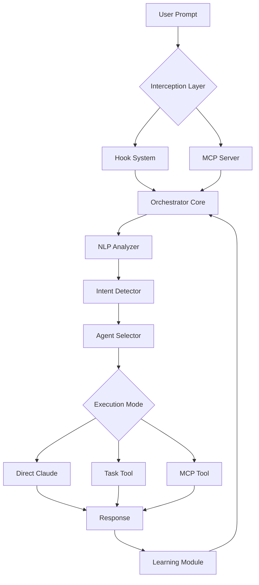

# 🚀 KIRO2 Akıllı Orkestratör Mimarisi v2.0

## 📋 İçindekiler
1. [Mimari Özet](#mimari-özet)
2. [Çalışma Prensibi](#çalışma-prensibi)
3. [Bileşenler](#bileşenler)
4. [Akış Diyagramı](#akış-diyagramı)
5. [Implementasyon Detayları](#implementasyon-detayları)
6. [Kurulum ve Konfigürasyon](#kurulum-ve-konfigürasyon)

## 🎯 Mimari Özet

### Vizyon
Her kullanıcı prompt'unu otomatik olarak analiz eden, en uygun agent'a yönlendiren ve sonuçları optimize eden akıllı bir orkestrasyon sistemi.

### Temel Özellikler
- ✅ **Otomatik Prompt Yakalama** - Tüm promptlar otomatik olarak yakalanır
- ✅ **Akıllı Yönlendirme** - NLP tabanlı içerik analizi ile doğru agent seçimi
- ✅ **Çoklu Execution Modu** - Hook, MCP Tool, veya Direct API
- ✅ **Gerçek Zamanlı Feedback** - Kullanıcıya anında yönlendirme bilgisi
- ✅ **Öğrenen Sistem** - Her execution'dan öğrenir ve kendini optimize eder

## 🔄 Çalışma Prensibi



## 🏗️ Bileşenler

### 1️⃣ Interception Layer (Yakalama Katmanı)

#### A. Multi-Channel Interceptor
```python
class MultiChannelInterceptor:
    """Tüm prompt kanallarını yakalar"""
    
    channels = {
        'hook': HookInterceptor(),        # .claude/hooks üzerinden
        'mcp': MCPInterceptor(),          # MCP server üzerinden
        'api': APIInterceptor(),          # External API üzerinden
        'cli': CLIInterceptor()           # CLI wrapper üzerinden
    }
    
    async def intercept(self, prompt: str, source: str) -> InterceptionResult:
        """Prompt'u yakalar ve işler"""
        # 1. Source detection
        channel = self.detect_channel(source)
        
        # 2. Capture prompt
        captured = await channel.capture(prompt)
        
        # 3. Enrich with context
        context = await self.gather_context(captured)
        
        return InterceptionResult(
            prompt=captured.prompt,
            source=captured.source,
            context=context,
            timestamp=datetime.now()
        )
```

#### B. Hook Configuration
```json
{
  "hooks": {
    "UserPromptSubmit": [{
      "matcher": ".*",
      "hooks": [
        {
          "type": "command",
          "command": "python .claude/orchestration/interceptor.py --mode=hook --prompt=\"$PROMPT\""
        }
      ]
    }],
    "PreToolCall": [{
      "hooks": [{
        "type": "command", 
        "command": "python .claude/orchestration/pre_tool_monitor.py --tool=\"$TOOL\" --params=\"$PARAMS\""
      }]
    }]
  }
}
```

### 2️⃣ Orchestrator Core (Orkestratör Çekirdeği)

```python
class OrchestratorCore:
    """Ana orkestrasyon motoru"""
    
    def __init__(self):
        self.analyzer = TurkishNLPAnalyzer()
        self.router = IntelligentRouter()
        self.executor = MultiModeExecutor()
        self.learner = ReinforcementLearner()
        self.cache = RedisCache()
        
    async def process(self, prompt: str) -> OrchestrationResult:
        """Ana işlem pipeline'ı"""
        
        # 1. Cache check
        if cached := await self.cache.get(prompt):
            return cached
            
        # 2. Analyze prompt
        analysis = await self.analyzer.analyze(prompt)
        
        # 3. Route to agent
        routing = await self.router.route(analysis)
        
        # 4. Execute with selected mode
        result = await self.executor.execute(routing)
        
        # 5. Learn from result
        await self.learner.record(prompt, routing, result)
        
        # 6. Cache result
        await self.cache.set(prompt, result)
        
        return result
```

### 3️⃣ NLP Analyzer (Doğal Dil İşleme)

```python
class TurkishNLPAnalyzer:
    """Türkçe ve İngilizce prompt analizi"""
    
    def __init__(self):
        self.turkish_model = BERTurk()
        self.english_model = BERT()
        self.keyword_extractor = KeywordExtractor()
        self.intent_classifier = IntentClassifier()
        
    async def analyze(self, prompt: str) -> PromptAnalysis:
        """Derinlemesine prompt analizi"""
        
        # 1. Language detection
        language = self.detect_language(prompt)
        
        # 2. Tokenization
        tokens = await self.tokenize(prompt, language)
        
        # 3. Keyword extraction
        keywords = await self.keyword_extractor.extract(tokens)
        
        # 4. Intent classification
        intent = await self.intent_classifier.classify(tokens, keywords)
        
        # 5. Entity recognition
        entities = await self.extract_entities(tokens)
        
        # 6. Complexity scoring
        complexity = self.calculate_complexity(tokens, entities)
        
        return PromptAnalysis(
            language=language,
            keywords=keywords,
            intent=intent,
            entities=entities,
            complexity=complexity,
            confidence=self.calculate_confidence(intent)
        )
```

### 4️⃣ Intelligent Router (Akıllı Yönlendirici)

```python
class IntelligentRouter:
    """ML-tabanlı agent yönlendirme"""
    
    def __init__(self):
        self.agent_registry = AgentRegistry()
        self.routing_model = RoutingModel()  # Trained ML model
        self.rule_engine = RuleEngine()
        
    async def route(self, analysis: PromptAnalysis) -> RoutingDecision:
        """En uygun agent'ı seç"""
        
        # 1. Get available agents
        agents = await self.agent_registry.get_available()
        
        # 2. Score each agent
        scores = {}
        for agent in agents:
            # ML-based scoring
            ml_score = await self.routing_model.score(analysis, agent)
            
            # Rule-based scoring
            rule_score = self.rule_engine.evaluate(analysis, agent)
            
            # Combined score
            scores[agent] = ml_score * 0.7 + rule_score * 0.3
            
        # 3. Select best agent(s)
        primary = max(scores, key=scores.get)
        secondary = self.select_secondary_agents(scores, primary)
        
        # 4. Determine execution mode
        mode = self.determine_execution_mode(analysis, primary)
        
        return RoutingDecision(
            primary_agent=primary,
            secondary_agents=secondary,
            execution_mode=mode,
            confidence=scores[primary],
            reasoning=self.generate_reasoning(analysis, primary)
        )
```

### 5️⃣ Multi-Mode Executor (Çoklu Mod Yürütücü)

```python
class MultiModeExecutor:
    """Farklı execution modlarını yönetir"""
    
    execution_modes = {
        'direct': DirectClaudeExecutor(),      # Doğrudan Claude
        'task': TaskToolExecutor(),            # Task tool üzerinden
        'mcp': MCPToolExecutor(),              # MCP tool üzerinden
        'pipeline': PipelineExecutor(),        # Multi-step pipeline
        'parallel': ParallelExecutor()         # Parallel execution
    }
    
    async def execute(self, routing: RoutingDecision) -> ExecutionResult:
        """Seçilen modda yürüt"""
        
        executor = self.execution_modes[routing.execution_mode]
        
        # Pre-execution hooks
        await self.run_pre_hooks(routing)
        
        # Execute
        result = await executor.execute(
            routing.primary_agent,
            routing.prompt,
            routing.context
        )
        
        # Post-execution hooks
        await self.run_post_hooks(routing, result)
        
        return result
```

### 6️⃣ Learning Module (Öğrenme Modülü)

```python
class ReinforcementLearner:
    """Sürekli öğrenen sistem"""
    
    def __init__(self):
        self.success_tracker = SuccessTracker()
        self.pattern_detector = PatternDetector()
        self.model_updater = ModelUpdater()
        
    async def record(self, prompt: str, routing: RoutingDecision, result: ExecutionResult):
        """Her execution'dan öğren"""
        
        # 1. Track success metrics
        await self.success_tracker.record(routing.primary_agent, result.success)
        
        # 2. Detect patterns
        patterns = await self.pattern_detector.analyze(prompt, routing, result)
        
        # 3. Update routing model if needed
        if patterns.significant:
            await self.model_updater.update(patterns)
            
        # 4. Store for future training
        await self.store_training_data(prompt, routing, result)
```

## 📊 Akış Diyagramı

### Normal Akış
```
User Prompt → Hook Capture → NLP Analysis → Agent Selection → Execution → Response
                    ↓              ↓              ↓              ↓
                 Logging      Learning      Monitoring     Feedback
```

### Hata Durumu Akışı
```
Error → Fallback Agent → Retry Logic → Manual Intervention → Log & Learn
```

## 💻 Implementasyon Detayları

### Dosya Yapısı
```
.claude/
├── orchestration/
│   ├── __init__.py
│   ├── core/
│   │   ├── orchestrator.py         # Ana orkestratör
│   │   ├── interceptor.py          # Prompt yakalama
│   │   ├── analyzer.py              # NLP analiz
│   │   ├── router.py                # Agent yönlendirme
│   │   └── executor.py              # Yürütme motoru
│   ├── agents/
│   │   ├── registry.py              # Agent kayıt sistemi
│   │   ├── health.py                # Agent sağlık kontrolü
│   │   └── capabilities.py          # Agent yetenekleri
│   ├── learning/
│   │   ├── reinforcement.py         # RL modülü
│   │   ├── patterns.py              # Pattern detection
│   │   └── training.py              # Model eğitimi
│   ├── utils/
│   │   ├── cache.py                 # Redis cache
│   │   ├── logger.py                # Logging
│   │   └── metrics.py               # Performans metrikleri
│   └── config/
│       ├── settings.yaml            # Ana konfigürasyon
│       ├── agents.yaml              # Agent tanımları
│       └── rules.yaml               # Yönlendirme kuralları
```

### Konfigürasyon Örneği

```yaml
# .claude/orchestration/config/settings.yaml
orchestrator:
  mode: auto  # auto | manual | hybrid
  
  interception:
    enabled: true
    channels:
      - hook
      - mcp
      - api
    
  analysis:
    languages:
      - turkish
      - english
    models:
      turkish: berturk-base
      english: bert-base
    
  routing:
    strategy: ml_hybrid  # ml | rule | ml_hybrid
    confidence_threshold: 0.7
    fallback_agent: general-purpose
    
  execution:
    default_mode: task  # direct | task | mcp | pipeline
    timeout_seconds: 30
    retry_attempts: 3
    
  learning:
    enabled: true
    update_frequency: 100  # Her 100 request'te model update
    min_confidence_for_update: 0.8
    
  monitoring:
    enabled: true
    metrics_port: 9090
    health_check_interval: 60
```

### Agent Tanımları

```yaml
# .claude/orchestration/config/agents.yaml
agents:
  kiro2-backend-api:
    name: Backend API Specialist
    capabilities:
      - api_development
      - database_operations
      - authentication
      - performance_optimization
    keywords:
      turkish: [api, endpoint, veritabanı, backend, sunucu]
      english: [api, endpoint, database, backend, server]
    preferred_models:
      - claude-opus-4
      - claude-sonnet-4
    execution_modes:
      - task
      - direct
    
  kiro2-frontend-specialist:
    name: Frontend Development Expert
    capabilities:
      - react_development
      - ui_ux_design
      - typescript
      - performance_optimization
    keywords:
      turkish: [react, component, arayüz, frontend, sayfa]
      english: [react, component, interface, frontend, page]
    preferred_models:
      - claude-sonnet-4
    execution_modes:
      - task
      - mcp
```

## 🚀 Kurulum ve Konfigürasyon

### 1. Temel Kurulum

```bash
# 1. Orkestratör dosyalarını oluştur
mkdir -p .claude/orchestration/{core,agents,learning,utils,config}

# 2. Gerekli paketleri yükle
pip install fastmcp redis berturk transformers pyyaml

# 3. Redis'i başlat (cache için)
redis-server --port 6380

# 4. Konfigürasyonu ayarla
cp .claude/orchestration/config/settings.example.yaml .claude/orchestration/config/settings.yaml

# 5. Hook'ları aktifleştir
python .claude/orchestration/setup.py --enable-hooks
```

### 2. MCP Server Kurulumu

```bash
# 1. MCP server'ı oluştur
python .claude/orchestration/create_mcp_server.py

# 2. MCP konfigürasyonunu güncelle
cat >> .mcp.json << EOF
{
  "mcpServers": {
    "orchestrator": {
      "command": "python",
      "args": ["-m", ".claude.orchestration.mcp_server"],
      "env": {
        "PYTHONPATH": ".",
        "ORCHESTRATOR_MODE": "auto"
      }
    }
  }
}
EOF

# 3. MCP server'ı başlat
python -m .claude.orchestration.mcp_server
```

### 3. Test ve Doğrulama

```python
# test_orchestrator.py
import asyncio
from claude.orchestration import OrchestratorCore

async def test():
    orchestrator = OrchestratorCore()
    
    # Test prompts
    prompts = [
        "Backend API endpoint oluştur kullanıcı listesi için",
        "React component yaz dashboard için",
        "Bu kodu review et ve hataları bul",
        "Test coverage'ı artır"
    ]
    
    for prompt in prompts:
        result = await orchestrator.process(prompt)
        print(f"Prompt: {prompt}")
        print(f"Agent: {result.routing.primary_agent}")
        print(f"Confidence: {result.routing.confidence}")
        print("---")

asyncio.run(test())
```

## 📈 Performans Metrikleri

### Hedef Metrikler
- **Prompt Yakalama**: %100 başarı oranı
- **Doğru Agent Seçimi**: >%90 accuracy
- **Response Time**: <500ms (orchestration overhead)
- **Learning Improvement**: %5 monthly accuracy increase

### Monitoring Dashboard
```python
# Prometheus metrics
orchestrator_requests_total
orchestrator_routing_accuracy
orchestrator_execution_duration_seconds
orchestrator_agent_usage_count
orchestrator_learning_updates_total
```

## 🔧 Troubleshooting

### Sık Karşılaşılan Sorunlar

1. **Hook'lar çalışmıyor**
   - Claude Desktop App kullandığınızdan emin olun
   - `.claude/settings.json` dosyasını kontrol edin
   - Hook script'lerinin executable olduğunu doğrulayın

2. **MCP server başlamıyor**
   - Port çakışması olup olmadığını kontrol edin
   - Python path'inin doğru ayarlandığını doğrulayın
   - MCP server loglarını inceleyin

3. **Yönlendirme hatalı**
   - Agent tanımlarını güncelleyin
   - Keyword listelerini genişletin
   - Confidence threshold'u ayarlayın

## 🎯 Sonuç

Bu mimari, her prompt'u otomatik olarak yakalayıp en uygun agent'a yönlendirir. Sistem sürekli öğrenir ve kendini optimize eder. Hook'lar, MCP server'lar ve ML modelleri birlikte çalışarak güçlü bir orkestrasyon sağlar.