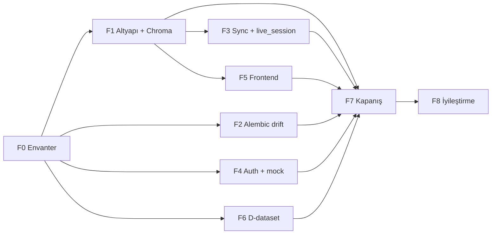

# KIRO2 — Öğrenci Tam Kapsam + Süresiz Otonom Çalışma Ana Planı

**Tarih:** 2026-04-21  
**Revizyon:** v1.2 — gözden geçirme: F7 giriş + F8 başlangıç kuralı netleştirildi  
**Durum:** Yürütme rehberi (insan onayı beklemeden çalışacak ajan için tek kaynak)  
**Önkoşul:** `KIRO2_SESSION_BRIEFING.md` (v13+), `NEXT_SESSION_HANDOFF.md`, `backend/_pilots/*_state.md`  

---

## İçindekiler

1. [Ürün hedefi](#1-ürün-hedefi-tek-cümle)  
2. [Gömülü kararlar](#2-kararlar-bu-plana-gömülü--tekrar-sorulmaz)  
3. [Terimler](#3-terimler)  
4. [Definition of Done](#4-definition-of-done-dod)  
5. [Paralel hatlar ve bağımlılık](#5-paralel-hatlar-ve-bağımlılık-dag)  
6. [Journey ve otomasyon](#6-journey-listesi--otomasyon-spec)  
7. [Faz 0–7 + iyileştirme (Faz 8)](#7-faz-plani-gelistirme--girişçıkış-kriterleri)  
8. [Chroma yığını — ayrıntılı kontrol listesi](#8-chroma-yığını-ayrıntılı-kontrol-listesi)  
9. [Güvenlik dalgaları](#9-güvenlik-dalgaları-mutating-endpoint)  
10. [D-dataset metrikleri](#10-d-dataset-metrikleri)  
11. [Otonom çalışma disiplini](#11-süresiz-otonom-çalışma-disiplini)  
12. [DUR sinyalleri](#12-dur-sinyalleri)  
13. [Anti-pattern](#13-anti-pattern-kaçınılacaklar)  
14. [Ajan başlangıç prompt’u](#14-ajan-başlangıç-promptu)  
15. [Dosya yolu özeti](#15-dosya-yolu-özeti)  
16. [Bilinçli riskler](#16-bilinçli-riskler)  

---

## 1. Ürün hedefi (tek cümle)

Kayıtlı bir **öğrenci**, platformun tanımlı **tüm işlevlerinden** (ChromaDB’li arama / öneri / kümeleme / duplicate dahil) **kesintisiz ve eksiksiz** yararlanabilsin; yarı çalışan mock veya sessiz 500 kabul edilmez.

---

## 2. Kararlar (bu plana gömülü — tekrar sorulmaz)

| # | Karar | Açıklama |
|---|--------|----------|
| K1 | **ChromaDB şart** | `semantic_search`, `clustering_api`, `content_recommendation`, `duplicate_detection` öğrenci deneyimi için **zorunlu**; "kapalı + UX" ile DoD kapatılamaz. |
| K2 | **D-dataset diski** | `C:\Users\husey\d-dataset` erişilebilir; match-rate ve pipeline bu yolla yürütülür. |
| K3 | **Push** | Anlamlı her adımdan sonra `git commit` + `git push` (force push yok). |
| K4 | **Migration disiplini** | `alembic revision --autogenerate` **yasak**. VARCHAR / UUID FK: briefing. Container’da `/app/alembic/versions/` yazılamıyorsa: lokal dosya + `docker cp` (briefing). |
| K5 | **Prod / staging** | Otonom varsayılan: **geliştirme** doğrulaması; prod `upgrade` / deploy **ayrı onay** (PR + log). |

---

## 3. Terimler

| Terim | Anlamı |
|-------|--------|
| **ADIM 0** | Kod yazmadan DB + loader + log ile durum tespiti; çıktı `backend/_pilots/*_state.md`. |
| **Journey (Jx)** | Öğrenci tarafında uçtan uca kullanıcı hikayesi; otomasyon spec + (mümkünse) Playwright. |
| **DoD** | Aşağıdaki checklist tamamı; tek journey yeşili DoD değildir. |
| **Kırmızı / Sarı / Yeşil** | `CAPABILITY_MATRIX.md`: çalışmıyor / kısmi veya riskli / kanıtlı çalışıyor. |
| **Geliştir** | Önce doğru davranış, şema uyumu, güvenlik, Chroma ingest — fonksiyonel tamamlama. |
| **İyileştir (Faz 8)** | Performans, gözlemlenebilirlik, test kapsamı, kod sadeleştirme — DoD bozulmadan. |

---

## 4. Definition of Done (DoD)

### 4.1 Altyapı

- [ ] Docker (veya eşdeğer): backend, postgres, redis, frontend, celery worker + beat **healthy**.
- [ ] Chroma süreç/container ayakta; backend bağlantısı doğrulanmış; başlangıçta **chromadb not available** yok.

### 4.2 Şema ve Alembic

- [ ] `alembic heads` **tek**; çift head yok.
- [ ] **Taze DB:** `alembic upgrade head` sonrası öğrenci journey tabloları oluşuyor (drift **recovery / idempotent** migration ile kapatılmış).

### 4.3 Router / API

- [ ] Briefing **Aşama B** router’ları: `CAPABILITY_MATRIX` + smoke + ilgili journey **yeşil** (güncel liste `_pilots` matrisi ile hizala; `offline_sync`, `pwa_sync`, `productive_failure` vb.).
- [ ] **Chroma dörtlüsü:** auth + hata sözleşmesi tutarlı; **5xx yok**; boş sonuç **tanımlı JSON** (stack trace yok).
- [ ] `live_session_routes`: kod ↔ DB tablo uyumu.
- [ ] `ROUTER_CATEGORIES` ↔ `ROUTER_MAPPING` (ör. `"search"` kategorisi).

### 4.4 Güvenlik (minimum bar)

- [ ] `question_crud_api` P0 ve benzeri: prod yolunda **auth zorunlu** (dev gevşetmesi env + dokümante).
- [ ] Öğrenci verisine yazan mutating uçlar: **IDOR + rol** (hedef: briefing ~50; en azından öğrenci-yüzeyi tamam).
- [ ] Yanıltıcı mock 200 yok; ya gerçek işlem ya **501 / flag** + açık mesaj.

### 4.5 Frontend

- [ ] `npm run lint`, `npm run test`, `npm run type-check` **yeşil**.
- [ ] §6’daki journey’ler FE tarafında karşılık buluyorsa **UI akışı** doğrulanmış.

### 4.6 D-dataset

- [ ] `C:\Users\husey\d-dataset` için **yeniden üretilebilir** komut + log + **§10 metrik raporu**.

### 4.7 Kanıt

- [ ] `CAPABILITY_MATRIX.md` güncel.
- [ ] `AUTOPILOT_LOG.md` güncel.
- [ ] Büyük özellikler: plan + `_state.md` + `_RESULT.md` (konvansiyon).

---

## 5. Paralel hatlar ve bağımlılık (DAG)



**Kural:** **F1 (Chroma ayakta + ingest + dörtlü smoke)** tamamlanmadan Chroma journey’leri (J10–J13) **yeşil** sayılmaz. F2–F6, F1 sonrası **kısmen paralel** yürütülebilir (tek dalda sık commit + push ile çakışmayı azalt).

---

## 6. Journey listesi + otomasyon spec

Her journey için `CAPABILITY_MATRIX.md` içinde şu sütunlar doldurulur: `Journey | API/Route | FE route | Son test | Durum | Not`.

| Kod | Journey | Otomasyon önceliği | Not |
|-----|---------|-------------------|-----|
| J1 | Kayıt / giriş / çıkış / refresh | P0 | `access_token`; cookie refresh path |
| J2 | Profil, STUDENT rol | P0 | |
| J3 | Soru bankası listele / çöz / kaydet | P0 | |
| J4 | Sınav oturumu + cevaplar | P0 | `exam_sessions`, `student_answers` |
| J5 | FSRS / tekrar | P1 | |
| J6 | Offline sync + sonuç | P1 | `.cursor/plans/20260423_offline_sync_debt_2_package_persist.md` zinciri |
| J7 | PWA sync | P1 | Prefix `/api/pwa-sync-api` — client + OpenAPI uyumu |
| J8 | Diary | P1 | Drift kapalı olmalı |
| J9 | Video ilerleme | P2 | |
| J10 | Semantic search (Chroma) | P0 | **Şart** — boş sonuç OK, 5xx değil |
| J11 | Content recommendation (Chroma) | P0 | **Şart** |
| J12 | Clustering (Chroma) | P0 | **API her zaman sağlıklı**; UI yoksa matrix’te "API-only" |
| J13 | Duplicate detection (Chroma) | P0 | Rol kuralları dokümante |
| J14 | KVKK / gizlilik | P1 | |
| J15 | Dashboard / özet | P2 | |

**Önerilen otomasyon sırası:** J1→J4 → J10→J13 → J6→J8 → kalan.

---

## 7. Faz planı (geliştirme) + giriş/çıkış kriterleri

Her faz için: **Giriş (önce şu true)** | **Çıktı (şu artefact)** | **Tahmini süre (rehber)**.

### Faz 0 — Envanter

- **Giriş:** Repo klonu / güncel dal.  
- **Çıktı:** `CAPABILITY_MATRIX.md` v1; audit dosyalarından gelen kırmızı/sarı tam liste; Chroma ve embedding env boşlukları notu.  
- **Süre:** 6–12 saat.

### Faz 1 — Altyapı + Chroma (bloke edici)

- **Giriş:** F0 tamam veya minimal matris.  
- **Çıktı:** §8 checklist **tamamı**; `backend/_pilots/YYYYMMDD_chroma_stack_state.md` + `..._RESULT.md`; dörtlü smoke log örneği.  
- **Süre:** 8–24 saat (ortam ve embedding’e bağlı).

### Faz 2 — Alembic drift

- **Giriş:** Tek head teyit; backup alındı.  
- **Çıktı:** Recovery migration(lar); taze DB doğrulama notu; ilgili journey (J8) tekrar koşuldu.  
- **Süre:** 16–40 saat.

### Faz 3 — Runtime 500 + senkron

- **Giriş:** F1 Chroma client backend’de yüklü (router 500’ü “chromadb yok” ile karıştırma).  
- **Çıktı:** `live_session` düzeltmesi; offline_sync planları; pwa prefix uyumu; J6/J7 yeşil veya sarı→yeşil.  
- **Süre:** 12–30 saat.

### Faz 4 — Auth, IDOR, mock

- **Giriş:** J1–J4 smoke yeşil.  
- **Çıktı:** P0 kapatıldı; mutating dalga raporu (dosya veya `docs/security/mutating_wave_N.md`); mock karar ağacı uygulandı.  
- **Süre:** sürekli, parça parça.

**Mock karar ağacı:**  
(1) Öğrenci journey’sinde kullanılıyor mu? → Evet: **gerçek implementasyon** hedefi.  
(2) Hayır ve admin-only: **501 + açık mesaj** veya feature-flag + UI gizle.  
(3) Asla: başarılı 200 + no-op.

### Faz 5 — Frontend parite

- **Giriş:** İlgili API yeşil.  
- **Çıktı:** Journey-FE eşlemesi; type-check kampanyası (klasör/dizin bazlı PR’lar).  
- **Süre:** 24–72+ saat.

### Faz 6 — D-dataset

- **Giriş:** Disk okunuyor; path doğrulandı.  
- **Çıktı:** §10 metrik tablosu + bir fazın otomasyonu + log.  
- **Süre:** süresiz ölçüm-döngü; hedef rakam briefing ile hizalı.

### Faz 7 — Kapanış (geliştirme sonu)

- **Giriş:** `CAPABILITY_MATRIX.md` kapsamındaki satırlarda **kırmızı yok** (veya kırmızı kalan her satır için §16’da yazılı blokaj + sahip onayı notu); §4.7 pilot/kanıt dosyaları tamamlanmış kabul edilir.  
- **Çıktı:** §4 DoD **tüm kutular** işaretli; son `AUTOPILOT_LOG.md` özet girişi.

### Faz 8 — İyileştirme (DoD sonrası veya DoD’u bozmadan paralel)

- **Başlangıç kuralı:** (a) **DoD tamamlandıktan sonra** ana F8 işi; **veya** (b) DoD üzerinde çalışırken **davranış değiştirmeyen** küçük iyileştirmeler (log, tip, yorum) — her commit’te §11 piramidi yeşil kalmalı.  
- **Amaç:** Davranış değiştirmeden kalite: yavaş sorgu indeks önerisi, structured logging, pytest kapsamı artışı, duplicate kod azaltma, OpenAPI/client drift, bundle boyutu, a11y küçük düzeltmeler.  
- **Kural:** Her iyileştirme commit’inde **aynı test piramidi** (§11); regresyon varsa geri al veya fix-first.  
- **Çıktı:** `AUTOPILOT_LOG.md` içinde "F8" blokları; isteğe bağlı `docs/perf/YYYYMMDD_notes.md`.

---

## 8. Chroma yığını — ayrıntılı kontrol listesi

### 8.1 Altyapı

- [ ] `docker compose` veya mevcut compose dosyasında chroma servisi tanımlı mı? Yoksa **ekle** (sürüm pin).
- [ ] Volume: veri kalıcılığı; restart sonrası koleksiyonlar duruyor mu?
- [ ] Backend env: host, port, TLS yoksa açıkça `http://...`.

### 8.2 Embedding

- [ ] Hangi model / API kullanılıyor? (Lokal sentence-transformers vs uzak API.)  
- [ ] Boyut uyumu: koleksiyon dimension ↔ embedding çıktısı.  
- [ ] Anahtar yoksa **DUR** (§12); sahte vektör üretme.

### 8.3 Ingest

- [ ] Kaynak: `question_bank` metni veya pipeline çıktısı — net SQL veya job.  
- [ ] Idempotent ingest: aynı job iki kez çalışınca tutarlı.  
- [ ] Minimum kayıt sayısı: J10 için anlamlı sonuç veya "boş sonuç" demo verisi.

### 8.4 Router dörtlüsü

- [ ] Her biri için: unauthenticated davranış (401/403) ürün kuralına uygun mu?  
- [ ] STUDENT ile: 200 + gövde şeması sabit mi?  
- [ ] `scripts/test_endpoints.ps1` veya pytest ile otomatik çağrı eklendi mi?

---

## 9. Güvenlik dalgaları (mutating endpoint)

Briefing ~50 endpoint hedefi için pratik yöntem:

1. **Dalga A:** `grep` / OpenAPI / router listesi ile mutating route envanteri → CSV.  
2. **Dalga B:** Öğrenci `student_id` / `users.id` VARCHAR taşıyan yazma uçları — önce bunlar.  
3. **Dalga C:** Admin/teacher ayrımı; yanlış rol → 403.  
4. **Dalga D:** Rate limit (kritik uçlar: auth, sync, arama).

Her dalga sonunda: küçük commit + `make test-fast` + ilgili journey.

---

## 10. D-dataset metrikleri

| Metrik | Kaynak / komut | Hedef yönü |
|--------|----------------|------------|
| Match rate | Pipeline raporu | Briefing (ör. %66 hedefe doğru) |
| İşlenmemiş YOLO crop | Dosya sayımı / kuyruk | Sıfıra doğru |
| Hata sınıfı dağılımı | Log parse | Azalan |

Her F6 döngüsünde `AUTOPILOT_LOG.md`’ye tablo yapıştır veya `docs/d-dataset/YYYYMMDD_metrics.md` üret.

---

## 11. Süresiz otonom çalışma disiplini

### Git

- Dal: `autopilot/student-ready-YYYYMMDD`.  
- `git push -u origin <dal>` ilk bağlantıda.  
- Hook: `git -c core.hooksPath=.git/hooks-empty commit ...` (handoff tercihi).

### Günlük ve matris

- **Blok ID:** `B-YYYYMMDD-HH` — `AUTOPILOT_LOG.md` her girişte blok ID + faz (F0–F8).  
- `CAPABILITY_MATRIX.md`: Router / modül satırı; durum; **son kanıt commit SHA**; tarih.

### Test piramidi (her anlamlı commit)

1. `cd backend` → `make test-fast`  
2. `cd frontend` → `npm run lint` && `npm run test`  
3. Aralıklı: `npm run type-check`, `pytest tests/integration/` (genişleyen liste)  
4. `powershell -ExecutionPolicy Bypass -File scripts\test_endpoints.ps1`  

### Yedekleme

- Migration veya toplu veri: `backups/pre_<iş>_YYYYMMDD_HHMM.sql` (veya `pg_dump` eşdeğeri).

---

## 12. DUR sinyalleri

- Çift Alembic head; migration dosya çakışması.  
- Prod DB veya geri alınamaz toplu DELETE/UPDATE (insan onayı yok).  
- Embedding / Gemini / harici API: anahtar veya kota yok.  
- `git push` auth hatası.  
- KVKK kapsamında belirsiz yeni veri işleme.  
- Chroma: süreç ayakta değilken router “geçici fix” ile ilerleme (**yasak** — önce §8).

---

## 13. Anti-pattern (kaçınılacaklar)

- `alembic revision --autogenerate`.  
- Ödül-hileli test: anlamsız `assert True`, aşırı mock ile gerçek davranış gizleme (`OVER_MOCK_ANALYSIS.md` ruhu).  
- Chroma olmadan “search tamam” demek.  
- Mock 200 ile endpoint kapatmak.  
- Tek devasa commit (geri alınamaz diff).

---

## 14. Ajan başlangıç prompt’u

```
Tek kaynak plan:
@.cursor/plans/20260421_student_ready_autonomous_master.md

Önce oku: KIRO2_SESSION_BRIEFING.md, NEXT_SESSION_HANDOFF.md, backend/_pilots/ güncel _state.md.
DoD: plan §4. Chroma §8 tamamlanmadan J10–J13 yeşil sayma.
D-dataset: C:\Users\husey\d-dataset
Her anlamlı adım: commit + push; AUTOPILOT_LOG.md (Blok ID) + CAPABILITY_MATRIX.md (SHA).
alembic revision --autogenerate yok. Migration öncesi backup.
Faz 8: (a) DoD bittikten sonra tam F8; veya (b) DoD sürecinde sadece davranış değiştirmeyen küçük iyileştirmeler — her F8 commit'inde aynı test piramidi yeşil.
Bittiğinde: DoD checklist'i işaretle ve kısa özet yaz.
```

---

## 15. Dosya yolu özeti

| Dosya | Amaç |
|-------|------|
| `.cursor/plans/20260421_student_ready_autonomous_master.md` | Bu plan |
| `AUTOPILOT_LOG.md` | Blok bazlı günlük |
| `CAPABILITY_MATRIX.md` | Journey × API × durum × SHA |
| `backend/_pilots/*_state.md` | ADIM 0 |
| `.cursor/plans/*_RESULT.md` | Pilot sonuç |
| `docs/security/mutating_wave_N.md` | İsteğe bağlı güvenlik dalgası |
| `docs/d-dataset/YYYYMMDD_metrics.md` | İsteğe bağlı F6 metrik |

---

## 16. Bilinçli riskler

- **vision_api / expert_agents_api:** Chroma’dan bağımsız; öğrenci şart listesine eklenmedikçe matris satırında **şart değil / blokaj** olarak kalır.  
- **%100 manuel endpoint:** Mümkün değil; journey + matrix + script ile sınırlandırılır.  
- **72 saat:** Tüm DoD için yeterlilik garanti değil; F7–F8 süresiz devam eder.

---

## Revizyon geçmişi

| Versiyon | Tarih | Özet |
|----------|-------|------|
| v1.0 | 2026-04-21 | İlk ana plan |
| v1.1 | 2026-04-21 | İçindekiler, DAG, faz giriş/çıkış, Chroma §8, güvenlik dalgaları, D-dataset metrik, F8 iyileştirme, anti-pattern, matris sütunları, J12 API-only netliği, revizyon tablosu |
| v1.2 | 2026-04-21 | F7 giriş: matris kırmızısı + blokaj notu; F8: (a) DoD sonrası tam F8 (b) DoD sırasında davranışsız küçük iyileştirme; ajan prompt F8 cümlesi düzeltildi |
