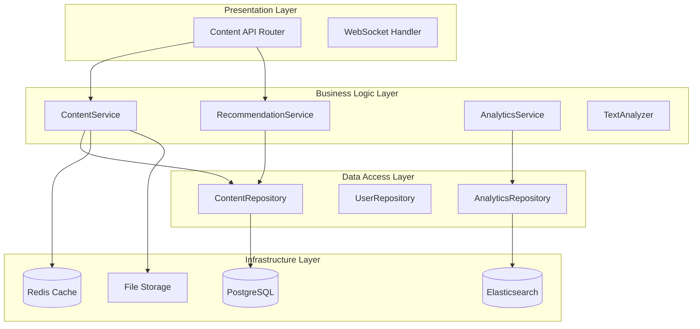

# İçerik Yönetim Sistemi - Tasarım Belgesi

## Genel Bakış

İçerik Yönetim Sistemi, Teknofest 2025 Eğitim Eylemci Platformu'nun temel bileşenlerinden biridir. Sistem, eğitim içeriklerinin (makale, video, quiz) yaşam döngüsünü yönetir ve öğrencilere kişiselleştirilmiş öğrenme deneyimi sunar. Mevcut kod yapısı üzerine inşa edilecek olan bu sistem, mikroservis mimarisi prensiplerine uygun olarak tasarlanmıştır.

## Mimari

### Katmanlı Mimari Yapısı



### Mikroservis Bileşenleri

1. **Content Management Service**: Ana içerik CRUD işlemleri
2. **Recommendation Service**: Kişiselleştirilmiş öneriler
3. **Analytics Service**: İstatistik ve trend analizi
4. **Search Service**: Gelişmiş arama ve filtreleme
5. **Cache Service**: Performans optimizasyonu

## Bileşenler ve Arayüzler

### 1. Content API Router (`/api/v1/content`)

**Sorumluluklar:**
- HTTP endpoint'lerini yönetme
- Request/Response validasyonu
- Yetkilendirme kontrolü
- Rate limiting

**Ana Endpoint'ler:**
```python
# Makale Endpoints
POST   /makale              # Yeni makale oluştur
GET    /makale/{id}         # Makale detayı
GET    /makale              # Makale listesi (filtreleme)
PUT    /makale/{id}         # Makale güncelle
DELETE /makale/{id}         # Makale sil
POST   /makale/{id}/like    # Makale beğen

# Video Endpoints
POST   /video               # Yeni video ekle
GET    /video/{id}          # Video detayı
GET    /video               # Video listesi

# Genel Endpoints
GET    /search              # Tüm içeriklerde arama
GET    /recommendations     # Kişiselleştirilmiş öneriler
GET    /trending            # Trend içerikler
GET    /stats               # İstatistikler
POST   /bulk-import         # Toplu içerik yükleme
```

### 2. Content Service

**Sorumluluklar:**
- İçerik yaşam döngüsü yönetimi
- Otomatik metadata oluşturma
- İçerik validasyonu
- Cache yönetimi

**Ana Metodlar:**
```python
class ContentService:
    async def create_content(content_type: str, content_data: dict, user_id: str)
    async def get_content_by_id(content_id: str, content_type: str)
    async def list_content(filters: dict, pagination: dict)
    async def update_content(content_id: str, update_data: dict)
    async def soft_delete_content(content_id: str)
    async def search_all_content(query: str, filters: dict)
    async def get_trending_content(period: str, content_type: str)
    async def increment_view_count(content_id: str, content_type: str)
    async def toggle_like(content_id: str, user_id: str)
```

### 3. Recommendation Service

**Sorumluluklar:**
- Kullanıcı davranış analizi
- İçerik benzerlik hesaplama
- Kişiselleştirilmiş öneri algoritmaları
- A/B test desteği

**Öneri Algoritmaları:**
```python
class RecommendationService:
    async def get_content_recommendations(student_id: str, limit: int)
    async def get_similar_content(content_id: str, limit: int)
    async def get_trending_for_user(student_id: str, period: str)
    async def update_user_preferences(student_id: str, interaction_data: dict)
    async def calculate_content_similarity(content1_id: str, content2_id: str)
```

### 4. Text Analyzer

**Sorumluluklar:**
- Otomatik özet oluşturma
- Anahtar kelime çıkarma
- İçerik kategorilendirme
- Türkçe NLP işlemleri

```python
class TextAnalyzer:
    def generate_summary(text: str, max_length: int) -> str
    def extract_keywords(text: str, count: int) -> List[str]
    def categorize_content(text: str) -> str
    def calculate_reading_time(text: str) -> int
    def detect_language(text: str) -> str
```

## Veri Modelleri

### 1. Makale İçerik Modeli

```python
class MakaleIcerik(BaseModel):
    id: str = Field(default_factory=lambda: str(uuid4()))
    baslik: str = Field(..., min_length=5, max_length=200)
    icerik: str = Field(..., min_length=50)
    ozet: Optional[str] = Field(max_length=500)
    kategori: str
    yazar: str
    yazar_id: Optional[str]
    etiketler: List[str] = Field(default_factory=list)
    okunma_suresi: int = Field(default=1)  # dakika
    goruntuleme_sayisi: int = Field(default=0)
    begeni_sayisi: int = Field(default=0)
    yayinlanma_tarihi: datetime = Field(default_factory=datetime.now)
    guncellenme_tarihi: Optional[datetime]
    aktif: bool = Field(default=True)
    
    class Config:
        json_encoders = {
            datetime: lambda v: v.isoformat()
        }
```

### 2. Video İçerik Modeli

```python
class VideoIcerik(BaseModel):
    id: str = Field(default_factory=lambda: str(uuid4()))
    baslik: str = Field(..., min_length=5, max_length=200)
    aciklama: Optional[str] = Field(max_length=1000)
    video_url: str = Field(..., regex=r'^https?://.+')
    thumbnail_url: Optional[str]
    kategori: str
    platform: str = Field(default="youtube")
    platform_id: Optional[str]
    sure: int = Field(default=0)  # saniye
    kalite: str = Field(default="720p")
    dil: str = Field(default="tr")
    altyazi_var: bool = Field(default=False)
    izlenme_sayisi: int = Field(default=0)
    begeni_sayisi: int = Field(default=0)
    yayinlanma_tarihi: datetime = Field(default_factory=datetime.now)
    guncellenme_tarihi: Optional[datetime]
    aktif: bool = Field(default=True)
```

### 3. İçerik Etkileşim Modeli

```python
class ContentInteraction(BaseModel):
    id: str = Field(default_factory=lambda: str(uuid4()))
    user_id: str
    content_id: str
    content_type: ContentType
    interaction_type: InteractionType  # VIEW, LIKE, SHARE, COMMENT
    interaction_data: Optional[Dict[str, Any]]
    timestamp: datetime = Field(default_factory=datetime.now)
    session_id: Optional[str]
    device_info: Optional[Dict[str, str]]
```

## Hata Yönetimi

### Hata Kategorileri

1. **Validation Errors (400)**
   - Geçersiz içerik formatı
   - Eksik zorunlu alanlar
   - URL validasyon hataları

2. **Authentication Errors (401/403)**
   - Yetkisiz erişim
   - Sahiplik kontrolü
   - Role-based access control

3. **Not Found Errors (404)**
   - İçerik bulunamadı
   - Kullanıcı bulunamadı

4. **Server Errors (500)**
   - Database bağlantı hataları
   - External service hataları
   - Cache hataları

### Hata Yönetim Stratejisi

```python
class ContentAPIException(Exception):
    def __init__(self, message: str, error_code: str, status_code: int = 400):
        self.message = message
        self.error_code = error_code
        self.status_code = status_code
        super().__init__(self.message)

# Hata yakalama middleware
@app.exception_handler(ContentAPIException)
async def content_api_exception_handler(request: Request, exc: ContentAPIException):
    return JSONResponse(
        status_code=exc.status_code,
        content={
            "success": False,
            "error": {
                "code": exc.error_code,
                "message": exc.message,
                "timestamp": datetime.now().isoformat()
            }
        }
    )
```

## Test Stratejisi

### 1. Unit Tests

**Test Kapsamı:**
- Service layer metodları
- Utility fonksiyonları
- Validation logic
- Business rules

**Test Araçları:**
- pytest
- pytest-asyncio
- pytest-mock
- factory_boy (test data)

### 2. Integration Tests

**Test Kapsamı:**
- API endpoint'leri
- Database işlemleri
- Cache operasyonları
- External service entegrasyonları

### 3. Performance Tests

**Test Kapsamı:**
- Response time benchmarks
- Concurrent user handling
- Cache hit ratios
- Database query optimization

### Test Veri Yönetimi

```python
# Test fixtures
@pytest.fixture
async def sample_makale():
    return MakaleIcerik(
        baslik="Test Makale",
        icerik="Bu bir test makalesidir. " * 20,
        kategori="Matematik",
        yazar="Test Yazar"
    )

@pytest.fixture
async def mock_content_service():
    with patch('services.content_service.ContentService') as mock:
        yield mock

# Test scenarios
class TestContentAPI:
    async def test_create_makale_success(self, client, sample_makale):
        response = await client.post("/api/v1/content/makale", json=sample_makale.dict())
        assert response.status_code == 200
        assert response.json()["success"] is True
    
    async def test_get_makale_not_found(self, client):
        response = await client.get("/api/v1/content/makale/nonexistent")
        assert response.status_code == 404
```

## Performans Optimizasyonu

### 1. Caching Stratejisi

**Cache Layers:**
```python
# L1 Cache: Application Level (Redis)
@cache_manager.cached(expire=3600, key_prefix="content")
async def get_content_by_id(content_id: str):
    pass

# L2 Cache: Database Query Cache
@lru_cache(maxsize=1000)
def get_content_categories():
    pass

# L3 Cache: CDN Level (Static Assets)
# Thumbnail images, video previews
```

**Cache Invalidation:**
```python
class CacheManager:
    async def invalidate_content_cache(self, content_id: str):
        await self.delete(f"content:{content_id}")
        await self.delete_pattern(f"content_list:*")
        await self.delete_pattern(f"recommendations:*")
```

### 2. Database Optimizasyonu

**Indexing Strategy:**
```sql
-- İçerik arama için composite index
CREATE INDEX idx_content_search ON content (content_type, category, created_at DESC);

-- Trend analizi için index
CREATE INDEX idx_content_trending ON content_interactions (content_id, interaction_type, timestamp);

-- Kullanıcı önerileri için index
CREATE INDEX idx_user_interactions ON content_interactions (user_id, content_type, timestamp DESC);
```

**Query Optimization:**
```python
# Pagination with cursor-based approach
async def get_content_list(cursor: Optional[str] = None, limit: int = 20):
    query = select(Content).order_by(Content.created_at.desc())
    if cursor:
        query = query.where(Content.created_at < cursor)
    return await session.execute(query.limit(limit))
```

### 3. Asenkron İşlemler

**Background Tasks:**
```python
# Thumbnail generation
@background_task
async def generate_video_thumbnail(video_id: str, video_url: str):
    thumbnail_url = await video_processor.generate_thumbnail(video_url)
    await content_service.update_thumbnail(video_id, thumbnail_url)

# Content indexing for search
@background_task
async def index_content_for_search(content_id: str, content_type: str):
    content = await content_service.get_content_by_id(content_id, content_type)
    await search_service.index_content(content)

# Analytics processing
@background_task
async def process_interaction_analytics(interaction_data: dict):
    await analytics_service.process_interaction(interaction_data)
```

## Güvenlik Önlemleri

### 1. Input Validation

```python
class ContentValidator:
    @staticmethod
    def validate_video_url(url: str) -> bool:
        allowed_domains = ["youtube.com", "youtu.be", "vimeo.com"]
        parsed = urlparse(url)
        return any(domain in parsed.netloc for domain in allowed_domains)
    
    @staticmethod
    def sanitize_html_content(content: str) -> str:
        allowed_tags = ["p", "br", "strong", "em", "ul", "ol", "li"]
        return bleach.clean(content, tags=allowed_tags, strip=True)
```

### 2. Rate Limiting

```python
from slowapi import Limiter, _rate_limit_exceeded_handler
from slowapi.util import get_remote_address

limiter = Limiter(key_func=get_remote_address)

@router.post("/makale")
@limiter.limit("10/minute")  # 10 makale per minute per IP
async def create_makale(request: Request, ...):
    pass
```

### 3. Access Control

```python
class ContentPermissionChecker:
    @staticmethod
    async def can_edit_content(user: User, content: Content) -> bool:
        # Content owner or admin can edit
        return (content.author_id == user.id or 
                user.role in [UserRole.ADMIN, UserRole.TEACHER])
    
    @staticmethod
    async def can_view_content(user: User, content: Content) -> bool:
        # Public content or enrolled student
        return (content.is_public or 
                await enrollment_service.is_enrolled(user.id, content.course_id))
```

## Monitoring ve Logging

### 1. Application Metrics

```python
from prometheus_client import Counter, Histogram, Gauge

# Metrics
content_created_total = Counter('content_created_total', 'Total content created', ['content_type'])
content_view_duration = Histogram('content_view_duration_seconds', 'Content view duration')
active_users_gauge = Gauge('active_users', 'Number of active users')

# Usage
content_created_total.labels(content_type='makale').inc()
content_view_duration.observe(view_time_seconds)
```

### 2. Structured Logging

```python
import structlog

logger = structlog.get_logger()

async def create_content(content_data: dict):
    logger.info(
        "content_creation_started",
        content_type=content_data["type"],
        user_id=content_data["user_id"],
        content_length=len(content_data.get("content", ""))
    )
    
    try:
        result = await content_service.create(content_data)
        logger.info(
            "content_creation_completed",
            content_id=result.id,
            processing_time_ms=processing_time
        )
        return result
    except Exception as e:
        logger.error(
            "content_creation_failed",
            error=str(e),
            content_data=content_data
        )
        raise
```

### 3. Health Checks

```python
@router.get("/health")
async def health_check():
    checks = {
        "database": await check_database_connection(),
        "cache": await check_redis_connection(),
        "search": await check_elasticsearch_connection(),
        "storage": await check_file_storage()
    }
    
    all_healthy = all(checks.values())
    status_code = 200 if all_healthy else 503
    
    return JSONResponse(
        status_code=status_code,
        content={
            "status": "healthy" if all_healthy else "unhealthy",
            "checks": checks,
            "timestamp": datetime.now().isoformat()
        }
    )
```

Bu tasarım belgesi, mevcut kod yapınızı temel alarak kapsamlı bir İçerik Yönetim Sistemi için gerekli tüm bileşenleri ve stratejileri tanımlar. Sistem, ölçeklenebilir, güvenli ve performanslı bir şekilde tasarlanmıştır.