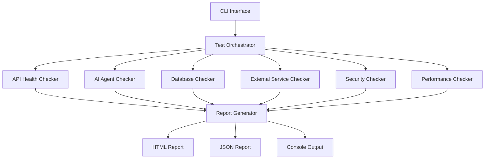

# Proje Sağlık Denetimi - Tasarım Belgesi

## Genel Bakış

Proje Sağlık Denetimi sistemi, Teknofest 2025 Eğitim Eylemci Platformu'nun teknik sağlığını otomatik olarak kontrol eden kapsamlı bir test ve analiz aracıdır. Sistem, Python tabanlı bir CLI aracı olarak tasarlanmış olup, platformun tüm kritik bileşenlerini (API'ler, AI agent'lar, veritabanları, dış servisler, güvenlik) test eder ve detaylı raporlar üretir.

### Temel Hedefler

1. **Otomatik Sağlık Kontrolü**: Tüm platform bileşenlerinin otomatik test edilmesi
2. **Erken Hata Tespiti**: Üretim ortamına geçmeden önce sorunların tespit edilmesi
3. **Performans İzleme**: API yanıt süreleri, memory kullanımı, cache performansı gibi metriklerin ölçülmesi
4. **Güvenlik Denetimi**: Güvenlik açıklarının ve yapılandırma hatalarının tespit edilmesi
5. **Raporlama**: HTML ve JSON formatında detaylı raporlar üretilmesi

### Kullanım Senaryoları

- **CI/CD Pipeline**: Her commit sonrası otomatik sağlık kontrolü
- **Geliştirme Ortamı**: Geliştiricilerin lokal ortamda test yapması
- **Staging Ortamı**: Üretim öncesi son kontroller
- **Üretim İzleme**: Periyodik sağlık kontrolleri (günlük/haftalık)

## Mimari

### Sistem Mimarisi



### Katmanlı Mimari

**1. CLI Katmanı (cli/)**
- Kullanıcı arayüzü ve komut satırı argüman işleme
- Konfigürasyon yükleme
- Test orchestrator'ı başlatma

**2. Orchestrator Katmanı (core/)**
- Test modüllerini koordine etme
- Paralel test yürütme
- Hata yönetimi ve retry mekanizması
- Progress tracking

**3. Checker Katmanı (checkers/)**
- Her gereksinim kategorisi için özel checker modülleri
- Bağımsız ve test edilebilir modüller
- Ortak interface implementasyonu

**4. Utility Katmanı (utils/)**
- HTTP client wrapper
- Database connection utilities
- Logging utilities
- Metric collection utilities

**5. Reporting Katmanı (reporting/)**
- HTML rapor oluşturma
- JSON rapor oluşturma
- Console output formatting

### Dizin Yapısı

```
health_audit/
├── cli/
│   ├── __init__.py
│   ├── main.py              # CLI entry point
│   └── config.py            # Configuration loader
├── core/
│   ├── __init__.py
│   ├── orchestrator.py      # Test orchestrator
│   ├── base_checker.py      # Base checker interface
│   └── result.py            # Test result models
├── checkers/
│   ├── __init__.py
│   ├── api_checker.py       # API health checks (Req 1, 10, 16)
│   ├── agent_checker.py     # AI agent checks (Req 2, 18)
│   ├── database_checker.py  # Database checks (Req 4, 15, 28, 41)
│   ├── external_service_checker.py  # External API checks (Req 3)
│   ├── security_checker.py  # Security checks (Req 6, 13, 21-23, 37-38, 42-43)
│   ├── performance_checker.py  # Performance checks (Req 10, 30-31)
│   ├── infrastructure_checker.py  # Docker, env vars (Req 9, 24, 44)
│   ├── documentation_checker.py  # Docs checks (Req 8, 17)
│   ├── testing_checker.py   # Test coverage (Req 7, 29)
│   └── monitoring_checker.py  # Monitoring checks (Req 11, 26)
├── utils/
│   ├── __init__.py
│   ├── http_client.py       # HTTP request wrapper
│   ├── db_utils.py          # Database utilities
│   ├── logger.py            # Logging utilities
│   └── metrics.py           # Metric collection
├── reporting/
│   ├── __init__.py
│   ├── html_reporter.py     # HTML report generator
│   ├── json_reporter.py     # JSON report generator
│   ├── console_reporter.py  # Console output
│   └── templates/
│       └── report.html      # HTML template
├── config/
│   ├── default_config.yaml  # Default configuration
│   └── thresholds.yaml      # Performance thresholds
└── tests/
    ├── test_api_checker.py
    ├── test_agent_checker.py
    └── ...
```

## Bileşenler ve Arayüzler

### 1. Base Checker Interface

Tüm checker modülleri bu interface'i implement eder:

```python
from abc import ABC, abstractmethod
from typing import List
from core.result import CheckResult

class BaseChecker(ABC):
    """Tüm checker'ların implement etmesi gereken base interface"""
    
    def __init__(self, config: dict):
        self.config = config
        self.results: List[CheckResult] = []
    
    @abstractmethod
    async def run_checks(self) -> List[CheckResult]:
        """Tüm kontrolleri çalıştır ve sonuçları döndür"""
        pass
    
    @abstractmethod
    def get_checker_name(self) -> str:
        """Checker adını döndür"""
        pass
```

### 2. Check Result Model

```python
from enum import Enum
from dataclasses import dataclass
from typing import Optional, Dict, Any
from datetime import datetime

class CheckStatus(Enum):
    SUCCESS = "success"
    WARNING = "warning"
    ERROR = "error"
    CRITICAL = "critical"

class CheckSeverity(Enum):
    LOW = "düşük"
    MEDIUM = "orta"
    HIGH = "yüksek"
    CRITICAL = "kritik"

@dataclass
class CheckResult:
    """Tek bir kontrol sonucunu temsil eder"""
    requirement_id: str          # Örn: "REQ-1.1"
    check_name: str              # Kontrol adı
    status: CheckStatus          # Başarı durumu
    message: str                 # Türkçe mesaj
    details: Optional[Dict[str, Any]] = None  # Ek detaylar
    metric_value: Optional[float] = None      # Ölçülen değer
    threshold: Optional[float] = None         # Eşik değer
    timestamp: datetime = None
    duration_ms: Optional[float] = None       # Test süresi
    suggestion: Optional[str] = None          # Düzeltme önerisi
    severity: Optional[CheckSeverity] = None  # Öncelik seviyesi
    estimated_fix_time: Optional[int] = None  # Tahmini düzeltme süresi (dakika)
    
    def __post_init__(self):
        if self.timestamp is None:
            self.timestamp = datetime.utcnow()
```

### 3. Test Orchestrator

```python
import asyncio
from typing import List, Dict
from core.base_checker import BaseChecker
from core.result import CheckResult
from utils.logger import get_logger

class TestOrchestrator:
    """Tüm checker'ları koordine eder ve paralel çalıştırır"""
    
    def __init__(self, config: dict):
        self.config = config
        self.logger = get_logger(__name__)
        self.checkers: List[BaseChecker] = []
        self.results: List[CheckResult] = []
    
    def register_checker(self, checker: BaseChecker):
        """Yeni bir checker ekle"""
        self.checkers.append(checker)
    
    async def run_all_checks(self) -> List[CheckResult]:
        """Tüm checker'ları paralel olarak çalıştır"""
        tasks = [checker.run_checks() for checker in self.checkers]
        results = await asyncio.gather(*tasks, return_exceptions=True)
        
        for result in results:
            if isinstance(result, Exception):
                self.logger.error(f"Checker hatası: {result}")
            else:
                self.results.extend(result)
        
        return self.results
    
    def get_summary(self) -> Dict[str, int]:
        """Sonuçların özetini döndür"""
        return {
            "total": len(self.results),
            "success": sum(1 for r in self.results if r.status == CheckStatus.SUCCESS),
            "warning": sum(1 for r in self.results if r.status == CheckStatus.WARNING),
            "error": sum(1 for r in self.results if r.status == CheckStatus.ERROR),
            "critical": sum(1 for r in self.results if r.status == CheckStatus.CRITICAL)
        }
```

### 4. API Health Checker

```python
import aiohttp
from typing import List
from core.base_checker import BaseChecker
from core.result import CheckResult, CheckStatus
from utils.http_client import HTTPClient

class APIHealthChecker(BaseChecker):
    """API endpoint'lerinin sağlık kontrolünü yapar (Req 1, 10, 16)"""
    
    def __init__(self, config: dict):
        super().__init__(config)
        self.base_url = config.get("api_base_url")
        self.endpoints = config.get("api_endpoints", [])
        self.http_client = HTTPClient(timeout=10)
    
    async def run_checks(self) -> List[CheckResult]:
        """Tüm API kontrollerini çalıştır"""
        results = []
        
        # REQ-1: Backend API Durum Kontrolü
        for endpoint in self.endpoints:
            result = await self._check_endpoint_status(endpoint)
            results.append(result)
        
        # REQ-16: Health Check Endpoint Kontrolü
        health_results = await self._check_health_endpoints()
        results.extend(health_results)
        
        # REQ-10: Performans Metrikleri
        perf_results = await self._check_performance_metrics()
        results.extend(perf_results)
        
        return results
    
    async def _check_endpoint_status(self, endpoint: dict) -> CheckResult:
        """Tek bir endpoint'in durumunu kontrol et"""
        url = f"{self.base_url}{endpoint['path']}"
        start_time = time.time()
        
        try:
            response = await self.http_client.get(url)
            duration_ms = (time.time() - start_time) * 1000
            
            # REQ-1.1: HTTP durum kodu kaydet
            # REQ-1.2: Yanıt süresini ölç
            status = CheckStatus.SUCCESS
            message = f"{endpoint['path']} endpoint'i çalışıyor"
            
            # REQ-1.3: 500ms'den uzun yanıt kontrolü
            if duration_ms > 500:
                status = CheckStatus.WARNING
                message = f"{endpoint['path']} endpoint'i yavaş yanıt veriyor"
            
            # REQ-1.4: 4xx/5xx hata kontrolü
            if 400 <= response.status < 600:
                status = CheckStatus.ERROR
                message = f"{endpoint['path']} endpoint'i hata döndürdü"
            
            return CheckResult(
                requirement_id="REQ-1",
                check_name=f"API Status: {endpoint['path']}",
                status=status,
                message=message,
                metric_value=duration_ms,
                threshold=500,
                duration_ms=duration_ms,
                details={"status_code": response.status, "url": url}
            )
        
        except Exception as e:
            return CheckResult(
                requirement_id="REQ-1",
                check_name=f"API Status: {endpoint['path']}",
                status=CheckStatus.CRITICAL,
                message=f"{endpoint['path']} endpoint'ine erişilemiyor",
                details={"error": str(e), "url": url}
            )
    
    def get_checker_name(self) -> str:
        return "API Health Checker"
```

### 5. AI Agent Checker

```python
import importlib
from typing import List
from core.base_checker import BaseChecker
from core.result import CheckResult, CheckStatus

class AIAgentChecker(BaseChecker):
    """AI agent modüllerinin kontrolünü yapar (Req 2, 18)"""
    
    def __init__(self, config: dict):
        super().__init__(config)
        self.agents = config.get("ai_agents", [
            "agents.learning_path_agent.LearningPathAgent",
            "agents.study_agent.StudyAgent",
            "agents.exam_agent.ExamAgent"
        ])
    
    async def run_checks(self) -> List[CheckResult]:
        """Tüm AI agent kontrollerini çalıştır"""
        results = []
        
        # REQ-2: AI Agent Modül Yükleme Kontrolü
        for agent_path in self.agents:
            result = await self._check_agent_import(agent_path)
            results.append(result)
        
        # REQ-18: AI Agent Yanıt Süresi Kontrolü
        for agent_path in self.agents:
            result = await self._check_agent_response_time(agent_path)
            results.append(result)
        
        return results
    
    async def _check_agent_import(self, agent_path: str) -> CheckResult:
        """Agent modülünün import edilebilirliğini kontrol et"""
        try:
            module_path, class_name = agent_path.rsplit(".", 1)
            module = importlib.import_module(module_path)
            agent_class = getattr(module, class_name)
            
            return CheckResult(
                requirement_id="REQ-2",
                check_name=f"Agent Import: {class_name}",
                status=CheckStatus.SUCCESS,
                message=f"{class_name} modülü başarıyla yüklendi"
            )
        
        except Exception as e:
            return CheckResult(
                requirement_id="REQ-2",
                check_name=f"Agent Import: {agent_path}",
                status=CheckStatus.CRITICAL,
                message=f"{agent_path} modülü yüklenemedi",
                details={"error": str(e)},
                suggestion="Modül yolunu ve bağımlılıkları kontrol edin"
            )
    
    def get_checker_name(self) -> str:
        return "AI Agent Checker"
```

### 6. Database Checker

```python
import asyncpg
import redis
from elasticsearch import AsyncElasticsearch
from typing import List
from core.base_checker import BaseChecker
from core.result import CheckResult, CheckStatus

class DatabaseChecker(BaseChecker):
    """Veritabanı bağlantılarını ve performansını kontrol eder (Req 4, 15, 28, 41)"""
    
    def __init__(self, config: dict):
        super().__init__(config)
        self.pg_url = config.get("database_url")
        self.redis_url = config.get("redis_url")
        self.es_url = config.get("elasticsearch_url")
    
    async def run_checks(self) -> List[CheckResult]:
        """Tüm veritabanı kontrollerini çalıştır"""
        results = []
        
        # REQ-4: Veritabanı Bağlantı Kontrolü
        results.append(await self._check_postgresql())
        results.append(await self._check_redis())
        results.append(await self._check_elasticsearch())
        
        # REQ-4.4: Redis cache hit oranı
        results.append(await self._check_cache_hit_ratio())
        
        # REQ-15: Database Migration Kontrolü
        results.append(await self._check_migrations())
        
        # REQ-28: Database Query Performansı
        results.extend(await self._check_slow_queries())
        
        # REQ-41: Database Connection Pool Kontrolü
        results.append(await self._check_connection_pool())
        
        return results
    
    async def _check_postgresql(self) -> CheckResult:
        """PostgreSQL bağlantısını kontrol et"""
        try:
            conn = await asyncpg.connect(self.pg_url)
            await conn.close()
            
            return CheckResult(
                requirement_id="REQ-4.1",
                check_name="PostgreSQL Bağlantı",
                status=CheckStatus.SUCCESS,
                message="PostgreSQL bağlantısı aktif"
            )
        except Exception as e:
            return CheckResult(
                requirement_id="REQ-4.1",
                check_name="PostgreSQL Bağlantı",
                status=CheckStatus.CRITICAL,
                message="PostgreSQL bağlantısı kurulamadı",
                details={"error": str(e)},
                suggestion="DATABASE_URL environment variable'ını kontrol edin"
            )
    
    def get_checker_name(self) -> str:
        return "Database Checker"
```

### 7. Security Checker

```python
from typing import List
from core.base_checker import BaseChecker
from core.result import CheckResult, CheckStatus
from utils.http_client import HTTPClient

class SecurityChecker(BaseChecker):
    """Güvenlik kontrollerini yapar (Req 6, 13, 21-23, 37-38, 42-43)"""
    
    def __init__(self, config: dict):
        super().__init__(config)
        self.base_url = config.get("api_base_url")
        self.http_client = HTTPClient()
    
    async def run_checks(self) -> List[CheckResult]:
        """Tüm güvenlik kontrollerini çalıştır"""
        results = []
        
        # REQ-6: Güvenlik Kontrolleri
        results.append(await self._check_rate_limiting())
        results.append(await self._check_https())
        
        # REQ-13: Authentication Token Kontrolü
        results.extend(await self._check_jwt_auth())
        
        # REQ-21: Rate Limiting Test
        results.append(await self._test_rate_limit_enforcement())
        
        # REQ-22: SQL Injection Koruması
        results.append(await self._check_sql_injection_protection())
        
        # REQ-23: XSS Koruması
        results.append(await self._check_xss_protection())
        
        # REQ-37: Input Validation Kontrolü
        results.extend(await self._check_input_validation())
        
        # REQ-38: Session Management Kontrolü
        results.extend(await self._check_session_management())
        
        # REQ-42: API Key Rotation Kontrolü
        results.append(await self._check_api_key_rotation())
        
        # REQ-43: Audit Log Kontrolü
        results.extend(await self._check_audit_logs())
        
        return results
    
    async def _check_rate_limiting(self) -> CheckResult:
        """Rate limiting mekanizmasını test et"""
        # REQ-6.1: Rate limiting aktif mi?
        try:
            # 100 istek/dakika limitini test et
            for i in range(105):
                response = await self.http_client.get(f"{self.base_url}/api/v1/test")
                if i > 100 and response.status == 429:
                    return CheckResult(
                        requirement_id="REQ-6.1",
                        check_name="Rate Limiting",
                        status=CheckStatus.SUCCESS,
                        message="Rate limiting mekanizması çalışıyor"
                    )
            
            return CheckResult(
                requirement_id="REQ-6.1",
                check_name="Rate Limiting",
                status=CheckStatus.WARNING,
                message="Rate limiting mekanizması test edilemedi",
                suggestion="Rate limiting yapılandırmasını kontrol edin"
            )
        
        except Exception as e:
            return CheckResult(
                requirement_id="REQ-6.1",
                check_name="Rate Limiting",
                status=CheckStatus.ERROR,
                message="Rate limiting testi başarısız",
                details={"error": str(e)}
            )
    
    def get_checker_name(self) -> str:
        return "Security Checker"
```

## Veri Modelleri

### Configuration Model

```python
from pydantic import BaseModel, HttpUrl
from typing import List, Dict, Optional

class EndpointConfig(BaseModel):
    path: str
    method: str = "GET"
    expected_status: int = 200
    timeout: int = 10

class DatabaseConfig(BaseModel):
    database_url: str
    redis_url: str
    elasticsearch_url: str
    min_connections: int = 5
    max_connections: int = 20

class ThresholdConfig(BaseModel):
    api_response_time_ms: int = 500
    critical_response_time_ms: int = 1000
    cache_hit_ratio_min: float = 0.70
    test_coverage_min: float = 0.70
    memory_increase_max: float = 0.50

class AuditConfig(BaseModel):
    api_base_url: HttpUrl
    api_endpoints: List[EndpointConfig]
    database: DatabaseConfig
    thresholds: ThresholdConfig
    ai_agents: List[str]
    external_services: Dict[str, str]
    parallel_execution: bool = True
    max_workers: int = 10
```

### Report Model

```python
from dataclasses import dataclass
from typing import List, Dict
from datetime import datetime
from core.result import CheckResult

@dataclass
class HealthReport:
    """Sağlık denetimi raporunu temsil eder"""
    timestamp: datetime
    total_checks: int
    passed_checks: int
    warning_checks: int
    failed_checks: int
    critical_checks: int
    health_score: float  # 0-100 arası
    duration_seconds: float
    results: List[CheckResult]
    summary_by_category: Dict[str, Dict[str, int]]
    
    def calculate_health_score(self) -> float:
        """Genel sağlık skorunu hesapla (0-100)"""
        if self.total_checks == 0:
            return 0.0
        
        # Ağırlıklı skorlama
        score = (
            (self.passed_checks * 100) +
            (self.warning_checks * 70) +
            (self.failed_checks * 30) +
            (self.critical_checks * 0)
        ) / self.total_checks
        
        return round(score, 2)
```

## Hata Yönetimi

### Hata Kategorileri

1. **Connection Errors**: Veritabanı, API, dış servis bağlantı hataları
2. **Timeout Errors**: Yanıt süresi aşımları
3. **Validation Errors**: Konfigürasyon ve input validation hataları
4. **Import Errors**: Modül yükleme hataları
5. **Permission Errors**: Yetki ve erişim hataları

### Retry Stratejisi

```python
from tenacity import retry, stop_after_attempt, wait_exponential

class RetryableChecker:
    """Retry mekanizması ile checker"""
    
    @retry(
        stop=stop_after_attempt(3),
        wait=wait_exponential(multiplier=1, min=2, max=10)
    )
    async def check_with_retry(self, check_func):
        """Hata durumunda 3 kez tekrar dene"""
        return await check_func()
```

### Hata Loglama

```python
import logging
from typing import Optional

class AuditLogger:
    """Denetim sistemi için özel logger"""
    
    def __init__(self, log_file: str = "health_audit.log"):
        self.logger = logging.getLogger("health_audit")
        self.logger.setLevel(logging.INFO)
        
        # File handler
        fh = logging.FileHandler(log_file, encoding='utf-8')
        fh.setLevel(logging.DEBUG)
        
        # Console handler
        ch = logging.StreamHandler()
        ch.setLevel(logging.INFO)
        
        # Formatter
        formatter = logging.Formatter(
            '%(asctime)s - %(name)s - %(levelname)s - %(message)s',
            datefmt='%Y-%m-%d %H:%M:%S'
        )
        fh.setFormatter(formatter)
        ch.setFormatter(formatter)
        
        self.logger.addHandler(fh)
        self.logger.addHandler(ch)
    
    def log_check_result(self, result: CheckResult):
        """Kontrol sonucunu logla"""
        level = {
            CheckStatus.SUCCESS: logging.INFO,
            CheckStatus.WARNING: logging.WARNING,
            CheckStatus.ERROR: logging.ERROR,
            CheckStatus.CRITICAL: logging.CRITICAL
        }.get(result.status, logging.INFO)
        
        self.logger.log(
            level,
            f"[{result.requirement_id}] {result.check_name}: {result.message}"
        )
```

## Test Stratejisi

### Unit Test Yaklaşımı

Her checker modülü için ayrı unit test dosyası:

```python
import pytest
from unittest.mock import AsyncMock, patch
from checkers.api_checker import APIHealthChecker
from core.result import CheckStatus

@pytest.mark.asyncio
async def test_api_checker_success():
    """API checker başarılı durumu test et"""
    config = {
        "api_base_url": "http://localhost:8000",
        "api_endpoints": [
            {"path": "/api/v1/health", "method": "GET"}
        ]
    }
    
    checker = APIHealthChecker(config)
    
    with patch.object(checker.http_client, 'get', new_callable=AsyncMock) as mock_get:
        mock_get.return_value.status = 200
        
        results = await checker.run_checks()
        
        assert len(results) > 0
        assert results[0].status == CheckStatus.SUCCESS

@pytest.mark.asyncio
async def test_api_checker_slow_response():
    """API checker yavaş yanıt durumu test et"""
    config = {
        "api_base_url": "http://localhost:8000",
        "api_endpoints": [
            {"path": "/api/v1/slow", "method": "GET"}
        ]
    }
    
    checker = APIHealthChecker(config)
    
    with patch.object(checker.http_client, 'get', new_callable=AsyncMock) as mock_get:
        mock_get.return_value.status = 200
        # 600ms yanıt süresi simüle et
        await asyncio.sleep(0.6)
        
        results = await checker.run_checks()
        
        assert results[0].status == CheckStatus.WARNING
        assert results[0].metric_value > 500
```

### Integration Test Yaklaşımı

Gerçek servislerle entegrasyon testleri:

```python
import pytest
from cli.main import main
from reporting.json_reporter import JSONReporter

@pytest.mark.integration
async def test_full_audit_run():
    """Tam bir denetim çalıştırması test et"""
    # Test ortamı hazırla
    config_path = "tests/fixtures/test_config.yaml"
    
    # Denetimi çalıştır
    exit_code = await main(["--config", config_path, "--output", "test_report.json"])
    
    # Sonuçları kontrol et
    assert exit_code == 0
    
    # Raporu oku ve doğrula
    with open("test_report.json") as f:
        report = json.load(f)
        assert report["total_checks"] > 0
        assert "health_score" in report
```

### Mock Stratejisi

Dış servisleri mock'lamak için:

```python
# tests/mock_responses.py
class MockResponses:
    """Test için mock response'lar"""
    
    @staticmethod
    def mock_api_success():
        return {
            "status": 200,
            "json": {"success": True, "data": {}, "message": "OK"}
        }
    
    @staticmethod
    def mock_api_error():
        return {
            "status": 500,
            "json": {"success": False, "message": "Internal Server Error"}
        }
    
    @staticmethod
    def mock_database_connection():
        return AsyncMock(spec=asyncpg.Connection)
```

## Raporlama Sistemi

### HTML Rapor Tasarımı

```html
<!DOCTYPE html>
<html lang="tr">
<head>
    <meta charset="UTF-8">
    <title>Proje Sağlık Denetimi Raporu</title>
    <style>
        body { font-family: 'Segoe UI', Tahoma, Geneva, Verdana, sans-serif; }
        .header { background: #2c3e50; color: white; padding: 20px; }
        .summary { display: grid; grid-template-columns: repeat(4, 1fr); gap: 20px; }
        .card { background: white; padding: 20px; border-radius: 8px; box-shadow: 0 2px 4px rgba(0,0,0,0.1); }
        .success { color: #27ae60; }
        .warning { color: #f39c12; }
        .error { color: #e74c3c; }
        .critical { color: #c0392b; font-weight: bold; }
        .health-score { font-size: 48px; font-weight: bold; }
        .progress-bar { height: 20px; background: #ecf0f1; border-radius: 10px; overflow: hidden; }
        .progress-fill { height: 100%; transition: width 0.3s; }
    </style>
</head>
<body>
    <div class="header">
        <h1>Proje Sağlık Denetimi Raporu</h1>
        <p>Oluşturulma: {{ timestamp }}</p>
    </div>
    
    <div class="summary">
        <div class="card">
            <h3>Genel Sağlık Skoru</h3>
            <div class="health-score">{{ health_score }}%</div>
        </div>
        <div class="card">
            <h3>Toplam Kontrol</h3>
            <p>{{ total_checks }}</p>
        </div>
        <div class="card">
            <h3>Başarılı</h3>
            <p class="success">{{ passed_checks }}</p>
        </div>
        <div class="card">
            <h3>Kritik Hata</h3>
            <p class="critical">{{ critical_checks }}</p>
        </div>
    </div>
    
    <!-- Detaylı sonuçlar -->
    <div class="results">
        
        <div class="result-item {{ result.status }}">
            <h4>{{ result.check_name }}</h4>
            <p>{{ result.message }}</p>
            
            <div class="suggestion">
                <strong>Öneri:</strong> {{ result.suggestion }}
            </div>
            
        </div>
        
    </div>
</body>
</html>
```

### JSON Rapor Formatı

```json
{
  "timestamp": "2025-10-18T10:30:00Z",
  "health_score": 85.5,
  "duration_seconds": 45.2,
  "summary": {
    "total_checks": 150,
    "passed": 120,
    "warnings": 20,
    "errors": 8,
    "critical": 2
  },
  "results": [
    {
      "requirement_id": "REQ-1.1",
      "check_name": "API Status: /api/v1/health",
      "status": "success",
      "message": "/api/v1/health endpoint'i çalışıyor",
      "metric_value": 245.5,
      "threshold": 500,
      "duration_ms": 245.5,
      "timestamp": "2025-10-18T10:30:15Z"
    }
  ],
  "categories": {
    "api_health": {
      "total": 25,
      "passed": 23,
      "warnings": 2,
      "errors": 0,
      "critical": 0
    }
  }
}
```

### Console Output Formatı

```
╔══════════════════════════════════════════════════════════════╗
║           PROJE SAĞLIK DENETİMİ RAPORU                      ║
╚══════════════════════════════════════════════════════════════╝

⏱  Süre: 45.2 saniye
📊 Toplam Kontrol: 150

✅ Başarılı: 120 (80.0%)
⚠️  Uyarı: 20 (13.3%)
❌ Hata: 8 (5.3%)
🔴 Kritik: 2 (1.3%)

🏥 Genel Sağlık Skoru: 85.5%

═══════════════════════════════════════════════════════════════

📋 DETAYLI SONUÇLAR

[✅ REQ-1.1] API Status: /api/v1/health
    /api/v1/health endpoint'i çalışıyor (245ms)

[⚠️  REQ-1.3] API Status: /api/v1/search
    /api/v1/search endpoint'i yavaş yanıt veriyor (650ms)
    💡 Öneri: Cache mekanizması ekleyin veya query optimizasyonu yapın

[❌ REQ-4.4] Redis Cache Hit Ratio
    Cache hit oranı düşük: %55
    💡 Öneri: Cache stratejisini gözden geçirin, TTL değerlerini optimize edin

[🔴 REQ-22] SQL Injection Koruması
    Ham SQL sorgusu tespit edildi
    💡 Öneri: Parametreli sorgu veya ORM kullanın
    ⏱  Tahmini düzeltme süresi: 30 dakika

═══════════════════════════════════════════════════════════════
```

## Performans Optimizasyonları

### 1. Paralel Execution

```python
import asyncio
from typing import List
from concurrent.futures import ThreadPoolExecutor

class ParallelExecutor:
    """Checker'ları paralel olarak çalıştır"""
    
    def __init__(self, max_workers: int = 10):
        self.max_workers = max_workers
    
    async def execute_parallel(self, checkers: List[BaseChecker]) -> List[CheckResult]:
        """Checker'ları paralel çalıştır"""
        # Async checker'lar için asyncio.gather kullan
        async_tasks = [checker.run_checks() for checker in checkers]
        results = await asyncio.gather(*async_tasks, return_exceptions=True)
        
        # Sonuçları düzleştir
        all_results = []
        for result in results:
            if isinstance(result, list):
                all_results.extend(result)
            elif isinstance(result, Exception):
                # Hata durumunu logla
                pass
        
        return all_results
```

### 2. Connection Pooling

```python
import aiohttp
from typing import Optional

class HTTPClientPool:
    """HTTP istekleri için connection pool"""
    
    def __init__(self, max_connections: int = 100):
        self.max_connections = max_connections
        self._session: Optional[aiohttp.ClientSession] = None
    
    async def __aenter__(self):
        connector = aiohttp.TCPConnector(limit=self.max_connections)
        self._session = aiohttp.ClientSession(connector=connector)
        return self
    
    async def __aexit__(self, exc_type, exc_val, exc_tb):
        if self._session:
            await self._session.close()
    
    async def get(self, url: str, **kwargs):
        """GET request yap"""
        async with self._session.get(url, **kwargs) as response:
            return response
```

### 3. Caching

```python
from functools import lru_cache
import hashlib
import json

class ResultCache:
    """Kontrol sonuçlarını cache'le"""
    
    def __init__(self, ttl_seconds: int = 300):
        self.ttl_seconds = ttl_seconds
        self.cache = {}
    
    def get_cache_key(self, checker_name: str, config: dict) -> str:
        """Cache key oluştur"""
        config_str = json.dumps(config, sort_keys=True)
        return hashlib.md5(f"{checker_name}:{config_str}".encode()).hexdigest()
    
    def get(self, key: str) -> Optional[List[CheckResult]]:
        """Cache'den sonuç al"""
        if key in self.cache:
            result, timestamp = self.cache[key]
            if time.time() - timestamp < self.ttl_seconds:
                return result
        return None
    
    def set(self, key: str, value: List[CheckResult]):
        """Cache'e sonuç kaydet"""
        self.cache[key] = (value, time.time())
```

## Güvenlik Tasarımı

### 1. Credential Management

```python
import os
from cryptography.fernet import Fernet

class SecureCredentialManager:
    """Güvenli credential yönetimi"""
    
    def __init__(self):
        # Encryption key'i environment variable'dan al
        key = os.getenv("AUDIT_ENCRYPTION_KEY")
        if not key:
            raise ValueError("AUDIT_ENCRYPTION_KEY environment variable gerekli")
        self.cipher = Fernet(key.encode())
    
    def encrypt_credential(self, credential: str) -> str:
        """Credential'ı şifrele"""
        return self.cipher.encrypt(credential.encode()).decode()
    
    def decrypt_credential(self, encrypted: str) -> str:
        """Credential'ı çöz"""
        return self.cipher.decrypt(encrypted.encode()).decode()
```

### 2. Audit Trail

```python
from datetime import datetime
from typing import Dict, Any

class AuditTrail:
    """Denetim işlemlerini kaydet"""
    
    def __init__(self, log_file: str = "audit_trail.log"):
        self.log_file = log_file
    
    def log_audit_start(self, user: str, config: Dict[str, Any]):
        """Denetim başlangıcını kaydet"""
        entry = {
            "timestamp": datetime.utcnow().isoformat(),
            "event": "audit_started",
            "user": user,
            "config_hash": self._hash_config(config)
        }
        self._write_log(entry)
    
    def log_audit_complete(self, user: str, health_score: float, duration: float):
        """Denetim tamamlanmasını kaydet"""
        entry = {
            "timestamp": datetime.utcnow().isoformat(),
            "event": "audit_completed",
            "user": user,
            "health_score": health_score,
            "duration_seconds": duration
        }
        self._write_log(entry)
    
    def _write_log(self, entry: Dict[str, Any]):
        """Log entry'yi dosyaya yaz"""
        with open(self.log_file, "a", encoding="utf-8") as f:
            f.write(json.dumps(entry, ensure_ascii=False) + "\n")
```

## Deployment Stratejisi

### 1. Docker Container

```dockerfile
FROM python:3.11-slim

WORKDIR /app

# Sistem bağımlılıkları
RUN apt-get update && apt-get install -y \
    gcc \
    postgresql-client \
    && rm -rf /var/lib/apt/lists/*

# Python bağımlılıkları
COPY requirements.txt .
RUN pip install --no-cache-dir -r requirements.txt

# Uygulama kodu
COPY health_audit/ ./health_audit/
COPY config/ ./config/

# CLI entry point
ENTRYPOINT ["python", "-m", "health_audit.cli.main"]
```

### 2. CI/CD Integration

```yaml
# .github/workflows/health-audit.yml
name: Health Audit

on:
  push:
    branches: [ main, develop ]
  schedule:
    - cron: '0 0 * * *'  # Her gün gece yarısı

jobs:
  health-audit:
    runs-on: ubuntu-latest
    
    steps:
      - uses: actions/checkout@v3
      
      - name: Set up Python
        uses: actions/setup-python@v4
        with:
          python-version: '3.11'
      
      - name: Install dependencies
        run: |
          pip install -r requirements.txt
      
      - name: Run Health Audit
        env:
          DATABASE_URL: ${{ secrets.DATABASE_URL }}
          REDIS_URL: ${{ secrets.REDIS_URL }}
          OPENAI_API_KEY: ${{ secrets.OPENAI_API_KEY }}
        run: |
          python -m health_audit.cli.main \
            --config config/production.yaml \
            --output reports/health_report_$(date +%Y%m%d).json
      
      - name: Upload Report
        uses: actions/upload-artifact@v3
        with:
          name: health-report
          path: reports/
      
      - name: Check Health Score
        run: |
          SCORE=$(jq '.health_score' reports/health_report_*.json)
          if (( $(echo "$SCORE < 80" | bc -l) )); then
            echo "Health score below threshold: $SCORE"
            exit 1
          fi
```

### 3. Kubernetes CronJob

```yaml
apiVersion: batch/v1
kind: CronJob
metadata:
  name: health-audit
spec:
  schedule: "0 */6 * * *"  # Her 6 saatte bir
  jobTemplate:
    spec:
      template:
        spec:
          containers:
          - name: health-audit
            image: teknofest/health-audit:latest
            env:
            - name: DATABASE_URL
              valueFrom:
                secretKeyRef:
                  name: db-credentials
                  key: url
            - name: REDIS_URL
              valueFrom:
                secretKeyRef:
                  name: redis-credentials
                  key: url
            volumeMounts:
            - name: reports
              mountPath: /app/reports
          volumes:
          - name: reports
            persistentVolumeClaim:
              claimName: health-audit-reports
          restartPolicy: OnFailure
```

## Monitoring ve Alerting

### 1. Prometheus Metrics

```python
from prometheus_client import Counter, Histogram, Gauge

# Metrikler
health_checks_total = Counter(
    'health_checks_total',
    'Toplam sağlık kontrolü sayısı',
    ['checker', 'status']
)

health_check_duration = Histogram(
    'health_check_duration_seconds',
    'Sağlık kontrolü süresi',
    ['checker']
)

health_score_gauge = Gauge(
    'health_score',
    'Genel sağlık skoru'
)

class MetricsCollector:
    """Prometheus metrikleri topla"""
    
    def record_check(self, checker_name: str, status: str, duration: float):
        """Kontrol sonucunu kaydet"""
        health_checks_total.labels(checker=checker_name, status=status).inc()
        health_check_duration.labels(checker=checker_name).observe(duration)
    
    def update_health_score(self, score: float):
        """Sağlık skorunu güncelle"""
        health_score_gauge.set(score)
```

### 2. Alert Rules

```yaml
# prometheus/alerts.yml
groups:
  - name: health_audit
    interval: 5m
    rules:
      - alert: LowHealthScore
        expr: health_score < 80
        for: 10m
        labels:
          severity: warning
        annotations:
          summary: "Düşük sağlık skoru"
          description: "Sağlık skoru {{ $value }}% - eşik değerin altında"
      
      - alert: CriticalHealthScore
        expr: health_score < 60
        for: 5m
        labels:
          severity: critical
        annotations:
          summary: "Kritik sağlık skoru"
          description: "Sağlık skoru {{ $value }}% - acil müdahale gerekli"
```

## Sonuç

Bu tasarım belgesi, Proje Sağlık Denetimi sisteminin kapsamlı bir teknik tasarımını sunmaktadır. Sistem:

- **Modüler**: Her kontrol kategorisi bağımsız modül olarak tasarlanmış
- **Ölçeklenebilir**: Paralel execution ve connection pooling ile yüksek performans
- **Güvenli**: Credential encryption ve audit trail ile güvenlik
- **Test Edilebilir**: Unit ve integration testleri için mock stratejisi
- **İzlenebilir**: Prometheus metrikleri ve detaylı raporlama
- **Otomatize Edilebilir**: CI/CD ve Kubernetes entegrasyonu

Sistem, 47 gereksinimin tamamını karşılayacak şekilde tasarlanmış olup, Türkçe mesajlar ve öneriler ile kullanıcı dostu bir deneyim sunmaktadır.
