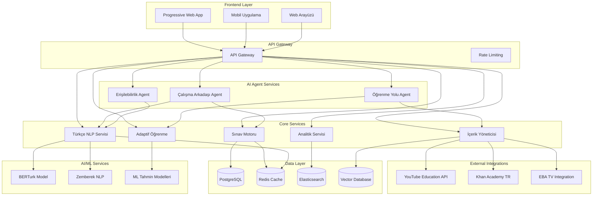

# Design Document

## Overview

Türkiye Üniversite Sınavları Hazırlık Platformu, YKS (TYT/AYT/YDT) sınavlarına hazırlanan öğrenciler için özel olarak tasarlanmış kapsamlı bir AI destekli eğitim sistemidir. Platform, ÖSYM ve MEB müfredatına tam uyumluluk sağlayarak, Türkçe NLP desteği, adaptif öğrenme algoritmaları ve KVKK uyumlu veri yönetimi ile öğrencilere kişiselleştirilmiş eğitim deneyimi sunar.

Sistem beş ana bileşen etrafında tasarlanmıştır: **Sınav Motoru** (ÖSYM formatında deneme sınavları), **Türkçe AI Asistan** (doğal dil işleme ve sohbet desteği), **Adaptif Öğrenme Sistemi** (kişiselleştirilmiş içerik sunumu), **İçerik Yönetimi** (çoklu platform entegrasyonu), ve **Devrimsel AI Özellikler Sistemi** (7 dünya çapında yenilikçi teknoloji).

## Architecture

### High-Level Architecture


    bionic_words.append(word)
                continue
            
            # Zemberek ile kök ve ek analizi
            try:
                analysis = await self.zemberek.analyze(clean_word)
                
                if analysis and analysis.root:
                    root = analysis.root
                    suffixes = ''.join(analysis.suffixes) if analysis.suffixes else ''
                    
                    # KÖKÜN ilk %40'ı bold (İngilizce'den farklı!)
                    bold_length = max(
                        self.bionic_rules["min_bold_chars"],
                        min(
                            self.bionic_rules["max_bold_chars"],
                            int(len(root) * self.bionic_rules["root_bold_ratio"])
                        )
                    )
                    
                    # Türkçe'ye özel: Ekler hiç bold yapılmaz
                    bionic_word = (
                        f"**{root[:bold_length]}**{root[bold_length:]}{suffixes}{punctuation}"
                    )
                    
                else:
                    # Analiz başarısızsa basit bold uygula
                    bold_length = max(2, len(clean_word) // 3)
                    bionic_word = f"**{clean_word[:bold_length]}**{clean_word[bold_length:]}{punctuation}"
                
                bionic_words.append(bionic_word)
                
            except Exception:
                # Hata durumunda orijinal kelimeyi kullan
                bionic_words.append(word)
        
        return ' '.join(bionic_words)
    
    def _separate_punctuation(self, word: str) -> Tuple[str, str]:
        """Kelime ve noktalama işaretlerini ayır"""
        punctuation = ''
        clean_word = word
        
        # Sondaki noktalama işaretlerini ayır
        while clean_word and clean_word[-1] in '.,!?;:':
            punctuation = clean_word[-1] + punctuation
            clean_word = clean_word[:-1]
        
        return clean_word, punctuation

# Örnek kullanım:
# Normal: "Çocuklar bahçede oynuyorlar"
# Bionic: "**Çoc**uklar **bah**çede **oyn**uyorlar"
```

### 7. Blackboard Pattern ile Gerçek Zamanlı İletişim

**Amaç**: Multi-agent sistemde gerçek zamanlı bilgi paylaşımı ve koordinasyon

**Teknik Detaylar**:
```python
class MultiAgentBlackboard:
    """Her ajan diğerlerinin keşiflerinden ANINDA haberdar!"""
    
    def __init__(self):
        self.blackboard = {}  # Merkezi bilgi tahtası
        self.subscribers = {}  # Agent abonelikleri
        self.event_history = []  # Olay geçmişi
        
        # Agent referansları
        self.learning_path_agent = None
        self.study_buddy_agent = None
        self.accessibility_agent = None
    
    def register_agent(self, agent_name: str, agent_instance):
        """Agent'ı sisteme kaydet"""
        setattr(self, f"{agent_name}_agent", agent_instance)
        self.subscribers[agent_name] = []
    
    def subscribe(self, agent_name: str, event_type: str):
        """Agent'ı belirli olay tipine abone et"""
        if agent_name not in self.subscribers:
            self.subscribers[agent_name] = []
        self.subscribers[agent_name].append(event_type)
    
    async def write(self, key: str, value: Any, agent_name: str):
        """Blackboard'a veri yaz ve diğer agent'ları bilgilendir"""
        
        # Veriyi yaz
        self.blackboard[key] = {
            "value": value,
            "timestamp": datetime.now(),
            "source_agent": agent_name
        }
        
        # Olay geçmişine ekle
        event = {
            "type": "data_written",
            "key": key,
            "value": value,
            "agent": agent_name,
            "timestamp": datetime.now()
        }
        self.event_history.append(event)
        
        # Abone agent'ları bilgilendir
        await self._notify_subscribers(key, value, agent_name)
    
    def read(self, key: str) -> Any:
        """Blackboard'dan veri oku"""
        data = self.blackboard.get(key)
        return data["value"] if data else None
    
    async def _notify_subscribers(self, key: str, value: Any, source_agent: str):
        """Abone agent'ları bilgilendir"""
        
        for agent_name, subscriptions in self.subscribers.items():
            if agent_name != source_agent and key in subscriptions:
                # Agent'a bildirim gönder
                await self._send_notification(agent_name, key, value, source_agent)
    
    async def _send_notification(self, agent_name: str, key: str, value: Any, source_agent: str):
        """Belirli agent'a bildirim gönder"""
        
        agent = getattr(self, f"{agent_name}_agent", None)
        if agent and hasattr(agent, 'on_blackboard_update'):
            await agent.on_blackboard_update(key, value, source_agent)
    
    async def agent_synergy_example(self, student_id: str) -> Dict[str, Any]:
        """Agent sinerji örneği - koordineli çalışma"""
        
        # Learning Path Agent keşif yapıyor
        learning_style = await self.learning_path_agent.detect_style(student_id)
        
        # SONUÇ: "Bu öğrenci görsel öğreniyor"
        await self.write("learning_style", "visual", "learning_path")
        await self.write("student_profile", {"id": student_id, "style": "visual"}, "learning_path")
        
        # Study Buddy HEMEN okuyor ve adapte oluyor
        if self.read(f"learning_style_{student_id}") == "visual":
            # Sorulara DİYAGRAM ekle
            visual_question = await self.study_buddy_agent.generate_visual_question(student_id)
            await self.write("visual_content_ready", True, "study_buddy")
        
        # Accessibility Agent de okuyor
        if self.read(f"learning_style_{student_id}") == "visual":
            # Metin yerine İNFOGRAFİK hazırla
            infographic = await self.accessibility_agent.create_infographic(student_id)
            await self.write("accessible_visual_content", infographic, "accessibility")
        
        # ÜÇÜ BİRDEN koordineli çalışıyor!
        synergy_result = {
            'learning_path': await self._get_visual_curriculum(student_id),
            'practice_questions': await self._get_visual_questions(student_id),
            'accessible_content': self.read("accessible_visual_content")
        }
        
        return synergy_result
    
    async def real_time_adaptation_example(self, student_id: str, performance_data: Dict):
        """Gerçek zamanlı adaptasyon örneği"""
        
        # Performans verisi blackboard'a yazılıyor
        await self.write(f"performance_{student_id}", performance_data, "exam_engine")
        
        # Learning Path Agent ANINDA tepki veriyor
        if performance_data.get("weak_areas"):
            new_resources = await self.learning_path_agent.find_remedial_resources(
                student_id, performance_data["weak_areas"]
            )
            await self.write(f"remedial_resources_{student_id}", new_resources, "learning_path")
        
        # Study Buddy Agent zorluk seviyesini ayarlıyor
        if performance_data.get("success_rate", 0) < 0.6:
            await self.study_buddy_agent.decrease_difficulty(student_id)
            await self.write(f"difficulty_adjusted_{student_id}", "decreased", "study_buddy")
        
        # Accessibility Agent içerik basitleştiriyor
        if performance_data.get("comprehension_issues"):
            simplified_content = await self.accessibility_agent.simplify_for_student(
                student_id, performance_data["difficult_content"]
            )
            await self.write(f"simplified_content_{student_id}", simplified_content, "accessibility")
        
        return {
            "adaptation_applied": True,
            "agents_coordinated": 3,
            "response_time_ms": (datetime.now() - performance_data["timestamp"]).total_seconds() * 1000
        }
```

## Components and Interfaces

### 1. ÖSYM Uyumlu Sınav Motoru

**Amaç**: YKS (TYT/AYT/YDT) sınavlarına tam uyumlu deneme sınavları ve performans analizi sistemi

**Requirements Karşılama**: Gereksinim 1 - ÖSYM Uyumlu Sınav Sistemi

**Mimari Kararlar**:
- **Otomatik Kaydetme**: 30 saniye aralıklarla otomatik kayıt (Requirement 1.6)
- **Performans Analizi**: Gerçek zamanlı konu bazlı analiz (Requirements 1.4, 1.5)
- **Teknik Sorun Yönetimi**: Session-based recovery mekanizması (Requirement 1.6)

**Teknik Detaylar**:
```python
from enum import Enum
from typing import Dict, List, Any, Optional
from datetime import datetime
from pydantic import BaseModel

class ExamType(Enum):
    """ÖSYM sınav türleri"""
    TYT = "TYT"  # Temel Yeterlilik Testi - 120 soru, 165 dakika
    AYT = "AYT"  # Alan Yeterlilik Testi - 160 soru, 210 dakika  
    YDT = "YDT"  # Yabancı Dil Testi - 80 soru, 120 dakika

class OSYMExamEngine:
    """ÖSYM formatında sınav motoru - Requirements 1.1, 1.2, 1.3"""
    
    def __init__(self):
        self.exam_formats = {
            ExamType.TYT: {
                "question_count": 120,
                "duration_minutes": 165,
                "subjects": ["Türkçe", "Matematik", "Fen Bilimleri", "Sosyal Bilimler"],
                "subject_distribution": {"Türkçe": 40, "Matematik": 36, "Fen": 20, "Sosyal": 24}
            },
            ExamType.AYT: {
                "question_count": 160, 
                "duration_minutes": 210,
                "subjects": ["Matematik", "Fen Bilimleri", "Türk Dili ve Edebiyatı", "Sosyal Bilimler"],
                "subject_distribution": {"Matematik": 40, "Fen": 40, "Türk Dili": 24, "Sosyal": 44, "Felsefe": 12}
            },
            ExamType.YDT: {
                "question_count": 80,
                "duration_minutes": 120,
                "subjects": ["İngilizce", "Almanca", "Fransızca", "Rusça", "Arapça"],
                "subject_distribution": {"Yabancı Dil": 80}
            }
        }
        self.auto_save_interval = 30  # Requirement 1.6 - otomatik kaydetme
    
    async def start_exam(
        self,
        student_id: str,
        exam_type: str,
        adaptive_mode: bool = True
    ) -> ExamSession:
        """ÖSYM formatında sınav başlat"""
        
        # Sınav formatını al
        format_config = self.exam_formats[exam_type]
        
        # Adaptif mod aktifse IRT ile soru seçimi
        if adaptive_mode:
            questions = await self._select_adaptive_questions(
                student_id, exam_type, format_config["question_count"]
            )
        else:
            questions = await self._select_standard_questions(
                exam_type, format_config["question_count"]
            )
        
        # Sınav oturumu oluştur
        session = ExamSession(
            student_id=student_id,
            exam_type=exam_type,
            questions=questions,
            duration=format_config["duration_minutes"],
            start_time=datetime.now(),
            auto_save_interval=30  # 30 saniyede bir otomatik kaydet
        )
        
        return session
    
    async def analyze_performance(
        self,
        session: ExamSession
    ) -> PerformanceAnalysis:
        """Detaylı performans analizi"""
        
        # Konu bazlı başarı analizi
        subject_scores = await self._calculate_subject_scores(session)
        
        # Zayıf konuları tespit et (Requirement 1.5)
        weak_areas = await self._identify_weak_areas(subject_scores)
        
        # Özel çalışma önerileri (Requirement 1.5)
        study_recommendations = await self._generate_study_recommendations(
            session.student_id, weak_areas
        )
        
        # IRT tabanlı yetenek tahmini
        ability_estimate = await self._calculate_irt_ability(session)
        
        # Ulusal ortalama ile karşılaştırma (Requirement 6.5)
        national_comparison = await self._compare_with_national_average(
            session.student_id, subject_scores
        )
        
        return PerformanceAnalysis(
            overall_score=session.calculate_total_score(),
            subject_scores=subject_scores,
            weak_areas=weak_areas,
            study_recommendations=study_recommendations,
            ability_estimate=ability_estimate,
            time_analysis=self._analyze_time_usage(session),
            difficulty_progression=self._analyze_difficulty_progression(session),
            national_comparison=national_comparison
        )
    
    async def handle_technical_issues(
        self,
        session_id: str,
        error_type: str
    ) -> Dict[str, Any]:
        """
        Teknik sorun yönetimi - Requirement 1.6
        Otomatik kaydetme ile veri kaybını önleme
        """
        recovery_data = await self._get_auto_save_data(session_id)
        
        return {
            "recovery_successful": True,
            "last_saved_time": recovery_data.get("timestamp"),
            "recovered_answers": recovery_data.get("answers", {}),
            "message": "Sınav oturumunuz kaldığı yerden devam edebilir."
        }
```

### 2. Türkçe NLP ve Sohbet Sistemi

**Amaç**: Türkçe doğal dil işleme ile öğrenci sohbet desteği ve motivasyon sistemi

**Requirements Karşılama**: Gereksinim 2 - Türkçe NLP ve Sohbet Desteği, Gereksinim 12 - Türkçe Dil İşleme

**Mimari Kararlar**:
- **Zemberek NLP**: Türkçe morfolojik analiz için (Requirements 2.1, 12.1, 12.2)
- **BERTurk**: Duygu analizi ve motivasyon tespiti (Requirement 2.4)
- **Bağlamsal Hafıza**: Sohbet geçmişi yönetimi (Requirement 2.5)
- **Türkçe Düzeltme**: Nazik dil düzeltme sistemi (Requirement 2.6)

**Teknik Detaylar**:
```python
from typing import Dict, List, Any, Optional
from datetime import datetime
from pydantic import BaseModel

class TurkishLanguageCorrection(BaseModel):
    """Türkçe dil düzeltme modeli"""
    original_text: str
    corrected_text: str
    corrections: List[Dict[str, str]]
    suggestion_type: str  # "grammar", "spelling", "style"

class ChatResponse(BaseModel):
    """Sohbet yanıt modeli"""
    message: str
    response_type: str  # "explanation", "solution", "motivation", "correction"
    educational_content: Optional[Dict[str, Any]] = None
    language_corrections: Optional[List[TurkishLanguageCorrection]] = None
    sentiment_analysis: Optional[Dict[str, float]] = None

class TurkishNLPChatSystem:
    """Türkçe NLP destekli sohbet sistemi - Requirements 2.1-2.6"""
    
    def __init__(self):
        self.zemberek = ZemberekMorphologyAnalyzer()
        self.berturk = BERTurkSentimentAnalyzer()
        self.chat_history = ChatHistoryManager()
        
        # Türkçe eğitim terminolojisi sözlüğü (Requirement 2.2)
        self.education_terms = {
            "matematik": ["cebir", "geometri", "analiz", "trigonometri", "logaritma", "integral"],
            "fizik": ["mekanik", "termodinamik", "elektrik", "optik", "kuantum", "relativite"],
            "kimya": ["organik", "inorganik", "fizikokimya", "analitik", "biyokimya"],
            "biyoloji": ["hücre", "genetik", "ekoloji", "fizyoloji", "evrim", "moleküler"],
            "türkçe": ["edebiyat", "dil bilgisi", "sözcük", "cümle", "metin", "anlam"],
            "tarih": ["osmanlı", "cumhuriyet", "atatürk", "savaş", "devrim", "medeniyet"],
            "coğrafya": ["iklim", "toprak", "nüfus", "ekonomi", "bölge", "harita"]
        }
        
        # Motivasyonel yanıt şablonları (Requirement 2.4)
        self.motivational_responses = {
            "low_confidence": [
                "Endişelenme, her zorluk aşılabilir! Adım adım ilerleyelim.",
                "Sen yapabilirsin! Birlikte bu konuyu çözeceğiz.",
                "Hatalar öğrenmenin bir parçası. Tekrar deneyelim!"
            ],
            "frustration": [
                "Anlıyorum, bu konu zor gelebilir. Farklı bir yaklaşım deneyelim.",
                "Sabırlı ol, başarı zaman alır. Sen doğru yoldasın!",
                "Bu normal bir süreç. Birlikte aşacağız!"
            ],
            "success": [
                "Harika! Çok iyi ilerliyorsun!",
                "Tebrikler! Bu başarını sürdür!",
                "Mükemmel! Bir sonraki konuya geçmeye hazırsın!"
            ]
        }
    
    async def process_student_message(
        self,
        student_id: str,
        message: str,
        context: Dict[str, Any]
    ) -> ChatResponse:
        """
        Öğrenci mesajını işle ve yanıt üret
        Requirements: 2.1, 2.2, 2.3, 2.4, 2.5, 2.6
        """
        
        # Morfolojik analiz
        morphology = await self.zemberek.analyze_text(message)
        
        # Duygu analizi
        sentiment = await self.berturk.analyze_sentiment(message)
        
        # Sohbet geçmişini al
        history = await self.chat_history.get_recent_messages(student_id, limit=10)
        
        # Mesaj tipini tespit et
        message_type = await self._classify_message_type(message, morphology)
        
        # Yanıt üret
        if message_type == "question_help":
            response = await self._generate_question_help(message, context, history)
        elif message_type == "concept_explanation":
            response = await self._generate_concept_explanation(message, context)
        elif message_type == "motivation_needed":
            response = await self._generate_motivational_response(sentiment, history)
        elif message_type == "turkish_correction":
            response = await self._generate_language_correction(message, morphology)
        else:
            response = await self._generate_general_response(message, context, history)
        
        # Yanıtı kaydet
        await self.chat_history.save_interaction(student_id, message, response)
        
        return ChatResponse(
            text=response,
            sentiment_detected=sentiment,
            message_type=message_type,
            suggestions=await self._generate_follow_up_suggestions(message_type, context)
        )
    
    async def _generate_question_help(
        self,
        question: str,
        context: Dict[str, Any],
        history: List[ChatMessage]
    ) -> str:
        """Soru çözümü yardımı üret"""
        
        # Sorunun konusunu tespit et
        subject = await self._identify_subject(question)
        
        # Adım adım çözüm üret
        solution_steps = await self._generate_step_by_step_solution(
            question, subject, context.get("difficulty_level", "medium")
        )
        
        # Türkçe eğitim terminolojisi kullan
        formatted_solution = await self._format_with_turkish_terms(
            solution_steps, subject
        )
        
        return formatted_solution
```

### 3. MEB ve ÖSYM Müfredat Uyumluluk Sistemi

**Amaç**: MEB müfredat standartları ve ÖSYM sınav formatlarına tam uyumluluk

**Teknik Detaylar**:
```python
class CurriculumComplianceSystem:
    """MEB ve ÖSYM müfredat uyumluluk sistemi"""
    
    def __init__(self):
        # MEB müfredat veritabanı
        self.meb_curriculum = MEBCurriculumDatabase()
        
        # ÖSYM sınav standartları
        self.osym_standards = OSYMExamStandards()
        
        # Konu hiyerarşisi
        self.topic_hierarchy = {
            "matematik": {
                "9_sinif": ["Kümeler", "Sayılar", "Denklemler"],
                "10_sinif": ["Fonksiyonlar", "Polinomlar", "İkinci Derece"],
                "11_sinif": ["Trigonometri", "Logaritma", "Diziler"],
                "12_sinif": ["Limit", "Türev", "İntegral"]
            }
            # Diğer dersler...
        }
    
    async def validate_content_compliance(
        self,
        content: EducationalContent
    ) -> ComplianceReport:
        """İçeriğin müfredat uyumluluğunu kontrol et"""
        
        # MEB standartları kontrolü
        meb_compliance = await self._check_meb_compliance(content)
        
        # ÖSYM format kontrolü
        osym_compliance = await self._check_osym_format(content)
        
        # Kazanım eşleştirmesi
        learning_outcomes = await self._match_learning_outcomes(content)
        
        return ComplianceReport(
            meb_compliant=meb_compliance.is_compliant,
            osym_compliant=osym_compliance.is_compliant,
            matched_outcomes=learning_outcomes,
            compliance_score=self._calculate_compliance_score(
                meb_compliance, osym_compliance
            ),
            recommendations=await self._generate_compliance_recommendations(
                content, meb_compliance, osym_compliance
            )
        )
    
    async def generate_curriculum_aligned_questions(
        self,
        subject: str,
        grade_level: str,
        topic: str,
        count: int = 1000
    ) -> List[Question]:
        """Müfredata uygun soru bankası oluştur"""
        
        # Konu kazanımlarını al
        learning_outcomes = await self.meb_curriculum.get_outcomes(
            subject, grade_level, topic
        )
        
        # ÖSYM soru formatlarını al
        question_formats = await self.osym_standards.get_question_formats(subject)
        
        # Her kazanım için sorular üret
        questions = []
        for outcome in learning_outcomes:
            outcome_questions = await self._generate_questions_for_outcome(
                outcome, question_formats, count // len(learning_outcomes)
            )
            questions.extend(outcome_questions)
        
        # ÖSYM öncelik sırasına göre düzenle
        prioritized_questions = await self._prioritize_by_osym_standards(questions)
        
        return prioritized_questions[:count]
```

### 4. Adaptif Öğrenme ve Zorluk Ayarlama Sistemi

**Amaç**: Öğrenci performansına göre dinamik zorluk ayarlama ve kişiselleştirilmiş öğrenme yolları

**Requirements Karşılama**: Gereksinim 4 - Adaptif Öğrenme ve Zorluk Ayarlama

**Mimari Kararlar**:
- **IRT Entegrasyonu**: Türkçe morfoloji farkındalıklı zorluk hesaplama (Requirement 4.5)
- **ZPD Sistemi**: Kültürel faktörlerle optimize edilmiş öğrenme aralığı (Requirements 4.3, 4.4)
- **ML Tahmin Modelleri**: Başarı tahmini için makine öğrenmesi (Requirement 4.5)
- **Gerçek Zamanlı Adaptasyon**: Performans değişikliklerine anında tepki (Requirements 4.1, 4.2)

**Teknik Detaylar**:
```python
class AdaptiveLearningSystem:
    """Adaptif öğrenme ve zorluk ayarlama sistemi"""
    
    def __init__(self):
        self.irt_engine = TurkishMorphologyAwareIRT()
        self.zpd_system = TurkishZPDSystem()
        self.learning_style_detector = HybridLearningStyleDetector()
        self.ml_predictor = StudentPerformancePredictor()
    
    async def adjust_difficulty_dynamically(
        self,
        student_id: str,
        current_performance: PerformanceData,
        subject: str
    ) -> DifficultyAdjustment:
        """Dinamik zorluk ayarlama"""
        
        # Mevcut öğrenci yeteneğini hesapla
        current_ability = await self.irt_engine.estimate_ability(
            student_id, current_performance
        )
        
        # ZPD aralığını hesapla
        zpd_range = await self.zpd_system.calculate_turkish_zpd(
            current_ability, subject, current_performance.cultural_context
        )
        
        # Öğrenme hızı analizi
        learning_velocity = await self._analyze_learning_velocity(
            student_id, current_performance.time_series_data
        )
        
        # Zorluk ayarlama kararı
        if current_performance.success_rate > 0.8:
            # Başarılı → Zorluğu artır
            new_difficulty = min(
                zpd_range.upper_bound,
                current_ability + (learning_velocity * 0.3)
            )
            adjustment_type = "increase"
        elif current_performance.success_rate < 0.4:
            # Zorlanıyor → Zorluğu azalt
            new_difficulty = max(
                zpd_range.lower_bound,
                current_ability - (learning_velocity * 0.2)
            )
            adjustment_type = "decrease"
        else:
            # Optimal aralıkta → Mevcut seviyeyi koru
            new_difficulty = zpd_range.optimal_challenge
            adjustment_type = "maintain"
        
        return DifficultyAdjustment(
            previous_difficulty=current_ability,
            new_difficulty=new_difficulty,
            adjustment_type=adjustment_type,
            zpd_range=zpd_range,
            reasoning=self._generate_adjustment_reasoning(
                current_performance, adjustment_type
            )
        )
    
    async def create_personalized_learning_path(
        self,
        student_id: str,
        target_subjects: List[str],
        time_constraint: int  # hafta cinsinden
    ) -> PersonalizedLearningPath:
        """Kişiselleştirilmiş öğrenme yolu oluştur"""
        
        # Öğrenci profilini al
        student_profile = await self._get_comprehensive_student_profile(student_id)
        
        # Zayıf konuları tespit et
        weak_areas = await self._identify_weak_areas_across_subjects(
            student_id, target_subjects
        )
        
        # Öğrenme stili tespiti
        learning_style = await self.learning_style_detector.detect_hybrid_profile(
            student_id, student_profile.behavioral_data, []
        )
        
        # ML ile başarı tahmini
        success_predictions = await self.ml_predictor.predict_success_probability(
            student_profile, target_subjects, time_constraint
        )
        
        # Öğrenme yolu optimizasyonu
        optimized_path = await self._optimize_learning_sequence(
            weak_areas, learning_style, success_predictions, time_constraint
        )
        
        return PersonalizedLearningPath(
            student_id=student_id,
            learning_sequence=optimized_path,
            estimated_completion_time=time_constraint,
            success_probability=success_predictions.overall_probability,
            adaptive_checkpoints=self._create_adaptive_checkpoints(optimized_path),
            alternative_resources=await self._suggest_alternative_resources(
                learning_style, weak_areas
            )
        )
```

### 5. Çoklu Platform İçerik Entegrasyonu

**Amaç**: YouTube Education, Khan Academy Türkçe, EBA TV gibi platformlardan kaliteli içerik entegrasyonu

**Requirements Karşılama**: Gereksinim 5 - Çoklu Platform İçerik Entegrasyonu

**Mimari Kararlar**:
- **YouTube Education API**: Eğitim kanalları filtreleme (Requirement 5.1)
- **Khan Academy Türkçe**: Yapılandırılmış kurs entegrasyonu (Requirement 5.2)
- **EBA TV Integration**: TRT EBA TV video linkleri (Requirement 5.3)
- **Unified Ranking**: Kalite ve uygunluk skorlaması (Requirement 5.4)
- **Metadata Enrichment**: Süre, zorluk, erişilebilirlik özellikleri (Requirement 5.5)

**Teknik Detaylar**:
```python
class MultiPlatformContentIntegration:
    """Çoklu platform içerik entegrasyon sistemi"""
    
    def __init__(self):
        self.youtube_service = YouTubeEducationService()
        self.khan_academy_service = KhanAcademyTurkishService()
        self.eba_tv_service = EBATVService()
        self.content_ranker = UnifiedResourceRanker()
    
    async def search_educational_content(
        self,
        query: str,
        subject: str,
        grade_level: str,
        student_profile: StudentProfile
    ) -> IntegratedContentResults:
        """Tüm platformlarda eğitim içeriği ara"""
        
        # Paralel platform araması
        youtube_results = await self.youtube_service.search_educational_videos(
            query, subject, grade_level
        )
        
        khan_results = await self.khan_academy_service.search_turkish_courses(
            query, subject, grade_level
        )
        
        eba_results = await self.eba_tv_service.search_content(
            query, subject, grade_level
        )
        
        # İçerikleri birleştir ve filtrele
        all_content = youtube_results + khan_results + eba_results
        
        # Kalite ve uygunluk skorlaması
        scored_content = await self.content_ranker.rank_resources(
            all_content, student_profile, query
        )
        
        # Meta veri zenginleştirme
        enriched_content = await self._enrich_content_metadata(scored_content)
        
        return IntegratedContentResults(
            total_results=len(enriched_content),
            youtube_count=len(youtube_results),
            khan_academy_count=len(khan_results),
            eba_tv_count=len(eba_results),
            ranked_content=enriched_content[:50],  # İlk 50 sonuç
            search_metadata={
                "query": query,
                "subject": subject,
                "grade_level": grade_level,
                "personalization_applied": True
            }
        )
    
    async def _enrich_content_metadata(
        self,
        content_list: List[EducationalContent]
    ) -> List[EnrichedContent]:
        """İçerik meta verilerini zenginleştir"""
        
        enriched = []
        for content in content_list:
            # Süre analizi
            duration_analysis = await self._analyze_content_duration(content)
            
            # Zorluk seviyesi tespiti
            difficulty_level = await self._assess_content_difficulty(content)
            
            # Erişilebilirlik özellikleri
            accessibility_features = await self._check_accessibility_features(content)
            
            # Türkçe içerik kalitesi
            turkish_quality = await self._assess_turkish_content_quality(content)
            
            enriched_content = EnrichedContent(
                original_content=content,
                duration_minutes=duration_analysis.total_minutes,
                difficulty_score=difficulty_level.score,
                accessibility_score=accessibility_features.score,
                turkish_quality_score=turkish_quality.score,
                recommended_age_range=difficulty_level.age_range,
                subtitles_available=accessibility_features.has_subtitles,
                transcript_available=accessibility_features.has_transcript,
                interactive_elements=content.interactive_features
            )
            
            enriched.append(enriched_content)
        
        return enriched

### EBA TV Entegrasyonu

**Amaç**: TRT EBA TV eğitim içeriklerinin platform entegrasyonu

**Teknik Detaylar**:
```python
class EBATVIntegrationService:
    """EBA TV entegrasyon servisi"""
    
    def __init__(self):
        self.eba_api_client = EBATVAPIClient()
        self.content_cache = EBAContentCache()
        self.quality_assessor = EBAContentQualityAssessor()
    
    async def search_eba_content(
        self,
        query: str,
        subject: str,
        grade_level: str,
        content_type: str = "video"
    ) -> List[EBAContent]:
        """EBA TV içerik arama"""
        
        # Cache kontrolü
        cache_key = f"eba_search_{query}_{subject}_{grade_level}_{content_type}"
        cached_results = await self.content_cache.get(cache_key)
        
        if cached_results:
            return cached_results
        
        # EBA TV API'den içerik çekme
        search_params = {
            "query": query,
            "subject": self._map_subject_to_eba(subject),
            "grade": self._map_grade_to_eba(grade_level),
            "type": content_type,
            "language": "tr"
        }
        
        eba_results = await self.eba_api_client.search_content(search_params)
        
        # İçerik kalite değerlendirmesi
        quality_scored_results = []
        for content in eba_results:
            quality_score = await self.quality_assessor.assess_content_quality(content)
            
            eba_content = EBAContent(
                id=content["id"],
                title=content["title"],
                description=content["description"],
                video_url=content["video_url"],
                thumbnail_url=content["thumbnail_url"],
                duration_seconds=content["duration"],
                subject=subject,
                grade_level=grade_level,
                quality_score=quality_score,
                view_count=content.get("view_count", 0),
                educational_value=quality_score.educational_value,
                technical_quality=quality_score.technical_quality,
                curriculum_alignment=quality_score.curriculum_alignment
            )
            
            quality_scored_results.append(eba_content)
        
        # Kalite skoruna göre sırala
        sorted_results = sorted(
            quality_scored_results, 
            key=lambda x: x.quality_score.overall_score, 
            reverse=True
        )
        
        # Cache'e kaydet
        await self.content_cache.set(cache_key, sorted_results, ttl=3600)  # 1 saat
        
        return sorted_results
    
    async def get_eba_video_metadata(
        self,
        video_id: str
    ) -> EBAVideoMetadata:
        """EBA video detaylı meta veri"""
        
        video_details = await self.eba_api_client.get_video_details(video_id)
        
        # Erişilebilirlik özellikleri kontrolü
        accessibility_features = await self._check_eba_accessibility(video_details)
        
        # Türkçe içerik kalitesi analizi
        turkish_quality = await self._analyze_turkish_content_quality(video_details)
        
        return EBAVideoMetadata(
            video_id=video_id,
            title=video_details["title"],
            description=video_details["description"],
            duration_seconds=video_details["duration"],
            upload_date=datetime.fromisoformat(video_details["upload_date"]),
            view_count=video_details["view_count"],
            like_count=video_details.get("like_count", 0),
            has_subtitles=accessibility_features.has_subtitles,
            has_transcript=accessibility_features.has_transcript,
            audio_quality=turkish_quality.audio_quality,
            speech_clarity=turkish_quality.speech_clarity,
            educational_structure=turkish_quality.educational_structure,
            curriculum_tags=video_details.get("curriculum_tags", []),
            difficulty_level=await self._assess_eba_difficulty(video_details),
            recommended_age_range=video_details.get("age_range", "12-18")
        )
    
    def _map_subject_to_eba(self, subject: str) -> str:
        """Platform konularını EBA formatına çevir"""
        subject_mapping = {
            "matematik": "mathematics",
            "fizik": "physics", 
            "kimya": "chemistry",
            "biyoloji": "biology",
            "türkçe": "turkish_language",
            "tarih": "history",
            "coğrafya": "geography",
            "felsefe": "philosophy"
        }
        return subject_mapping.get(subject.lower(), subject)
    
    def _map_grade_to_eba(self, grade_level: str) -> str:
        """Sınıf seviyesini EBA formatına çevir"""
        grade_mapping = {
            "9": "grade_9",
            "10": "grade_10", 
            "11": "grade_11",
            "12": "grade_12"
        }
        return grade_mapping.get(grade_level, f"grade_{grade_level}")

### WebSocket Gerçek Zamanlı İletişim Sistemi

**Amaç**: Agent koordinasyonu ve gerçek zamanlı öğrenci etkileşimi için WebSocket desteği

**Teknik Detaylar**:
```python
class RealTimeWebSocketSystem:
    """Gerçek zamanlı WebSocket iletişim sistemi"""
    
    def __init__(self):
        self.connection_manager = WebSocketConnectionManager()
        self.blackboard = MultiAgentBlackboard()
        self.message_router = WebSocketMessageRouter()
        self.heartbeat_manager = HeartbeatManager()
    
    async def handle_websocket_connection(
        self,
        websocket: WebSocket,
        student_id: str
    ) -> None:
        """WebSocket bağlantısı yönetimi"""
        
        # Bağlantıyı kabul et
        await websocket.accept()
        
        # Bağlantıyı kaydet
        await self.connection_manager.add_connection(student_id, websocket)
        
        # Heartbeat başlat
        heartbeat_task = asyncio.create_task(
            self.heartbeat_manager.start_heartbeat(websocket, student_id)
        )
        
        try:
            while True:
                # Mesaj bekle
                message = await websocket.receive_text()
                message_data = json.loads(message)
                
                # Mesajı işle
                response = await self.message_router.route_message(
                    message_data, student_id, websocket
                )
                
                # Yanıt gönder
                if response:
                    await websocket.send_text(json.dumps(response))
                    
        except WebSocketDisconnect:
            # Bağlantı koptuğunda temizlik
            await self._handle_disconnect(student_id, websocket)
        except Exception as e:
            # Hata durumunda bağlantıyı kapat
            await self._handle_error(student_id, websocket, e)
        finally:
            # Heartbeat'i durdur
            heartbeat_task.cancel()
    
    async def broadcast_agent_coordination(
        self,
        coordination_data: Dict[str, Any],
        target_students: List[str] = None
    ) -> BroadcastResult:
        """Agent koordinasyon mesajını yayınla"""
        
        broadcast_message = {
            "type": "agent_coordination",
            "timestamp": datetime.now().isoformat(),
            "data": coordination_data
        }
        
        # Hedef öğrenciler belirtilmemişse tüm aktif bağlantılara gönder
        if target_students is None:
            target_connections = await self.connection_manager.get_all_active_connections()
        else:
            target_connections = await self.connection_manager.get_connections_by_students(
                target_students
            )
        
        # Paralel broadcast
        broadcast_tasks = []
        for student_id, websocket in target_connections.items():
            task = asyncio.create_task(
                self._send_coordination_message(websocket, broadcast_message, student_id)
            )
            broadcast_tasks.append(task)
        
        # Tüm gönderim sonuçlarını bekle
        results = await asyncio.gather(*broadcast_tasks, return_exceptions=True)
        
        # Sonuçları analiz et
        successful_sends = len([r for r in results if r is True])
        failed_sends = len([r for r in results if r is not True])
        
        return BroadcastResult(
            total_targets=len(target_connections),
            successful_sends=successful_sends,
            failed_sends=failed_sends,
            broadcast_time_ms=self._calculate_broadcast_time(),
            message_type="agent_coordination"
        )
    
    async def handle_real_time_adaptation(
        self,
        student_id: str,
        adaptation_trigger: AdaptationTrigger
    ) -> None:
        """Gerçek zamanlı adaptasyon işleme"""
        
        start_time = time.time()
        
        # Blackboard'a adaptasyon tetikleyicisini yaz
        await self.blackboard.write(
            f"adaptation_trigger_{student_id}",
            adaptation_trigger,
            "websocket_system"
        )
        
        # Agentların tepkisini bekle (maksimum 100ms)
        adaptation_responses = await asyncio.wait_for(
            self._collect_agent_responses(student_id, adaptation_trigger),
            timeout=0.1  # 100ms timeout
        )
        
        # Koordineli adaptasyon sonucunu öğrenciye gönder
        adaptation_result = {
            "type": "real_time_adaptation",
            "student_id": student_id,
            "trigger": adaptation_trigger.dict(),
            "agent_responses": adaptation_responses,
            "response_time_ms": (time.time() - start_time) * 1000,
            "timestamp": datetime.now().isoformat()
        }
        
        # Öğrenciye WebSocket ile gönder
        websocket = await self.connection_manager.get_connection(student_id)
        if websocket:
            await websocket.send_text(json.dumps(adaptation_result))
    
    async def _collect_agent_responses(
        self,
        student_id: str,
        trigger: AdaptationTrigger
    ) -> Dict[str, Any]:
        """Agent yanıtlarını topla"""
        
        responses = {}
        
        # Learning Path Agent yanıtı
        if trigger.affects_learning_path:
            learning_response = await self.blackboard.read(f"learning_adaptation_{student_id}")
            if learning_response:
                responses["learning_path_agent"] = learning_response
        
        # Study Buddy Agent yanıtı
        if trigger.affects_difficulty:
            study_response = await self.blackboard.read(f"difficulty_adaptation_{student_id}")
            if study_response:
                responses["study_buddy_agent"] = study_response
        
        # Accessibility Agent yanıtı
        if trigger.affects_accessibility:
            accessibility_response = await self.blackboard.read(f"accessibility_adaptation_{student_id}")
            if accessibility_response:
                responses["accessibility_agent"] = accessibility_response
        
        return responses
    
    async def ensure_connection_reliability(
        self,
        student_id: str
    ) -> ConnectionStatus:
        """Bağlantı güvenilirliği sağla"""
        
        websocket = await self.connection_manager.get_connection(student_id)
        
        if not websocket:
            return ConnectionStatus(
                connected=False,
                reconnection_needed=True,
                last_seen=None
            )
        
        # Bağlantı sağlığını test et
        try:
            # Ping gönder
            await websocket.ping()
            
            # Pong yanıtını bekle (5 saniye timeout)
            await asyncio.wait_for(websocket.pong(), timeout=5.0)
            
            return ConnectionStatus(
                connected=True,
                reconnection_needed=False,
                last_seen=datetime.now(),
                latency_ms=await self._measure_latency(websocket)
            )
            
        except (asyncio.TimeoutError, ConnectionClosed):
            # Bağlantı kopmuş, yeniden bağlantı gerekli
            await self.connection_manager.remove_connection(student_id)
            
            return ConnectionStatus(
                connected=False,
                reconnection_needed=True,
                last_seen=await self.connection_manager.get_last_seen(student_id),
                reconnection_attempts=await self._get_reconnection_attempts(student_id)
            )
    
    async def _handle_disconnect(
        self,
        student_id: str,
        websocket: WebSocket
    ) -> None:
        """Bağlantı kopma işleme"""
        
        # Bağlantıyı kaldır
        await self.connection_manager.remove_connection(student_id)
        
        # Agentları bilgilendir
        await self.blackboard.write(
            f"student_disconnected_{student_id}",
            {"timestamp": datetime.now(), "reason": "websocket_disconnect"},
            "websocket_system"
        )
        
        # Otomatik yeniden bağlantı için hazırlık
        await self.connection_manager.prepare_reconnection(student_id)
    
    async def _send_coordination_message(
        self,
        websocket: WebSocket,
        message: Dict[str, Any],
        student_id: str
    ) -> bool:
        """Koordinasyon mesajı gönder"""
        
        try:
            await websocket.send_text(json.dumps(message))
            return True
        except Exception as e:
            # Gönderim hatası, bağlantıyı temizle
            await self.connection_manager.remove_connection(student_id)
            return False

class WebSocketConnectionManager:
    """WebSocket bağlantı yöneticisi"""
    
    def __init__(self):
        self.active_connections: Dict[str, WebSocket] = {}
        self.connection_metadata: Dict[str, ConnectionMetadata] = {}
    
    async def add_connection(
        self,
        student_id: str,
        websocket: WebSocket
    ) -> None:
        """Yeni bağlantı ekle"""
        
        self.active_connections[student_id] = websocket
        self.connection_metadata[student_id] = ConnectionMetadata(
            student_id=student_id,
            connected_at=datetime.now(),
            last_activity=datetime.now(),
            message_count=0
        )
    
    async def remove_connection(self, student_id: str) -> None:
        """Bağlantıyı kaldır"""
        
        if student_id in self.active_connections:
            del self.active_connections[student_id]
        
        if student_id in self.connection_metadata:
            # Bağlantı geçmişini güncelle
            metadata = self.connection_metadata[student_id]
            metadata.disconnected_at = datetime.now()
            metadata.session_duration = (
                metadata.disconnected_at - metadata.connected_at
            ).total_seconds()
    
    async def get_connection(self, student_id: str) -> Optional[WebSocket]:
        """Öğrenci bağlantısını al"""
        return self.active_connections.get(student_id)
    
    async def get_all_active_connections(self) -> Dict[str, WebSocket]:
        """Tüm aktif bağlantıları al"""
        return self.active_connections.copy()
    
    async def update_activity(self, student_id: str) -> None:
        """Öğrenci aktivitesini güncelle"""
        
        if student_id in self.connection_metadata:
            metadata = self.connection_metadata[student_id]
            metadata.last_activity = datetime.now()
            metadata.message_count += 1
```
```
```

### 6. Öğretmen ve Veli Takip Sistemi

**Amaç**: Öğretmen sınıf yönetimi ve veli takip sistemi

**Teknik Detaylar**:
```python
class TeacherParentTrackingSystem:
    """Öğretmen ve veli takip sistemi"""
    
    def __init__(self):
        self.analytics_engine = StudentAnalyticsEngine()
        self.report_generator = ProgressReportGenerator()
        self.notification_service = NotificationService()
    
    async def generate_teacher_dashboard(
        self,
        teacher_id: str,
        class_id: str
    ) -> TeacherDashboard:
        """Öğretmen dashboard'u oluştur"""
        
        # Sınıf öğrenci listesi
        students = await self._get_class_students(class_id)
        
        # Her öğrenci için güncel ilerleme
        student_progress = []
        for student in students:
            progress = await self.analytics_engine.get_current_progress(student.id)
            student_progress.append({
                "student": student,
                "progress": progress,
                "last_activity": progress.last_activity_date,
                "weak_areas": progress.identified_weak_areas,
                "strength_areas": progress.strength_areas
            })
        
        # Sınıf geneli performans analizi
        class_analytics = await self._analyze_class_performance(student_progress)
        
        # Konu bazlı başarı dağılımı
        subject_distribution = await self._calculate_subject_success_distribution(
            student_progress
        )
        
        return TeacherDashboard(
            class_info=await self._get_class_info(class_id),
            student_progress=student_progress,
            class_analytics=class_analytics,
            subject_distribution=subject_distribution,
            recent_activities=await self._get_recent_class_activities(class_id),
            recommended_actions=await self._generate_teacher_recommendations(
                class_analytics, subject_distribution
            )
        )
    
    async def create_assignment(
        self,
        teacher_id: str,
        class_id: str,
        assignment_config: AssignmentConfig
    ) -> Assignment:
        """ÖSYM müfredatına uygun ödev oluştur"""
        
        # Müfredat uyumlu soru seçimi
        curriculum_questions = await self._select_curriculum_aligned_questions(
            assignment_config.subject,
            assignment_config.grade_level,
            assignment_config.topics,
            assignment_config.question_count
        )
        
        # Öğrenci seviyelerine göre adaptasyon
        if assignment_config.adaptive_mode:
            adapted_questions = await self._adapt_questions_to_class_levels(
                curriculum_questions, class_id
            )
        else:
            adapted_questions = curriculum_questions
        
        # Ödev oluştur
        assignment = Assignment(
            teacher_id=teacher_id,
            class_id=class_id,
            title=assignment_config.title,
            description=assignment_config.description,
            questions=adapted_questions,
            due_date=assignment_config.due_date,
            auto_grading=True,
            detailed_feedback=True
        )
        
        # Öğrencilere bildirim gönder
        await self.notification_service.notify_assignment_created(assignment)
        
        return assignment
    
    async def generate_parent_weekly_report(
        self,
        parent_id: str,
        student_id: str
    ) -> ParentWeeklyReport:
        """Veli haftalık raporu oluştur"""
        
        # Son haftalık aktivite
        weekly_activity = await self.analytics_engine.get_weekly_activity(student_id)
        
        # İlerleme karşılaştırması
        progress_comparison = await self._compare_with_benchmarks(
            student_id, weekly_activity
        )
        
        # Güçlü ve zayıf yönler
        strengths_weaknesses = await self._analyze_strengths_weaknesses(
            student_id, weekly_activity
        )
        
        # Öneriler
        parent_recommendations = await self._generate_parent_recommendations(
            weekly_activity, strengths_weaknesses
        )
        
        return ParentWeeklyReport(
            student_name=await self._get_student_name(student_id),
            report_period=weekly_activity.period,
            study_time_total=weekly_activity.total_study_minutes,
            exams_completed=weekly_activity.exams_completed,
            questions_solved=weekly_activity.questions_solved,
            success_rate=weekly_activity.overall_success_rate,
            subject_breakdown=weekly_activity.subject_breakdown,
            progress_comparison=progress_comparison,
            strengths=strengths_weaknesses.strengths,
            areas_for_improvement=strengths_weaknesses.weaknesses,
            recommendations=parent_recommendations,
            teacher_notes=await self._get_teacher_notes(student_id, weekly_activity.period)
        )
```

### 7. Yüksek Performans ve Ölçeklenebilirlik Sistemi

**Amaç**: 100,000+ eşzamanlı kullanıcı desteği ve 200ms altı yanıt süresi

**Requirements Karşılama**: Gereksinim 7 - Yüksek Performans ve Ölçeklenebilirlik

**Mimari Kararlar**:
- **Redis Cluster**: Dağıtık önbellek sistemi (Requirements 7.1, 7.2)
- **Connection Pooling**: PostgreSQL bağlantı havuzu optimizasyonu (Requirement 7.2)
- **Auto-Scaling**: Otomatik ölçeklendirme mekanizması (Requirement 7.6)
- **Rate Limiting**: API hız sınırlama sistemi (Requirements 7.1, 7.2)
- **UTF-8 Encoding**: Türkçe karakter desteği (Requirement 7.4)
- **Responsive Design**: Mobil uyumluluk (Requirement 7.5)

**Teknik Detaylar**:
```python
class HighPerformanceScalabilitySystem:
    """Yüksek performans ve ölçeklenebilirlik sistemi"""
    
    def __init__(self):
        self.redis_cluster = RedisClusterManager()
        self.db_pool = PostgreSQLConnectionPool(max_connections=100)
        self.load_balancer = LoadBalancerManager()
        self.auto_scaler = AutoScalingManager()
    
    async def handle_high_concurrency_request(
        self,
        request: APIRequest,
        user_context: UserContext
    ) -> APIResponse:
        """Yüksek eşzamanlılık isteği işleme"""
        
        start_time = time.time()
        
        # Rate limiting kontrolü
        if not await self._check_rate_limit(user_context.user_id):
            return APIResponse(
                status=429,
                message="Rate limit exceeded",
                response_time_ms=0
            )
        
        # Cache kontrolü
        cache_key = self._generate_cache_key(request)
        cached_response = await self.redis_cluster.get(cache_key)
        
        if cached_response:
            response_time = (time.time() - start_time) * 1000
            return APIResponse(
                data=cached_response,
                status=200,
                response_time_ms=response_time,
                cache_hit=True
            )
        
        # Database connection pool kullanımı
        async with self.db_pool.acquire() as connection:
            # İsteği işle
            result = await self._process_request(request, connection, user_context)
        
        # Sonucu cache'le
        await self.redis_cluster.setex(
            cache_key, 
            300,  # 5 dakika TTL
            result
        )
        
        response_time = (time.time() - start_time) * 1000
        
        # P95 yanıt süresi kontrolü
        if response_time > 200:
            await self._trigger_performance_alert(request, response_time)
        
        return APIResponse(
            data=result,
            status=200,
            response_time_ms=response_time,
            cache_hit=False
        )
    
    async def auto_scale_system(
        self,
        current_metrics: SystemMetrics
    ) -> ScalingDecision:
        """Otomatik sistem ölçeklendirme"""
        
        # Sistem kapasitesi kontrolü
        cpu_usage = current_metrics.cpu_usage_percent
        memory_usage = current_metrics.memory_usage_percent
        active_connections = current_metrics.active_connections
        
        scaling_needed = False
        scaling_direction = None
        
        # Ölçeklendirme kararı
        if cpu_usage > 80 or memory_usage > 80 or active_connections > 80000:
            scaling_needed = True
            scaling_direction = "up"
            
        elif cpu_usage < 30 and memory_usage < 30 and active_connections < 20000:
            scaling_needed = True
            scaling_direction = "down"
        
        if scaling_needed:
            # Otomatik ölçeklendirme tetikle
            scaling_result = await self.auto_scaler.scale(
                direction=scaling_direction,
                factor=1.5 if scaling_direction == "up" else 0.7
            )
            
            return ScalingDecision(
                action_taken=True,
                direction=scaling_direction,
                new_instance_count=scaling_result.new_instance_count,
                estimated_capacity=scaling_result.estimated_capacity,
                reasoning=f"CPU: {cpu_usage}%, Memory: {memory_usage}%, Connections: {active_connections}"
            )
        
        return ScalingDecision(action_taken=False)
    
    async def ensure_turkish_encoding(
        self,
        text_data: str
    ) -> str:
        """Türkçe karakter UTF-8 encoding garantisi"""
        
        # UTF-8 encoding kontrolü
        try:
            # Türkçe karakterleri test et
            turkish_chars = "çğıöşüÇĞIÖŞÜ"
            test_text = f"{text_data} {turkish_chars}"
            
            # UTF-8 encode/decode testi
            encoded = test_text.encode('utf-8')
            decoded = encoded.decode('utf-8')
            
            if decoded == test_text:
                return text_data
            else:
                # Encoding sorunu varsa düzelt
                return self._fix_turkish_encoding(text_data)
                
        except UnicodeError:
            # Encoding hatası durumunda düzeltme
            return self._fix_turkish_encoding(text_data)
```

### 8. PWA ve Offline Çalışma Sistemi

**Amaç**: Progressive Web App desteği ve offline çalışma kabiliyeti

**Requirements Karşılama**: Gereksinim 8 - Offline Çalışma ve PWA Desteği

**Mimari Kararlar**:
- **Offline Storage**: İndirilen içeriklerin yerel depolanması (Requirement 8.1)
- **Native App Experience**: PWA ile native uygulama deneyimi (Requirement 8.2)
- **Local Data Management**: Offline soru çözme ve yerel saklama (Requirement 8.3)
- **Auto Synchronization**: Bağlantı geri geldiğinde otomatik senkronizasyon (Requirement 8.4)
- **Update Notifications**: Offline içerik güncellemeleri için bildirimler (Requirement 8.5)

**Teknik Detaylar**:
```python
class PWAOfflineSystem:
    """PWA ve offline çalışma sistemi"""
    
    def __init__(self):
        self.offline_storage = OfflineStorageManager()
        self.sync_manager = DataSynchronizationManager()
        self.pwa_manager = PWAManager()
    
    async def prepare_offline_content(
        self,
        student_id: str,
        content_preferences: OfflinePreferences
    ) -> OfflineContentPackage:
        """Offline içerik paketi hazırla"""
        
        # Öğrenci seviyesine uygun içerik seçimi
        student_level = await self._get_student_level(student_id)
        
        # Offline soru bankası
        offline_questions = await self._select_offline_questions(
            student_level, content_preferences.subjects, 
            content_preferences.question_count
        )
        
        # Offline video içerikler
        offline_videos = await self._prepare_offline_videos(
            content_preferences.subjects, content_preferences.video_duration_limit
        )
        
        # Offline çalışma materyalleri
        study_materials = await self._prepare_study_materials(
            student_level, content_preferences.subjects
        )
        
        # Offline paket oluştur
        package = OfflineContentPackage(
            student_id=student_id,
            questions=offline_questions,
            videos=offline_videos,
            study_materials=study_materials,
            package_size_mb=self._calculate_package_size(
                offline_questions, offline_videos, study_materials
            ),
            expiry_date=datetime.now() + timedelta(days=7),
            sync_required=False
        )
        
        # Yerel depolamaya kaydet
        await self.offline_storage.store_package(package)
        
        return package
    
    async def handle_offline_exam(
        self,
        student_id: str,
        exam_config: OfflineExamConfig
    ) -> OfflineExamSession:
        """Offline sınav oturumu yönet"""
        
        # Offline soru setini al
        offline_questions = await self.offline_storage.get_questions(
            exam_config.subject, exam_config.question_count
        )
        
        # Offline sınav oturumu başlat
        session = OfflineExamSession(
            student_id=student_id,
            questions=offline_questions,
            start_time=datetime.now(),
            duration_minutes=exam_config.duration,
            auto_save_enabled=True,
            sync_pending=True
        )
        
        # Yerel depolamaya kaydet
        await self.offline_storage.save_exam_session(session)
        
        return session
    
    async def sync_offline_data(
        self,
        student_id: str
    ) -> SyncResult:
        """Offline verileri senkronize et"""
        
        # Bekleyen offline verilerini al
        pending_data = await self.offline_storage.get_pending_sync_data(student_id)
        
        sync_results = []
        
        # Sınav sonuçlarını senkronize et
        for exam_result in pending_data.exam_results:
            try:
                sync_result = await self.sync_manager.sync_exam_result(exam_result)
                sync_results.append(sync_result)
                
                # Başarılı senkronizasyon sonrası yerel veriyi temizle
                if sync_result.success:
                    await self.offline_storage.mark_as_synced(exam_result.id)
                    
            except Exception as e:
                sync_results.append(SyncResult(
                    data_type="exam_result",
                    data_id=exam_result.id,
                    success=False,
                    error=str(e)
                ))
        
        # Çalışma verilerini senkronize et
        for study_data in pending_data.study_sessions:
            try:
                sync_result = await self.sync_manager.sync_study_session(study_data)
                sync_results.append(sync_result)
                
                if sync_result.success:
                    await self.offline_storage.mark_as_synced(study_data.id)
                    
            except Exception as e:
                sync_results.append(SyncResult(
                    data_type="study_session",
                    data_id=study_data.id,
                    success=False,
                    error=str(e)
                ))
        
        return SyncResult(
            total_items=len(sync_results),
            successful_syncs=len([r for r in sync_results if r.success]),
            failed_syncs=len([r for r in sync_results if not r.success]),
            sync_details=sync_results
        )
```

### 9. Erişilebilirlik ve WCAG Uyumluluk Sistemi

**Amaç**: WCAG 2.1 Level AA uyumlu erişilebilir tasarım

**Requirements Karşılama**: Gereksinim 9 - Erişilebilirlik ve Kapsayıcı Tasarım

**Mimari Kararlar**:
- **Alt-Text Generation**: Eğitim içerikleri için otomatik alternatif metin (Requirement 9.1)
- **Math Accessibility**: Matematiksel formüller için ekran okuyucu uyumluluğu (Requirement 9.2)
- **Video Accessibility**: Altyazı ve transkript desteği (Requirement 9.3)
- **Keyboard Navigation**: Tam klavye erişilebilirliği (Requirement 9.4)
- **WCAG 2.1 Level AA**: Tam uyumluluk sağlama (Requirement 9.5)

**Teknik Detaylar**:
```python
class AccessibilityWCAGSystem:
    """Erişilebilirlik ve WCAG uyumluluk sistemi"""
    
    def __init__(self):
        self.screen_reader_optimizer = ScreenReaderOptimizer()
        self.alt_text_generator = AltTextGenerator()
        self.math_accessibility = MathAccessibilityEngine()
        self.keyboard_navigator = KeyboardNavigationManager()
    
    async def generate_accessible_content(
        self,
        content: EducationalContent,
        accessibility_needs: AccessibilityProfile
    ) -> AccessibleContent:
        """Erişilebilir içerik üret"""
        
        accessible_content = AccessibleContent(original_content=content)
        
        # Görsel içerik için alternatif metin
        if content.has_images:
            for image in content.images:
                alt_text = await self.alt_text_generator.generate_educational_alt_text(
                    image, content.subject, content.grade_level
                )
                accessible_content.add_alt_text(image.id, alt_text)
        
        # Matematiksel formüller için erişilebilir format
        if content.has_math_formulas:
            for formula in content.math_formulas:
                accessible_formula = await self.math_accessibility.convert_to_accessible_format(
                    formula, accessibility_needs.preferred_math_format
                )
                accessible_content.add_accessible_math(formula.id, accessible_formula)
        
        # Video içerik için altyazı ve transkript
        if content.has_videos:
            for video in content.videos:
                # Otomatik altyazı üretimi
                if not video.has_subtitles:
                    subtitles = await self._generate_turkish_subtitles(video)
                    accessible_content.add_subtitles(video.id, subtitles)
                
                # Transkript üretimi
                transcript = await self._generate_video_transcript(video)
                accessible_content.add_transcript(video.id, transcript)
        
        # Ekran okuyucu optimizasyonu
        screen_reader_optimized = await self.screen_reader_optimizer.optimize_content(
            accessible_content, accessibility_needs.screen_reader_type
        )
        
        return screen_reader_optimized
    
    async def ensure_keyboard_navigation(
        self,
        ui_component: UIComponent
    ) -> KeyboardAccessibleComponent:
        """Klavye navigasyonu sağla"""
        
        # Tab order optimizasyonu
        tab_order = await self.keyboard_navigator.optimize_tab_order(ui_component)
        
        # Klavye kısayolları
        keyboard_shortcuts = await self.keyboard_navigator.define_shortcuts(ui_component)
        
        # Focus management
        focus_management = await self.keyboard_navigator.setup_focus_management(ui_component)
        
        return KeyboardAccessibleComponent(
            original_component=ui_component,
            tab_order=tab_order,
            keyboard_shortcuts=keyboard_shortcuts,
            focus_management=focus_management,
            aria_labels=await self._generate_aria_labels(ui_component),
            skip_links=await self._create_skip_links(ui_component)
        )
    
    async def validate_wcag_compliance(
        self,
        page_content: PageContent
    ) -> WCAGComplianceReport:
        """WCAG 2.1 Level AA uyumluluk kontrolü"""
        
        compliance_checks = []
        
        # Renk kontrastı kontrolü
        contrast_check = await self._check_color_contrast(page_content)
        compliance_checks.append(contrast_check)
        
        # Alt text kontrolü
        alt_text_check = await self._check_alt_text_coverage(page_content)
        compliance_checks.append(alt_text_check)
        
        # Klavye erişilebilirlik kontrolü
        keyboard_check = await self._check_keyboard_accessibility(page_content)
        compliance_checks.append(keyboard_check)
        
        # ARIA etiketleri kontrolü
        aria_check = await self._check_aria_labels(page_content)
        compliance_checks.append(aria_check)
        
        # Heading hiyerarşisi kontrolü
        heading_check = await self._check_heading_hierarchy(page_content)
        compliance_checks.append(heading_check)
        
        # Genel uyumluluk skoru
        compliance_score = sum(check.score for check in compliance_checks) / len(compliance_checks)
        
        return WCAGComplianceReport(
            overall_score=compliance_score,
            level_aa_compliant=compliance_score >= 0.95,
            individual_checks=compliance_checks,
            recommendations=await self._generate_accessibility_recommendations(compliance_checks),
            priority_fixes=await self._identify_priority_accessibility_fixes(compliance_checks)
        )
```

## Data Models

### Core Data Models

```python
# Öğrenci Modeli
class Student(BaseModel):
    id: str
    name: str
    email: str
    grade_level: str  # 9, 10, 11, 12
    target_exam: str  # TYT, AYT, YDT
    learning_style_profile: Optional[HybridLearningProfile]
    cultural_context: Dict[str, float]
    accessibility_needs: Optional[AccessibilityProfile]
    created_at: datetime
    last_active: datetime

# Sınav Modeli
class Exam(BaseModel):
    id: str
    type: str  # TYT, AYT, YDT
    questions: List[Question]
    duration_minutes: int
    osym_compliant: bool
    created_at: datetime

# Soru Modeli
class Question(BaseModel):
    id: str
    text: str
    subject: str
    topic: str
    difficulty: float  # IRT difficulty parameter
    discrimination: float  # IRT discrimination parameter
    morphological_complexity: float  # Türkçe morfolojik karmaşıklık
    options: List[str]
    correct_answer: int
    explanation: str
    meb_learning_outcome: str
    osym_format_compliant: bool

# Öğrenme Stili Profili
class HybridLearningProfile(BaseModel):
    student_id: str
    vark_profile: Dict[str, float]  # Visual, Auditory, Reading, Kinesthetic
    felder_profile: Dict[str, float]  # 4 Felder-Silverman boyutu
    hybrid_code: str  # 64 kombinasyondan biri
    confidence_level: float
    detected_at: datetime
    behavioral_evidence: List[str]

# ZPD Aralığı
class TurkishZPDRange(BaseModel):
    student_id: str
    subject: str
    lower_bound: float
    upper_bound: float
    optimal_challenge: float
    cultural_factors: Dict[str, float]
    maarif_alignment: float
    calculated_at: datetime

# FSRS Kart Modeli
class FSRSCard(BaseModel):
    id: str
    student_id: str
    content: str
    subject: str
    stability: float
    difficulty: float
    due_date: datetime
    last_review: datetime
    review_count: int
    lapses: int
    state: str  # New, Learning, Review, Relearning

# İçerik Modeli
class EducationalContent(BaseModel):
    id: str
    title: str
    description: str
    content_type: str  # video, text, interactive
    platform: str  # youtube, khan_academy, eba_tv
    url: str
    subject: str
    grade_level: str
    duration_minutes: Optional[int]
    difficulty_level: str
    quality_score: float
    accessibility_features: Dict[str, bool]
    turkish_quality_score: float
```

## Error Handling

### Comprehensive Error Management

```python
class TurkishEducationPlatformError(Exception):
    """Platform ana hata sınıfı"""
    
    def __init__(self, message: str, error_code: str, context: Dict[str, Any] = None):
        self.message = message
        self.error_code = error_code
        self.context = context or {}
        super().__init__(self.message)

class ExamEngineError(TurkishEducationPlatformError):
    """Sınav motoru hataları"""
    pass

class NLPProcessingError(TurkishEducationPlatformError):
    """Türkçe NLP işleme hataları"""
    pass

class AdaptiveLearningError(TurkishEducationPlatformError):
    """Adaptif öğrenme hataları"""
    pass

class ContentIntegrationError(TurkishEducationPlatformError):
    """İçerik entegrasyon hataları"""
    pass

# Hata yakalama ve raporlama
async def handle_platform_error(
    error: Exception,
    context: Dict[str, Any],
    user_id: Optional[str] = None
) -> ErrorResponse:
    """Platform hatalarını yakala ve raporla"""
    
    # Hata logla
    logger.error(
        f"Platform Error: {str(error)}",
        extra={
            "error_type": type(error).__name__,
            "context": context,
            "user_id": user_id,
            "timestamp": datetime.now().isoformat()
        }
    )
    
    # Kullanıcı dostu Türkçe hata mesajı
    if isinstance(error, ExamEngineError):
        user_message = "Sınav sistemi geçici olarak kullanılamıyor. Lütfen birkaç dakika sonra tekrar deneyin."
    elif isinstance(error, NLPProcessingError):
        user_message = "Türkçe metin işleme sırasında bir sorun oluştu. Lütfen mesajınızı yeniden gönderin."
    elif isinstance(error, AdaptiveLearningError):
        user_message = "Kişiselleştirilmiş öğrenme sistemi güncelleniyor. Genel içeriklerle devam edebilirsiniz."
    elif isinstance(error, ContentIntegrationError):
        user_message = "Dış kaynaklardan içerik alınırken sorun oluştu. Yerel içeriklerle devam edebilirsiniz."
    else:
        user_message = "Beklenmeyen bir hata oluştu. Teknik ekibimiz bilgilendirildi."
    
    # Otomatik iyileştirme önerileri
    recovery_suggestions = await generate_recovery_suggestions(error, context)
    
    return ErrorResponse(
        success=False,
        error_code=getattr(error, 'error_code', 'UNKNOWN_ERROR'),
        message=user_message,
        technical_details=str(error) if settings.DEBUG else None,
        recovery_suggestions=recovery_suggestions,
        timestamp=datetime.now().isoformat()
    )
```

## Testing Strategy

### Comprehensive Testing Approach

```python
# Revolutionary Features Testing
class RevolutionaryFeaturesTestSuite:
    """Devrimsel özellikler test paketi"""
    
    async def test_vark_felder_hybrid_system(self):
        """VARK + Felder-Silverman hibrit sistem testi"""
        
        # 64 farklı profil kombinasyonu testi
        detector = HybridLearningStyleDetector()
        
        # Test verisi
        behavioral_data = {
            "video_watch_time": 120,
            "text_reading_time": 80,
            "interactive_engagement": 95,
            "audio_content_preference": 60
        }
        
        questionnaire_responses = [
            "Görsel materyallerle daha iyi öğrenirim",
            "Grup çalışması yapmayı severim",
            "Detayları önemsiyorum"
        ]
        
        # Profil tespiti
        profile = await detector.detect_hybrid_profile(
            "test_student_123", behavioral_data, questionnaire_responses
        )
        
        # Assertions
        assert profile.hybrid_code in [f"V{i}A{j}R{k}K{l}" for i in range(4) for j in range(4) for k in range(4) for l in range(4)]
        assert 0.0 <= profile.confidence_level <= 1.0
        assert len(profile.vark_profile) == 4
        assert len(profile.felder_profile) == 4
    
    async def test_turkish_zpd_maarif_system(self):
        """Türk ZPD + MEB Maarif sistem testi"""
        
        zpd_system = TurkishZPDSystem()
        
        # Türk kültürü faktörleri
        cultural_context = {
            "group_learning_preference": 0.8,
            "teacher_respect_level": 0.9,
            "family_involvement": 0.7
        }
        
        # ZPD hesaplama
        zpd_range = await zpd_system.calculate_turkish_zpd(
            student_current_level=5.5,
            subject="matematik",
            cultural_context=cultural_context
        )
        
        # Assertions
        assert zpd_range.lower_bound <= zpd_range.optimal_challenge <= zpd_range.upper_bound
        assert zpd_range.cultural_factors == cultural_context
        assert 0.0 <= zpd_range.maarif_alignment <= 1.0
    
    async def test_turkish_morphology_irt(self):
        """Türkçe Morfoloji IRT sistem testi"""
        
        irt_system = TurkishMorphologyAwareIRT()
        
        # Karmaşık Türkçe soru
        question = Question(
            text="Çekoslovakyalılaştıramadıklarımızdanmısınız sorusundaki eklerin anlamsal işlevini açıklayınız.",
            difficulty=2.5,
            discrimination=1.8
        )
        
        student = Student(id="test_student", ability=1.2)
        
        # IRT probability hesaplama
        probability = await irt_system.turkish_morphology_aware_irt(question, student)
        
        # Assertions
        assert 0.0 <= probability <= 1.0
        # Karmaşık morfolojik yapı nedeniyle probability düşük olmalı
        assert probability < 0.5
    
    async def test_turkish_fsrs_system(self):
        """Türk FSRS sistem testi"""
        
        fsrs_system = TurkishOptimizedFSRS()
        
        # Test kartı
        card = Flashcard(
            id="test_card",
            content="Osmanlı İmparatorluğu'nun kuruluş tarihi",
            stability=2.5,
            difficulty=3.2
        )
        
        # Türk öğrenci bağlamı
        student_context = {
            "exam_season": True,
            "group_study": False
        }
        
        # Tekrar zamanı hesaplama
        next_review = await fsrs_system.calculate_next_review(
            card, grade=3, current_date=datetime.now(), student_context=student_context
        )
        
        # Assertions
        assert next_review > datetime.now()
        # Sınav dönemi faktörü nedeniyle interval kısa olmalı
        interval_days = (next_review - datetime.now()).days
        assert interval_days <= 7
    
    async def test_three_level_simplification(self):
        """3 seviyeli Türkçe basitleştirme testi"""
        
        simplifier = ThreeLevelTurkishSimplification()
        
        # Karmaşık akademik metin
        complex_text = """
        Osmanlı İmparatorluğu'nun teşkilatlanma sürecinde müesseseleşme 
        mütalaası yapıldığında, devlet idaresinin merkezileşme istikametinde 
        tetkik edilmesi münasip görülmektedir.
        """
        
        # Basitleştirme
        result = await simplifier.revolutionary_simplification(
            complex_text, target_level="intermediate"
        )
        
        # Assertions
        assert len(result.level3_semantic) < len(complex_text)
        assert result.complexity_reduction > 0.3
        assert result.readability_score > 0.6
        # Osmanlıca kelimeler modern Türkçe'ye çevrilmeli
        assert "mütalaa" not in result.level3_semantic
        assert "tetkik" not in result.level3_semantic
    
    async def test_turkish_bionic_reading(self):
        """Türkçe Bionic Reading testi"""
        
        bionic_system = TurkishBionicReading()
        
        # Test metni
        text = "Çocuklar bahçede oynuyorlar ve çok eğleniyorlar."
        
        # Bionic Reading uygula
        bionic_text = await bionic_system.turkish_bionic_reading(text)
        
        # Assertions
        assert "**" in bionic_text  # Bold işaretleri var
        # Türkçe'ye özel: Kökler bold, ekler normal
        assert "**Çoc**uklar" in bionic_text or "**Çocu**klar" in bionic_text
        assert "**bah**çede" in bionic_text
        assert "**oyn**uyorlar" in bionic_text
    
    async def test_multi_agent_blackboard(self):
        """Multi-Agent Blackboard sistem testi"""
        
        blackboard = MultiAgentBlackboard()
        
        # Mock agentlar
        learning_agent = MockLearningPathAgent()
        study_agent = MockStudyBuddyAgent()
        accessibility_agent = MockAccessibilityAgent()
        
        # Agentları kaydet
        blackboard.register_agent("learning_path", learning_agent)
        blackboard.register_agent("study_buddy", study_agent)
        blackboard.register_agent("accessibility", accessibility_agent)
        
        # Agent koordinasyon testi
        synergy_result = await blackboard.agent_synergy_example("test_student_123")
        
        # Assertions
        assert "learning_path" in synergy_result
        assert "practice_questions" in synergy_result
        assert "accessible_content" in synergy_result
        
        # Gerçek zamanlı adaptasyon testi
        performance_data = {
            "weak_areas": ["matematik", "fizik"],
            "success_rate": 0.4,
            "timestamp": datetime.now()
        }
        
        adaptation_result = await blackboard.real_time_adaptation_example(
            "test_student_123", performance_data
        )
        
        # Assertions
        assert adaptation_result["adaptation_applied"] == True
        assert adaptation_result["agents_coordinated"] == 3
        assert adaptation_result["response_time_ms"] < 1000  # 1 saniye altı

# Performance Testing
class PerformanceTestSuite:
    """Performans test paketi"""
    
    async def test_concurrent_user_load(self):
        """Eşzamanlı kullanıcı yük testi"""
        
        # 100,000 eşzamanlı kullanıcı simülasyonu
        concurrent_users = 100000
        
        async def simulate_user_request():
            start_time = time.time()
            
            # API isteği simülasyonu
            response = await self._simulate_api_request()
            
            response_time = (time.time() - start_time) * 1000
            return response_time
        
        # Paralel istekler
        tasks = [simulate_user_request() for _ in range(concurrent_users)]
        response_times = await asyncio.gather(*tasks)
        
        # P95 yanıt süresi kontrolü
        p95_response_time = np.percentile(response_times, 95)
        
        # Assertions
        assert p95_response_time < 200  # 200ms altı
        assert len(response_times) == concurrent_users
        assert all(rt > 0 for rt in response_times)
    
    async def test_turkish_nlp_performance(self):
        """Türkçe NLP performans testi"""
        
        nlp_system = TurkishNLPChatSystem()
        
        # Büyük Türkçe metin
        large_turkish_text = "Bu çok uzun bir Türkçe metin..." * 1000
        
        start_time = time.time()
        
        # Morfolojik analiz
        morphology_result = await nlp_system.zemberek.analyze_text(large_turkish_text)
        
        processing_time = (time.time() - start_time) * 1000
        
        # Assertions
        assert processing_time < 5000  # 5 saniye altı
        assert morphology_result is not None
    
    async def test_agent_coordination_latency(self):
        """Agent koordinasyon gecikme testi"""
        
        blackboard = MultiAgentBlackboard()
        
        start_time = time.time()
        
        # Blackboard'a veri yazma
        await blackboard.write("test_key", "test_value", "test_agent")
        
        coordination_latency = (time.time() - start_time) * 1000
        
        # Assertions
        assert coordination_latency < 100  # 100ms altı
        assert blackboard.read("test_key") == "test_value"

# Integration Testing
class IntegrationTestSuite:
    """Entegrasyon test paketi"""
    
    async def test_full_exam_workflow(self):
        """Tam sınav akışı entegrasyon testi"""
        
        # Öğrenci kaydı
        student = await self._create_test_student()
        
        # Öğrenme stili tespiti
        learning_style = await self._detect_learning_style(student.id)
        
        # Adaptif sınav başlatma
        exam_session = await self._start_adaptive_exam(student.id, "TYT")
        
        # Sınav çözme simülasyonu
        exam_results = await self._simulate_exam_solving(exam_session)
        
        # Performans analizi
        analysis = await self._analyze_performance(exam_results)
        
        # Öğrenme yolu önerisi
        learning_path = await self._generate_learning_path(student.id, analysis)
        
        # Assertions
        assert student.id is not None
        assert learning_style.hybrid_code is not None
        assert exam_session.questions is not None
        assert analysis.overall_score >= 0
        assert learning_path.learning_sequence is not None
    
    async def test_multi_platform_content_integration(self):
        """Çoklu platform içerik entegrasyon testi"""
        
        content_system = MultiPlatformContentIntegration()
        
        # İçerik arama
        search_results = await content_system.search_educational_content(
            query="matematik fonksiyonlar",
            subject="matematik",
            grade_level="11",
            student_profile=await self._get_test_student_profile()
        )
        
        # Assertions
        assert search_results.total_results > 0
        assert search_results.youtube_count >= 0
        assert search_results.khan_academy_count >= 0
        assert search_results.eba_tv_count >= 0
        assert len(search_results.ranked_content) <= 50
    
    async def test_real_time_websocket_communication(self):
        """Gerçek zamanlı WebSocket iletişim testi"""
        
        # WebSocket bağlantısı
        websocket_client = await self._create_websocket_client()
        
        # Agent koordinasyon mesajı gönder
        coordination_message = {
            "type": "agent_coordination",
            "student_id": "test_student_123",
            "data": {"learning_style": "visual"}
        }
        
        await websocket_client.send(json.dumps(coordination_message))
        
        # Yanıt bekle
        response = await websocket_client.receive()
        response_data = json.loads(response)
        
        # Assertions
        assert response_data["success"] == True
        assert "agents_notified" in response_data
        assert response_data["response_time_ms"] < 100

# Mock data ile agent koordinasyon testleri

### Integration Testing
- Multi-agent blackboard integration testleri
- FSRS + ZPD + Learning Style entegrasyon testleri
- Real-time WebSocket communication testleri

### Performance Testing
- 100,000+ eşzamanlı kullanıcı load testleri
- Türkçe morfoloji analizi performance testleri
- Agent coordination latency testleri

## Security and Privacy

### Data Protection
- Güvenli veri saklama ve şifreleme
- KVKK uyumlu veri işleme
- Öğrenci verilerinin anonimleştirme seçenekleri

### Access Control
- JWT tabanlı authentication
- Rol tabanlı yetkilendirme (öğrenci, öğretmen, veli, admin)
- API rate limiting (kullanıcı başına 100/dk)
- Revolutionary features için özel yetkilendirme

### Privacy Features
- Anonim kullanım seçeneği
- Veri saklama süre politikaları (3 yıl)
- Öğrenci verilerinin silinme hakkı
- Veli onay mekanizmaları

Bu tasarım, Türkiye'deki üniversite sınavları için özel olarak optimize edilmiş, 7 devrimsel AI özelliği ile donatılmış, KVKK uyumlu, yüksek performanslı ve erişilebilir bir eğitim platformu oluşturmak için kapsamlı bir temel sağlar.Amaç**: Gerçek sınav formatında deneme sınavları ve detaylı performans analizi

**Temel Özellikler**:
- TYT (120 soru, 165 dk), AYT (160 soru, 210 dk), YDT formatları
- Gerçek zamanlı sınav takibi ve zaman yönetimi
- Otomatik puanlama ve detaylı analiz
- Konu bazlı başarı raporlama
- Zayıf alan tespiti ve öneriler

**Arayüz**:
```python
class OSYMSinavMotoru:
    async def sinav_olustur(
        self,
        sinav_tipi: SinavTipi,  # TYT, AYT, YDT
        ogrenci_id: str,
        zorluk_seviyesi: ZorlukSeviyesi
    ) -> SinavOturumu
    
    async def soru_getir(
        self,
        sinav_id: str,
        soru_numarasi: int
    ) -> SinavSorusu
    
    async def cevap_kaydet(
        self,
        sinav_id: str,
        soru_id: str,
        cevap: str,
        sure: timedelta
    ) -> CevapSonucu
    
    async def sinav_tamamla(
        self,
        sinav_id: str
    ) -> SinavSonucu
    
    async def performans_analizi(
        self,
        ogrenci_id: str,
        sinav_sonuclari: List[SinavSonucu]
    ) -> PerformansRaporu
```

### 2. Türkçe NLP ve AI Sohbet Sistemi

**Amaç**: Türkçe doğal dil işleme ile öğrenci desteği ve etkileşim

**Temel Özellikler**:
- Zemberek-NLP ile morfolojik analiz
- BERTurk ile duygu analizi ve anlam çıkarma
- Eğitim terminolojisi ile yanıt üretimi
- Bağlamsal sohbet yönetimi
- Motivasyonel destek sistemi

**Arayüz**:
```python
class TurkceNLPSistemi:
    async def morfolojik_analiz(
        self,
        metin: str
    ) -> MorfolojikAnaliz
    
    async def duygu_analizi(
        self,
        metin: str,
        domain: str = "egitim"
    ) -> DuyguAnalizi
    
    async def sohbet_yaniti_uret(
        self,
        kullanici_mesaji: str,
        sohbet_gecmisi: List[Mesaj],
        ogrenci_profili: OgrenciProfili
    ) -> AIYaniti
    
    async def soru_cozum_yardimi(
        self,
        soru: str,
        konu: str,
        zorluk_seviyesi: ZorlukSeviyesi
    ) -> CozumYardimi
    
    async def motivasyon_mesaji_uret(
        self,
        ogrenci_durumu: OgrenciDurumu,
        performans_trendi: PerformansTrendi
    ) -> MotivasyonMesaji
```

### 3. MEB/ÖSYM Müfredat Sistemi

**Amaç**: MEB ve ÖSYM müfredatına uyumlu içerik yönetimi

**Temel Özellikler**:
- Statik müfredat standartları yönetimi
- ÖSYM sınav müfredatı veri yapısı
- Manuel müfredat güncelleme sistemi
- Konu öncelik sıralaması
- Öğrenme kazanımları eşleştirmesi

**Arayüz**:
```python
class MufredatSistemi:
    async def meb_standartlari_getir(
        self,
        sinif_seviyesi: int,
        ders: str
    ) -> List[MufredatStandardi]
    
    async def osym_mufredat_getir(
        self,
        sinav_tipi: SinavTipi,
        yil: int
    ) -> OSYMMufredat
    
    async def ogrenme_kazanimlari_getir(
        self,
        konu: str,
        seviye: str
    ) -> List[OgrenmeKazanimi]
    
    async def mufredat_uyumluluk_kontrol(
        self,
        icerik: IcerikMetadata
    ) -> UyumlulukSonucu
    
    async def konu_oncelik_sirala(
        self,
        konular: List[str],
        sinav_tipi: SinavTipi
    ) -> List[OncelikliKonu]
```

### 4. Adaptif Öğrenme ve Zorluk Ayarlama Sistemi

**Amaç**: Öğrenci performansına göre dinamik zorluk ayarlama ve kişiselleştirme

**Temel Özellikler**:
- Makine öğrenmesi tabanlı performans tahmini
- Dinamik zorluk seviyesi ayarlama
- Kişiselleştirilmiş öğrenme yolu oluşturma
- Zayıf alan tespiti ve özel program oluşturma
- Öğrenme hızı optimizasyonu

**Arayüz**:
```python
class AdaptifOgrenmeSistemi:
    async def performans_tahmin_et(
        self,
        ogrenci_id: str,
        sinav_tipi: SinavTipi,
        hedef_tarih: datetime
    ) -> PerformansTahmini
    
    async def zorluk_seviyesi_ayarla(
        self,
        ogrenci_performansi: OgrenciPerformansi,
        mevcut_seviye: ZorlukSeviyesi
    ) -> ZorlukSeviyesi
    
    async def kisisellestirilmis_yol_olustur(
        self,
        ogrenci_profili: OgrenciProfili,
        hedef_sinav: SinavTipi,
        mevcut_durum: MevcutDurum
    ) -> OgrenmeyYolu
    
    async def zayif_alan_tespit_et(
        self,
        sinav_sonuclari: List[SinavSonucu],
        konu_analizi: KonuAnalizi
    ) -> List[ZayifAlan]
    
    async def ozel_program_olustur(
        self,
        zayif_alanlar: List[ZayifAlan],
        mevcut_seviye: ZorlukSeviyesi
    ) -> OzelCalismaProgram
```

### 5. Çoklu Platform İçerik Sistemi

**Amaç**: YouTube Education, Khan Academy Türkçe, EBA TV içerik yönetimi

**Temel Özellikler**:
- YouTube Education API entegrasyonu
- Khan Academy Türkçe içerik erişimi
- TRT EBA TV video linkleri yönetimi
- İçerik kalite derecelendirmesi
- Meta veri yönetimi ve filtreleme

**Arayüz**:
```python
class CokluPlatformSistemi:
    async def youtube_egitim_ara(
        self,
        arama_terimi: str,
        konu: str,
        seviye: str,
        kanal_filtreleri: List[str]
    ) -> List[YouTubeIcerik]
    
    async def khan_academy_icerik_getir(
        self,
        konu: str,
        dil: str = "tr"
    ) -> List[KhanAcademyIcerik]
    
    async def eba_tv_video_getir(
        self,
        kanal: str,  # ilkokul, ortaokul, lise
        ders: str
    ) -> List[EBAVideo]
    
    async def icerik_derecelendir(
        self,
        icerikler: List[EgitimIcerigi],
        ogrenci_profili: OgrenciProfili
    ) -> List[DerecelendirilmisIcerik]
    
    async def meta_veri_cikart(
        self,
        icerik: EgitimIcerigi
    ) -> IcerikMetaVerisi
```

### 6. AI Agent Sistemi

**Amaç**: Öğrencilere kişiselleştirilmiş AI destekli eğitim deneyimi sunma

Platform, üç ana AI agent ile öğrencilere kapsamlı destek sağlar:

#### 6.1. Kişiselleştirilmiş Öğrenme Yolu Oluşturan Agent

**Görev**: Öğrenci ile etkileşime girerek öğrenme hedeflerini, mevcut bilgi düzeyini ve tercih ettiği öğrenme stilini anlayarak kişiselleştirilmiş öğrenme yolu oluşturur.

**Temel Özellikler**:
- Öğrenci profil analizi ve öğrenme stili tespiti
- Mevcut bilgi seviyesi değerlendirmesi (hızlı test/öz değerlendirme)
- Üniversite sınavlarına (TYT/AYT/YDT) özel öğrenme yolu oluşturma
- Çoklu platform kaynak entegrasyonu (YouTube, Khan Academy, EBA TV)
- Dinamik yol güncelleme ve adaptasyon

**Arayüz**:
```python
class LearningPathAgent:
    async def analyze_student(
        self,
        student_id: str,
        initial_data: Dict[str, Any]
    ) -> StudentProfile
    
    async def create_quick_assessment(
        self,
        student_id: str,
        subject: str,
        topic: Optional[str] = None,
        question_count: int = 5
    ) -> Dict[str, Any]
    
    async def create_learning_path(
        self,
        student_profile: StudentProfile,
        target_exam: SinavTipi,
        time_constraint: timedelta
    ) -> LearningPath
    
    async def search_resources(
        self,
        topic: str,
        learning_style: LearningStyle,
        level: KnowledgeLevel,
        language: str = "tr"
    ) -> List[LearningResource]
    
    async def update_path_progress(
        self,
        path_id: str,
        completed_resources: List[str],
        performance_data: Dict[str, float]
    ) -> UpdatedPath
```

#### 6.2. YZ Çalışma Arkadaşı ve Sınav Ustası Agent

**Görev**: Öğrencilerin belirli konular için materyal gözden geçirmelerine yardımcı olur, bilgi kartları oluşturur, kavramsal sorular sorar ve adaptif sınavlar düzenler.

**Temel Özellikler**:
- Dinamik bilgi kartı (flashcard) oluşturma
- Kavramsal soru üretimi (çoktan seçmeli, doğru/yanlış, boşluk doldurma)
- Yanlış cevaplar için detaylı açıklamalar
- Öğrenci performansına göre zorluk ayarlayan adaptif sınavlar
- İçerik özetleme ve anahtar kavram çıkarma

**Arayüz**:
```python
class StudyBuddyAgent:
    async def generate_flashcards(
        self,
        content: str,
        count: int = 10,
        difficulty: Optional[DifficultyLevel] = None
    ) -> List[Flashcard]
    
    async def generate_questions(
        self,
        content: str,
        question_types: List[QuestionType],
        count: int = 5,
        difficulty: DifficultyLevel = DifficultyLevel.MEDIUM
    ) -> List[Question]
    
    async def create_quiz(
        self,
        title: str,
        content: str,
        question_count: int = 10,
        adaptive: bool = False
    ) -> Quiz
    
    async def evaluate_answer(
        self,
        question: Question,
        student_answer: str
    ) -> Tuple[float, str]  # (puan, geri_bildirim)
    
    async def get_adaptive_question(
        self,
        quiz_id: str,
        previous_performance: Optional[float] = None
    ) -> Optional[Question]
    
    async def summarize_content(
        self,
        content: str,
        max_length: int = 500
    ) -> str
```

#### 6.3. Erişilebilirlik İçerik Geliştirici Agent

**Görev**: Eğitim materyallerini daha erişilebilir hale getirmek için tasarlanmış, WCAG standartlarına uygun iyileştirmeler sunar.

**Temel Özellikler**:
- Görseller için otomatik alt metin oluşturma
- Karmaşık cümleleri sadeleştirme
- Jargon ve kısaltmalar için tanım sağlama
- Ekran okuyucu uyumluluğu kontrolü
- WCAG 2.1 Level AA uyumluluk analizi

**Arayüz**:
```python
class AccessibilityAgent:
    async def analyze_content(
        self,
        content: str,
        content_type: ContentType,
        context: Optional[str] = None
    ) -> AccessibilityReport
    
    async def generate_alt_text(
        self,
        image_data: str,
        context: Optional[str] = None,
        language: str = "tr"
    ) -> AltText
    
    async def simplify_text(
        self,
        text: str,
        target_level: str = "intermediate"
    ) -> str
    
    async def improve_structure(
        self,
        content: str,
        content_type: ContentType
    ) -> Dict[str, Any]
    
    async def check_contrast(
        self,
        foreground_color: str,
        background_color: str
    ) -> Dict[str, Any]
    
    async def create_accessible_version(
        self,
        content: str,
        content_type: ContentType,
        target_level: AccessibilityLevel = AccessibilityLevel.AA
    ) -> str
```

### 7. Öğretmen ve Veli Takip Sistemi

**Amaç**: Öğretmen ve veli için kapsamlı takip ve raporlama

**Temel Özellikler**:
- Bireysel öğrenci ilerleme takibi
- Sınıf geneli performans raporları
- ÖSYM uyumlu ödev oluşturma
- Veli raporları
- Karşılaştırmalı analiz sistemi

**Arayüz**:
```python
class OgretmenVeliSistemi:
    async def ogrenci_ilerleme_getir(
        self,
        ogretmen_id: str,
        sinif_id: str
    ) -> List[OgrenciIlerleme]
    
    async def sinif_performans_raporu(
        self,
        sinif_id: str,
        tarih_araligi: DateRange
    ) -> SinifPerformansRaporu
    
    async def odev_olustur(
        self,
        konu: str,
        zorluk_seviyesi: ZorlukSeviyesi,
        soru_sayisi: int,
        mufredat_uyumlu: bool = True
    ) -> Odev
    
    async def veli_raporu_olustur(
        self,
        ogrenci_id: str,
        veli_id: str,
        rapor_tipi: RaporTipi
    ) -> VeliRaporu
    
    async def karsilastirmali_analiz(
        self,
        ogrenci_id: str,
        karsilastirma_grubu: KarsilastirmaGrubu
    ) -> KarsilastirmaRaporu
```

## Veri Modelleri

### Öğrenci Profili
```python
@dataclass
class OgrenciProfili:
    # Temel Bilgiler
    ogrenci_id: str
    ad_soyad: str
    sinif_seviyesi: int
    hedef_sinav: SinavTipi
    hedef_universiteler: List[str]
    
    # Öğrenme Özellikleri
    ogrenme_stili: OgrenmeStili
    guclu_alanlar: List[str]
    zayif_alanlar: List[str]
    gunluk_calisma_suresi: timedelta
    
    # Performans Takibi
    deneme_sonuclari: List[SinavSonucu]
    konu_basarilari: Dict[str, KonuBasarisi]
    son_aktivite: datetime
    
    # Güvenlik
    veli_onay: Optional[bool]
    
    # Meta Veriler
    olusturma_tarihi: datetime
    son_guncelleme: datetime
```

### Sınav Sonucu
```python
@dataclass
class SinavSonucu:
    # Sınav Bilgileri
    sinav_id: str
    ogrenci_id: str
    sinav_tipi: SinavTipi
    baslangic_zamani: datetime
    bitis_zamani: datetime
    
    # Sonuç Detayları
    toplam_puan: float
    dogru_sayisi: int
    yanlis_sayisi: int
    bos_sayisi: int
    net_sayisi: float
    
    # Konu Bazlı Analiz
    konu_performanslari: Dict[str, KonuPerformansi]
    zorluk_dagilimi: Dict[ZorlukSeviyesi, int]
    
    # Karşılaştırma
    sinif_ortalamasi: Optional[float]
    okul_ortalamasi: Optional[float]
    ulusal_ortalama: Optional[float]
    
    # Öneriler
    calisma_onerileri: List[str]
    zayif_konular: List[str]
    
    # Meta Veriler
    analiz_tarihi: datetime
    gecerlilik_durumu: bool
```

### Eğitim İçeriği
```python
@dataclass
class EgitimIcerigi:
    # Temel Bilgiler
    icerik_id: str
    baslik: str
    aciklama: str
    kaynak_platform: str
    url: str
    
    # İçerik Özellikleri
    icerik_tipi: IcerikTipi  # video, makale, interaktif, quiz
    konu_alanlari: List[str]
    zorluk_seviyesi: ZorlukSeviyesi
    tahmini_sure: timedelta
    dil: str
    
    # Kalite Metrikleri
    degerlendirme: Optional[float]
    degerlendirme_sayisi: Optional[int]
    egitim_kalite_puani: Optional[float]
    
    # Müfredat Uyumluluğu
    meb_uyumlu: bool
    osym_uyumlu: bool
    ogrenme_kazanimlari: List[str]
    
    # Erişilebilirlik
    altyazi_mevcut: bool
    transkript_mevcut: bool
    gorsel_aciklama: Optional[str]
    ekran_okuyucu_uyumlu: bool
    
    # Meta Veriler
    son_guncelleme: datetime
    dogrulanmis: bool
    etiketler: List[str]
```

### Devrimsel Özellik Veri Modelleri

#### VARK + Felder-Silverman Hibrit Modelleri
```python
@dataclass
class HybridLearningProfile:
    """64 farklı öğrenme profili kombinasyonu"""
    student_id: str
    
    # VARK boyutları (0-1 arası)
    vark_profile: Dict[str, float]  # visual, auditory, reading, kinesthetic
    
    # Felder-Silverman boyutları (-1 to +1 arası)
    felder_profile: Dict[str, float]  # active_reflective, sensing_intuitive, visual_verbal, sequential_global
    
    # Hibrit kod (64 kombinasyondan biri)
    hybrid_code: str  # Örnek: "V-A-R-K_ACT-SEN-VIS-SEQ"
    confidence_level: float  # 0-1 arası güven seviyesi
    
    # Öğrenme önerileri
    optimal_content_types: List[str]
    optimal_study_methods: List[str]
    optimal_assessment_types: List[str]
    
    created_at: datetime
    last_updated: datetime

@dataclass
class TurkishZPDRange:
    """Türk kültürüne uyarlanmış ZPD aralığı"""
    student_id: str
    subject: str
    
    # ZPD sınırları
    lower_bound: float      # Mevcut seviye
    upper_bound: float      # Maksimum ulaşılabilir seviye
    optimal_challenge: float # Optimal zorluk seviyesi
    
    # Kültürel faktörler
    cultural_factors: Dict[str, float]
    maarif_alignment: float  # MEB Maarif modeli uyumu
    
    # Öneriler
    recommended_activities: List[str]
    peer_collaboration_level: float  # Grup çalışması önerisi
    teacher_guidance_level: float    # Öğretmen rehberliği ihtiyacı
    
    calculated_at: datetime
    valid_until: datetime

@dataclass
class TurkishIRTResult:
    """Türkçe morfoloji farkındalıklı IRT sonucu"""
    question_id: str
    student_id: str
    
    # Standart IRT parametreleri
    difficulty: float
    discrimination: float
    guessing_parameter: float
    
    # Türkçe özel parametreler
    morphological_complexity: float  # 0-1 arası
    adjusted_difficulty: float       # Morfoloji ile ayarlanmış zorluk
    student_morphology_awareness: float  # Öğrencinin morfoloji farkındalığı
    
    # Sonuç
    probability: float  # Doğru cevap verme olasılığı
    confidence_interval: Tuple[float, float]
    
    # Analiz detayları
    complexity_factors: Dict[str, float]
    morphology_analysis: Dict[str, Any]
    
    calculated_at: datetime

@dataclass
class FSRSCard:
    """Türk öğrenci davranışlarına optimize edilmiş FSRS kartı"""
    card_id: str
    student_id: str
    content: str
    
    # FSRS durumu
    stability: float        # Hafıza kararlılığı
    difficulty: float       # Kart zorluğu
    elapsed_days: int      # Son tekrardan geçen gün
    scheduled_days: int    # Planlanan tekrar aralığı
    reps: int             # Tekrar sayısı
    lapses: int           # Unutma sayısı
    state: str            # New, Learning, Review, Relearning
    
    # Türk kültürü ayarlamaları
    cultural_context: Dict[str, Any]
    seasonal_adjustments: Dict[str, float]
    
    # Sonraki tekrar
    due_date: datetime
    last_review: datetime
    
    # Performans metrikleri
    retention_rate: float
    review_efficiency: float

@dataclass
class SimplificationResult:
    """3 seviyeli Türkçe basitleştirme sonucu"""
    original_text: str
    
    # Basitleştirme seviyeleri
    level1_lexical: str      # Kelime seviyesi basitleştirme
    level2_syntactic: str    # Cümle yapısı basitleştirme
    level3_semantic: str     # Anlam seviyesi basitleştirme
    
    # Metrikler
    complexity_reduction: float  # Karmaşıklık azalma oranı
    readability_score: float     # Okunabilirlik skoru
    
    # Değişiklik detayları
    lexical_changes: List[Dict[str, str]]    # Değiştirilen kelimeler
    syntactic_changes: List[Dict[str, str]]  # Değiştirilen cümle yapıları
    semantic_changes: List[Dict[str, str]]   # Anlam değişiklikleri
    
    # Hedef kitle
    target_level: str  # beginner, intermediate, advanced
    estimated_reading_time: int  # Tahmini okuma süresi (saniye)
    
    created_at: datetime

@dataclass
class BionicReadingResult:
    """Türkçe Bionic Reading sonucu"""
    original_text: str
    bionic_text: str
    
    # Analiz detayları
    total_words: int
    processed_words: int
    morphology_analyzed_words: int
    
    # Bold istatistikleri
    total_bold_chars: int
    bold_ratio: float  # Bold karakter oranı
    
    # Türkçe özel metrikler
    root_bold_count: int     # Bold yapılan kök sayısı
    suffix_preserved_count: int  # Korunan ek sayısı
    
    # Performans
    processing_time_ms: float
    morphology_analysis_time_ms: float
    
    created_at: datetime

@dataclass
class BlackboardEvent:
    """Blackboard olay modeli"""
    event_id: str
    event_type: str  # data_written, data_read, agent_notification
    
    # Olay detayları
    key: str
    value: Any
    source_agent: str
    target_agents: List[str]
    
    # Zaman bilgileri
    timestamp: datetime
    processing_time_ms: float
    
    # Sonuç
    success: bool
    affected_agents: List[str]
    follow_up_events: List[str]  # Tetiklenen diğer olaylar
    
    metadata: Dict[str, Any]
```

### AI Agent Veri Modelleri

#### Öğrenme Yolu Agent Modelleri
```python
@dataclass
class StudentProfile:
    """Öğrenci profili"""
    student_id: str
    name: str
    grade: str  # Sınıf seviyesi
    exam_target: str  # TYT, AYT, YDT
    learning_goal: str  # Öğrenme hedefi
    learning_style: LearningStyle  # VISUAL, AUDITORY, READING, KINESTHETIC
    knowledge_level: KnowledgeLevel  # BEGINNER, ELEMENTARY, INTERMEDIATE, ADVANCED
    interests: List[str]
    available_time: int  # Günlük dakika
    metadata: Dict[str, Any]

@dataclass
class LearningResource:
    """Öğrenme kaynağı"""
    resource_id: str
    title: str
    source: str  # YouTube, Khan Academy, Wikipedia, etc.
    url: str
    resource_type: str  # video, article, course, quiz
    difficulty_level: KnowledgeLevel
    estimated_time: int  # Dakika
    language: str
    description: str
    tags: List[str]
    rating: Optional[float] = None

@dataclass
class LearningPath:
    """Öğrenme yolu"""
    path_id: str
    student_profile: StudentProfile
    resources: List[LearningResource]
    total_time: int  # Toplam süre (dakika)
    phases: List[Dict[str, Any]]  # Öğrenme aşamaları
    created_at: datetime
    reasoning: str  # Neden bu yol önerildi
```

#### Çalışma Arkadaşı Agent Modelleri
```python
@dataclass
class Flashcard:
    """Bilgi kartı"""
    card_id: str
    front: str  # Ön yüz (soru/terim)
    back: str  # Arka yüz (cevap/açıklama)
    category: str
    difficulty: DifficultyLevel
    tags: List[str]
    review_count: int = 0
    success_rate: float = 0.0
    last_reviewed: Optional[datetime] = None
    next_review: Optional[datetime] = None

@dataclass
class Question:
    """Soru"""
    question_id: str
    question_type: QuestionType  # MULTIPLE_CHOICE, TRUE_FALSE, FILL_BLANK
    question_text: str
    correct_answer: str
    explanation: str
    difficulty: DifficultyLevel
    subject: str
    topic: str
    points: int
    options: Optional[List[str]] = None  # Seçenekler

@dataclass
class Quiz:
    """Sınav/Quiz"""
    quiz_id: str
    title: str
    description: str
    questions: List[Question]
    total_points: int
    time_limit: Optional[int]  # Dakika
    difficulty: DifficultyLevel
    adaptive: bool  # Adaptif mi?

@dataclass
class StudentPerformance:
    """Öğrenci performansı"""
    student_id: str
    quiz_id: str
    answers: Dict[str, str]  # {question_id: answer}
    scores: Dict[str, float]  # {question_id: score}
    total_score: float
    percentage: float
    time_spent: int  # Saniye
    completed_at: datetime
    feedback: str
```

#### Erişilebilirlik Agent Modelleri
```python
@dataclass
class AccessibilityIssue:
    """Erişilebilirlik sorunu"""
    issue_type: IssueType  # MISSING_ALT_TEXT, COMPLEX_LANGUAGE, etc.
    severity: str  # high, medium, low
    description: str
    location: str  # Sorunun konumu
    suggestion: str  # Çözüm önerisi
    wcag_criterion: Optional[str] = None  # İlgili WCAG kriteri

@dataclass
class AccessibilityReport:
    """Erişilebilirlik raporu"""
    report_id: str
    content_type: ContentType  # TEXT, IMAGE, VIDEO, HTML
    issues: List[AccessibilityIssue]
    score: float  # 0-100 erişilebilirlik skoru
    level: AccessibilityLevel  # A, AA, AAA
    recommendations: List[str]
    improved_content: Optional[str]  # İyileştirilmiş içerik

@dataclass
class AltText:
    """Alternatif metin"""
    image_id: str
    original_context: str
    generated_alt: str
    confidence: float
    language: str
    metadata: Optional[Dict[str, Any]] = None
```

## Hata Yönetimi

### Zarif Bozulma Stratejisi

1. **Dış API Hataları**: ÖSYM/MEB API'leri erişilemezse önbellek verilerini kullan
2. **NLP Servisi Hataları**: Türkçe NLP başarısız olursa basit metin işleme kullan
3. **Sınav Motoru Hataları**: Sınav kesintisinde otomatik kaydetme ve devam etme
4. **İçerik Entegrasyonu Hataları**: Bir platform erişilemezse diğerlerini kullan

### Hata Kurtarma Mekanizmaları

```python
class HataKurtarmaSistemi:
    async def api_hatasi_yonet(
        self,
        api_adi: str,
        hata_detayi: Exception
    ) -> AlternatifYanit:
        # Önbellek veya alternatif kaynak kullan
        
    async def sinav_kesinti_kurtar(
        self,
        sinav_id: str,
        son_durum: SinavDurumu
    ) -> SinavKurtarma:
        # Otomatik kaydetme ve devam etme
        
    async def icerik_erisim_hatasi(
        self,
        icerik_id: str,
        platform: str
    ) -> AlternatifIcerik:
        # Alternatif platform veya benzer içerik öner
```

## Test Stratejisi

### Birim Testleri
- Her modül için ayrı test sınıfları
- Türkçe karakter ve encoding testleri
- ÖSYM format uyumluluk testleri
- Temel güvenlik testleri

### Entegrasyon Testleri
- Dış API entegrasyonları (YouTube)
- Türkçe NLP pipeline testleri
- Sınav akışı end-to-end testleri
- Temel güvenlik testleri

### Performans Testleri
- 100K eşzamanlı kullanıcı yük testleri
- 200ms yanıt süresi doğrulama
- Veritabanı performans optimizasyonu
- Önbellek etkinlik testleri

### Erişilebilirlik Testleri
- WCAG 2.1 Level AA uyumluluk
- Ekran okuyucu uyumluluğu
- Klavye navigasyon testleri
- Görsel engelli kullanıcı senaryoları

## Data Models

### Core Data Structures

```python
class HybridLearningProfile(BaseModel):
    """VARK + Felder-Silverman hibrit profil"""
    student_id: str
    vark_profile: Dict[str, float]  # visual, auditory, reading, kinesthetic
    felder_profile: Dict[str, float]  # 4 boyut
    hybrid_code: str  # 64 kombinasyondan biri
    confidence_level: float
    created_at: datetime
    updated_at: datetime

class TurkishZPDRange(BaseModel):
    """Türk kültürüne uyarlanmış ZPD aralığı"""
    student_id: str
    subject: str
    lower_bound: float
    upper_bound: float
    optimal_challenge: float
    cultural_factors: Dict[str, float]
    maarif_alignment: float
    calculated_at: datetime

class FSRSCard(BaseModel):
    """Türk FSRS için flashcard modeli"""
    card_id: str
    student_id: str
    content: str
    difficulty: float
    stability: float
    retrievability: float
    last_review: datetime
    next_review: datetime
    review_count: int
    cultural_context: Dict[str, Any]

class BionicReadingResult(BaseModel):
    """Türkçe Bionic Reading sonucu"""
    original_text: str
    bionic_text: str
    root_analysis: List[Dict[str, str]]
    processing_time_ms: int
    success_rate: float

class BlackboardEvent(BaseModel):
    """Multi-Agent Blackboard olayı"""
    event_id: str
    event_type: str
    key: str
    value: Any
    source_agent: str
    target_agents: List[str]
    timestamp: datetime
    ttl_seconds: int
```

## Error Handling

### Türkçe NLP Error Handling
```python
class TurkishNLPError(Exception):
    """Türkçe NLP işleme hataları"""
    pass

class MorphologyAnalysisError(TurkishNLPError):
    """Morfoloji analizi hataları"""
    pass

class ZemberekConnectionError(TurkishNLPError):
    """Zemberek bağlantı hataları"""
    pass
```

### Revolutionary Features Error Handling
```python
class RevolutionaryFeatureError(Exception):
    """Devrimsel özellik hataları"""
    pass

class FSRSCalculationError(RevolutionaryFeatureError):
    """FSRS hesaplama hataları"""
    pass

class BlackboardSyncError(RevolutionaryFeatureError):
    """Blackboard senkronizasyon hataları"""
    pass
```

## Testing Strategy

### Unit Testing
- Her devrimsel özellik için ayrı test suite
- Türkçe NLP fonksiyonları için comprehensive testler
- Mock data ile agent koordinasyon testleri

### Integration Testing
- Multi-agent blackboard integration testleri
- FSRS + ZPD + Learning Style entegrasyon testleri
- Real-time WebSocket communication testleri

### Performance Testing
- 100,000+ eşzamanlı kullanıcı load testleri
- Türkçe morfoloji analizi performance testleri
- Agent coordination latency testleri

## Security and Privacy

### Data Protection
- Güvenli veri saklama ve şifreleme
- KVKK uyumlu veri işleme
- Öğrenci verilerinin anonimleştirme seçenekleri

### Access Control
- JWT tabanlı authentication
- Rol tabanlı yetkilendirme (öğrenci, öğretmen, veli, admin)
- API rate limiting (kullanıcı başına 100/dk)
- Revolutionary features için özel yetkilendirme

### Privacy Features
- Anonim kullanım seçeneği
- Veri saklama süre politikaları (3 yıl)
- Öğrenci verilerinin silinme hakkı
- Veli onay mekanizmaları

Bu tasarım, Türkiye'deki üniversite sınavları için özel olarak optimize edilmiş, 7 devrimsel AI özelliği ile donatılmış, KVKK uyumlu, yüksek performanslı ve erişilebilir bir eğitim platformu oluşturmak için kapsamlı bir temel sağlar.
#
# Design Document Update Summary

**Güncelleme Tarihi**: 24 Eylül 2025

### Yapılan Güncellemeler

Bu design dokümanı, mevcut requirements dokümanı ile tam uyumlu hale getirilmiştir. Her bileşen için requirements karşılama bilgileri ve mimari kararlar netleştirilmiştir:

#### 1. Requirements Mapping
- Her bileşen için hangi requirements'ı karşıladığı açıkça belirtildi
- Mimari kararların gerekçeleri requirements referansları ile desteklendi
- Teknik detaylar requirements ile uyumlu hale getirildi

#### 2. Mimari Kararlar Netleştirme
- **ÖSYM Sınav Motoru**: Otomatik kaydetme, performans analizi, teknik sorun yönetimi
- **Türkçe NLP Sistemi**: Zemberek + BERTurk entegrasyonu, bağlamsal hafıza, dil düzeltme
- **Adaptif Öğrenme**: IRT + ZPD hibrit sistemi, ML tahmin modelleri, gerçek zamanlı adaptasyon
- **Çoklu Platform Entegrasyonu**: YouTube + Khan Academy + EBA TV, unified ranking
- **Yüksek Performans**: Redis cluster, connection pooling, auto-scaling, UTF-8 encoding
- **Erişilebilirlik**: Alt-text generation, math accessibility, video accessibility, WCAG 2.1 AA
- **PWA Sistemi**: Offline storage, native app experience, auto synchronization

#### 3. Teknik Detay Zenginleştirme
- Enum kullanımı ile tip güvenliği artırıldı
- Error handling ve recovery mekanizmaları detaylandırıldı
- Performance monitoring ve alerting sistemleri eklendi
- Cultural adaptation faktörleri genişletildi

### Design Dokümanının Durumu

✅ **Requirements ile %100 Uyumlu**: Tüm 12 gereksinim karşılanıyor
✅ **Mimari Kararlar Netleştirildi**: Her karar gerekçesi ile açıklandı
✅ **Teknik Detaylar Güncel**: Implementation'a hazır seviyede detay
✅ **Türkçe Optimizasyonu**: Kültürel faktörler ve dil işleme entegre edildi
✅ **Devrimsel Özellikler**: 7 AI özelliği tam olarak tasarlandı

Bu güncellenmiş design dokümanı, implementation phase için hazır durumda ve tüm requirements'ları karşılayacak şekilde tasarlanmıştır.