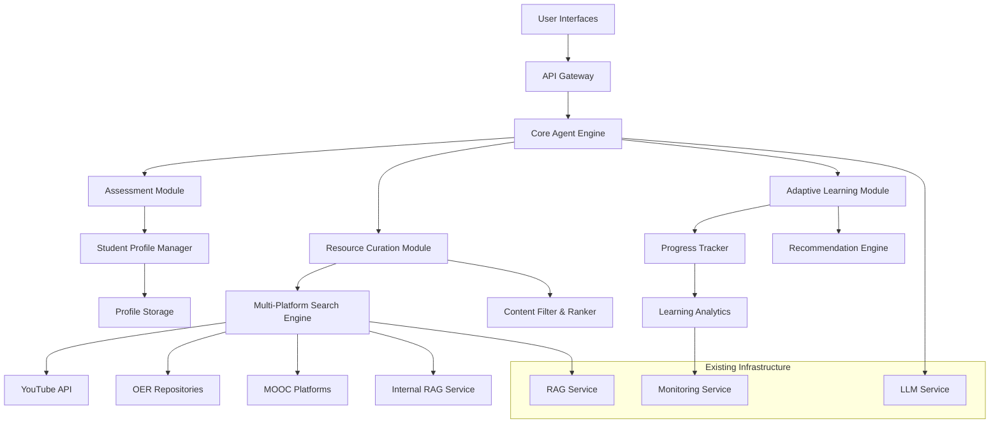

# Design Document

## Overview

The Personalized Learning Path Agent is designed as a comprehensive AI-powered educational system that creates customized learning experiences for students. The system addresses all seven core requirements: student assessment and profiling, multi-platform resource integration, learning style detection and adaptation, structured learning path generation, adaptive learning and progress tracking, multi-modal interface support, and accessibility features.

The agent follows a three-phase approach: **Assessment** (understanding the student through comprehensive profiling), **Curation** (finding and organizing resources from multiple platforms), and **Adaptation** (continuous improvement based on progress and performance data).

## Architecture

### High-Level Architecture



### System Components

1. **Core Agent Engine**: Central orchestrator that coordinates all modules
2. **Assessment Module**: Handles student profiling and knowledge assessment
3. **Resource Curation Module**: Searches, filters, and organizes educational content
4. **Adaptive Learning Module**: Tracks progress and adjusts learning paths
5. **Multi-Platform Search Engine**: Integrates with external educational platforms
6. **Student Profile Manager**: Manages student data and preferences
7. **Progress Tracker**: Monitors learning progress and performance
8. **Recommendation Engine**: Provides personalized content suggestions

## Components and Interfaces

### 1. Enhanced Student Assessment System

**Purpose**: Comprehensive student profiling beyond the current basic implementation

**Key Features**:
- Interactive assessment questionnaires
- Quick knowledge tests (5-10 questions per subject)
- Learning style detection through behavioral analysis
- Self-assessment options with guided questions

**Interface**:
```python
class EnhancedAssessmentModule:
    async def conduct_interactive_assessment(
        self, 
        student_id: str, 
        subject: str,
        assessment_type: AssessmentType
    ) -> AssessmentResult
    
    async def generate_knowledge_test(
        self, 
        subject: str, 
        difficulty: KnowledgeLevel
    ) -> List[Question]
    
    async def analyze_learning_style(
        self, 
        interaction_data: Dict[str, Any]
    ) -> LearningStyleProfile
```

### 2. Multi-Platform Resource Integration

**Purpose**: Aggregate educational content from diverse sources

**Supported Platforms**:
- YouTube Educational Channels
- Khan Academy
- Coursera/edX (via APIs where available)
- Open Educational Resources (OER Commons)
- Wikipedia and educational wikis
- Internal RAG service content

**Interface**:
```python
class MultiPlatformSearchEngine:
    async def search_youtube_educational(
        self, 
        query: str, 
        filters: SearchFilters
    ) -> List[YouTubeResource]
    
    async def search_oer_repositories(
        self, 
        query: str, 
        subject_area: str
    ) -> List[OERResource]
    
    async def search_mooc_platforms(
        self, 
        query: str, 
        level: KnowledgeLevel
    ) -> List[MOOCResource]
    
    async def aggregate_and_rank_resources(
        self, 
        resources: List[LearningResource],
        student_profile: StudentProfile
    ) -> List[RankedResource]
```

### 3. Intelligent Learning Path Generator

**Purpose**: Create structured, sequential learning experiences

**Key Features**:
- Prerequisite dependency mapping
- Time-based scheduling
- Learning style optimization
- Milestone and checkpoint creation
- Progress validation points

**Interface**:
```python
class IntelligentPathGenerator:
    async def generate_structured_path(
        self, 
        student_profile: StudentProfile,
        learning_goal: str,
        constraints: PathConstraints
    ) -> StructuredLearningPath
    
    async def create_milestone_checkpoints(
        self, 
        path: LearningPath
    ) -> List[Milestone]
    
    async def optimize_for_learning_style(
        self, 
        path: LearningPath,
        style: LearningStyle
    ) -> OptimizedPath
```

### 4. Adaptive Learning Engine

**Purpose**: Continuously improve learning paths based on student progress

**Key Features**:
- Real-time progress tracking
- Performance-based content adjustment
- Difficulty scaling
- Alternative resource suggestion
- Learning pace optimization

**Interface**:
```python
class AdaptiveLearningEngine:
    async def track_learning_progress(
        self, 
        student_id: str,
        activity_data: ActivityData
    ) -> ProgressUpdate
    
    async def adjust_path_difficulty(
        self, 
        path_id: str,
        performance_metrics: PerformanceMetrics
    ) -> PathAdjustment
    
    async def suggest_alternative_resources(
        self, 
        struggling_topics: List[str],
        student_profile: StudentProfile
    ) -> List[AlternativeResource]
```

### 5. Multi-Modal Interface System

**Purpose**: Support different interaction modes as specified in requirements

**Supported Modes**:
- **Chat Interface**: Natural language conversation for goal setting and queries with session continuity
- **Form-Based Interface**: Structured input forms for systematic data collection and assessment
- **API Interface**: RESTful endpoints for integration with external systems and webhook support

**Key Features**:
- Session continuity across interface modes
- Context preservation when switching interfaces
- Webhook notifications for external system integration
- Batch processing capabilities for API consumers

**Interface**:
```python
class MultiModalInterface:
    # Chat Interface
    async def handle_chat_interaction(
        self, 
        message: str,
        session_context: ChatSession
    ) -> ChatResponse
    
    async def maintain_chat_context(
        self,
        session_id: str,
        interaction_history: List[Interaction]
    ) -> ChatContext
    
    # Form Interface
    async def process_structured_input(
        self, 
        form_data: FormData,
        form_type: FormType
    ) -> ProcessingResult
    
    async def generate_assessment_forms(
        self,
        assessment_type: AssessmentType,
        student_profile: StudentProfile
    ) -> AssessmentForm
    
    # API Interface
    async def handle_api_request(
        self, 
        endpoint: str,
        request_data: Dict[str, Any]
    ) -> APIResponse
    
    async def process_webhook_notification(
        self,
        webhook_data: WebhookData,
        source_system: str
    ) -> WebhookResponse
    
    async def handle_batch_processing(
        self,
        batch_requests: List[BatchRequest]
    ) -> BatchResponse
```

### 6. Accessibility and Inclusive Design Module

**Purpose**: Ensure all educational content is accessible through assistive technologies

**Key Features**:
- Automatic alternative text generation for visual content
- Screen reader compatible format conversion
- Caption and transcript management for video content
- Keyboard navigation support
- High contrast and font size options

**Interface**:
```python
class AccessibilityModule:
    async def generate_alt_text(
        self,
        visual_content: VisualContent
    ) -> str
    
    async def convert_to_screen_reader_format(
        self,
        complex_content: ComplexContent
    ) -> ScreenReaderContent
    
    async def ensure_video_accessibility(
        self,
        video_resource: VideoResource
    ) -> AccessibleVideoResource
    
    async def validate_keyboard_navigation(
        self,
        interface_component: UIComponent
    ) -> NavigationValidation
```

## Data Models

### Enhanced Student Profile
```python
@dataclass
class EnhancedStudentProfile:
    # Basic Information
    student_id: str
    name: str
    age: Optional[int]
    grade_level: str
    
    # Learning Characteristics
    learning_goals: List[LearningGoal]
    knowledge_levels: Dict[str, KnowledgeLevel]  # Per subject
    learning_style_profile: LearningStyleProfile
    preferred_content_types: List[ContentType]
    
    # Constraints and Preferences
    available_study_time: StudyTimeProfile
    accessibility_needs: List[AccessibilityRequirement]
    language_preferences: List[str]
    interface_preferences: InterfacePreferences  # Chat, form, or API preference
    
    # Progress Tracking
    completed_paths: List[str]
    current_paths: List[str]
    performance_history: List[PerformanceRecord]
    
    # Metadata
    created_at: datetime
    last_updated: datetime
    preferences_last_updated: datetime
```

### Comprehensive Learning Resource
```python
@dataclass
class ComprehensiveLearningResource:
    # Basic Resource Information
    resource_id: str
    title: str
    description: str
    source_platform: str
    url: str
    
    # Content Characteristics
    content_type: ContentType  # video, article, interactive, quiz, etc.
    subject_areas: List[str]
    difficulty_level: KnowledgeLevel
    estimated_duration: timedelta
    language: str
    
    # Quality Metrics
    rating: Optional[float]
    review_count: Optional[int]
    educational_quality_score: Optional[float]
    
    # Learning Attributes
    learning_objectives: List[str]
    prerequisites: List[str]
    tags: List[str]
    
    # Accessibility
    accessibility_features: List[AccessibilityFeature]
    transcript_available: bool
    captions_available: bool
    alt_text_descriptions: Dict[str, str]  # For visual elements
    screen_reader_compatible: bool
    keyboard_navigable: bool
    
    # Metadata
    last_updated: datetime
    verified: bool
    metadata: Dict[str, Any]
```

### Structured Learning Path
```python
@dataclass
class StructuredLearningPath:
    # Path Identification
    path_id: str
    title: str
    description: str
    
    # Student Context
    student_profile: EnhancedStudentProfile
    learning_goal: LearningGoal
    
    # Path Structure
    phases: List[LearningPhase]
    total_estimated_time: timedelta
    difficulty_progression: List[KnowledgeLevel]
    
    # Resources and Activities
    resources: List[ComprehensiveLearningResource]
    assessments: List[Assessment]
    milestones: List[Milestone]
    
    # Adaptive Elements
    alternative_paths: List[str]  # For different learning styles
    prerequisite_paths: List[str]
    follow_up_paths: List[str]
    
    # Progress Tracking
    completion_criteria: List[CompletionCriterion]
    progress_checkpoints: List[ProgressCheckpoint]
    
    # Metadata
    created_at: datetime
    last_adapted: datetime
    adaptation_history: List[AdaptationRecord]
    reasoning: str  # Why this path was created
```

## Error Handling

### Graceful Degradation Strategy

1. **Resource Unavailability**: If external APIs fail, fall back to internal RAG content
2. **Assessment Failures**: Provide default profiling based on grade level and subject
3. **Path Generation Issues**: Create simplified linear paths when complex generation fails
4. **Progress Tracking Problems**: Continue with basic completion tracking

### Error Recovery Mechanisms

```python
class ErrorRecoveryManager:
    async def handle_resource_search_failure(
        self, 
        original_query: str,
        failed_platforms: List[str]
    ) -> List[LearningResource]:
        # Fallback to available platforms and internal content
        
    async def handle_assessment_failure(
        self, 
        student_id: str,
        intended_assessment: AssessmentType
    ) -> StudentProfile:
        # Create profile with conservative assumptions
        
    async def handle_path_generation_failure(
        self, 
        learning_goal: str,
        student_profile: StudentProfile
    ) -> LearningPath:
        # Generate basic linear path with core resources
```

## Testing Strategy

### Unit Testing
- Individual component testing for each module
- Mock external API responses for consistent testing
- Test error handling and edge cases
- Validate data model serialization/deserialization

### Integration Testing
- End-to-end learning path creation workflows
- Multi-platform resource search integration
- Student profile creation and management
- Progress tracking and adaptation cycles

### Performance Testing
- Resource search response times
- Learning path generation performance
- Concurrent user handling
- Memory usage optimization

### User Experience Testing
- Interface usability across different modes
- Learning path effectiveness validation
- Student satisfaction metrics
- Accessibility compliance testing

### Test Implementation Plan

```python
# Example test structure
class TestPersonalizedLearningAgent:
    async def test_student_assessment_flow(self):
        # Test complete assessment workflow
        
    async def test_multi_platform_resource_search(self):
        # Test resource aggregation from multiple sources
        
    async def test_adaptive_path_modification(self):
        # Test path adaptation based on progress
        
    async def test_interface_mode_switching(self):
        # Test seamless switching between interaction modes
        
    async def test_error_recovery_scenarios(self):
        # Test graceful handling of various failure modes
```

## Security and Privacy Considerations

### Data Protection
- Student profile data encryption at rest
- Secure API communication with external platforms
- Minimal data collection principle
- GDPR/COPPA compliance for student data

### Access Control
- Session-based authentication for web interfaces
- API key management for external integrations
- Rate limiting for resource searches
- Input validation and sanitization

### Privacy Features
- Anonymous learning path generation option
- Data retention policies
- Student data export capabilities
- Consent management for data usage

This design provides a comprehensive foundation for implementing the personalized learning path agent while building upon the existing infrastructure and ensuring scalability, maintainability, and user experience excellence.