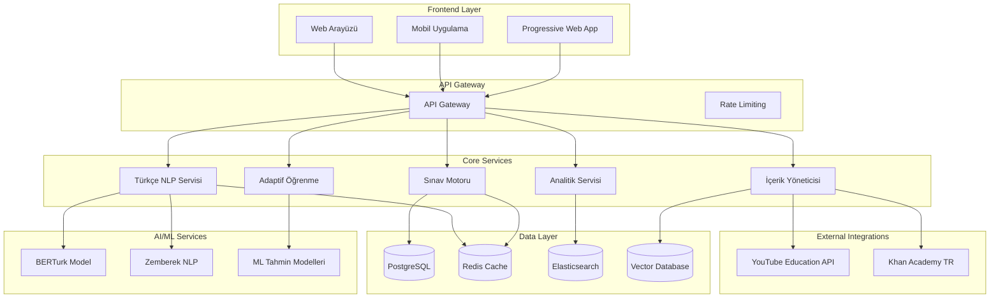

# Tasarım Dokümantasyonu

## Genel Bakış

Türkiye Üniversite Sınavları Hazırlık Platformu, YKS (TYT/AYT/YDT) sınavlarına hazırlanan öğrenciler için özel olarak tasarlanmış kapsamlı bir AI destekli eğitim sistemidir. Platform, ÖSYM ve MEB müfredatına tam uyumluluk sağlayarak, Türkçe NLP desteği, adaptif öğrenme algoritmaları ve KVKK uyumlu veri yönetimi ile öğrencilere kişiselleştirilmiş eğitim deneyimi sunar.

Sistem dört ana bileşen etrafında tasarlanmıştır: **Sınav Motoru** (ÖSYM formatında deneme sınavları), **Türkçe AI Asistan** (doğal dil işleme ve sohbet desteği), **Adaptif Öğrenme Sistemi** (kişiselleştirilmiş içerik sunumu), ve **İçerik Yönetimi** (çoklu platform entegrasyonu).

## Mimari

### Üst Seviye Mimari



### Sistem Bileşenleri

1. **Sınav Motoru**: ÖSYM formatında deneme sınavları ve değerlendirme sistemi
2. **Türkçe NLP Servisi**: Doğal dil işleme ve AI sohbet desteği
3. **Adaptif Öğrenme Sistemi**: Kişiselleştirilmiş öğrenme yolu oluşturma
4. **İçerik Yöneticisi**: Çoklu platform içerik entegrasyonu ve yönetimi
5. **Analitik Servisi**: Performans takibi ve raporlama
6. **Bildirim Servisi**: Öğrenci, öğretmen ve veli bildirimleri

## Bileşenler ve Arayüzler

### 1. ÖSYM Uyumlu Sınav Motoru

**Amaç**: Gerçek sınav formatında deneme sınavları ve detaylı performans analizi

**Temel Özellikler**:
- TYT (120 soru, 165 dk), AYT (160 soru, 210 dk), YDT formatları
- Gerçek zamanlı sınav takibi ve zaman yönetimi
- Otomatik puanlama ve detaylı analiz
- Konu bazlı başarı raporlama
- Zayıf alan tespiti ve öneriler

**Arayüz**:
```python
class OSYMSinavMotoru:
    async def sinav_olustur(
        self,
        sinav_tipi: SinavTipi,  # TYT, AYT, YDT
        ogrenci_id: str,
        zorluk_seviyesi: ZorlukSeviyesi
    ) -> SinavOturumu
    
    async def soru_getir(
        self,
        sinav_id: str,
        soru_numarasi: int
    ) -> SinavSorusu
    
    async def cevap_kaydet(
        self,
        sinav_id: str,
        soru_id: str,
        cevap: str,
        sure: timedelta
    ) -> CevapSonucu
    
    async def sinav_tamamla(
        self,
        sinav_id: str
    ) -> SinavSonucu
    
    async def performans_analizi(
        self,
        ogrenci_id: str,
        sinav_sonuclari: List[SinavSonucu]
    ) -> PerformansRaporu
```

### 2. Türkçe NLP ve AI Sohbet Sistemi

**Amaç**: Türkçe doğal dil işleme ile öğrenci desteği ve etkileşim

**Temel Özellikler**:
- Zemberek-NLP ile morfolojik analiz
- BERTurk ile duygu analizi ve anlam çıkarma
- Eğitim terminolojisi ile yanıt üretimi
- Bağlamsal sohbet yönetimi
- Motivasyonel destek sistemi

**Arayüz**:
```python
class TurkceNLPSistemi:
    async def morfolojik_analiz(
        self,
        metin: str
    ) -> MorfolojikAnaliz
    
    async def duygu_analizi(
        self,
        metin: str,
        domain: str = "egitim"
    ) -> DuyguAnalizi
    
    async def sohbet_yaniti_uret(
        self,
        kullanici_mesaji: str,
        sohbet_gecmisi: List[Mesaj],
        ogrenci_profili: OgrenciProfili
    ) -> AIYaniti
    
    async def soru_cozum_yardimi(
        self,
        soru: str,
        konu: str,
        zorluk_seviyesi: ZorlukSeviyesi
    ) -> CozumYardimi
    
    async def motivasyon_mesaji_uret(
        self,
        ogrenci_durumu: OgrenciDurumu,
        performans_trendi: PerformansTrendi
    ) -> MotivasyonMesaji
```

### 3. MEB/ÖSYM Müfredat Sistemi

**Amaç**: MEB ve ÖSYM müfredatına uyumlu içerik yönetimi

**Temel Özellikler**:
- Statik müfredat standartları yönetimi
- ÖSYM sınav müfredatı veri yapısı
- Manuel müfredat güncelleme sistemi
- Konu öncelik sıralaması
- Öğrenme kazanımları eşleştirmesi

**Arayüz**:
```python
class MufredatSistemi:
    async def meb_standartlari_getir(
        self,
        sinif_seviyesi: int,
        ders: str
    ) -> List[MufredatStandardi]
    
    async def osym_mufredat_getir(
        self,
        sinav_tipi: SinavTipi,
        yil: int
    ) -> OSYMMufredat
    
    async def ogrenme_kazanimlari_getir(
        self,
        konu: str,
        seviye: str
    ) -> List[OgrenmeKazanimi]
    
    async def mufredat_uyumluluk_kontrol(
        self,
        icerik: IcerikMetadata
    ) -> UyumlulukSonucu
    
    async def konu_oncelik_sirala(
        self,
        konular: List[str],
        sinav_tipi: SinavTipi
    ) -> List[OncelikliKonu]
```

### 4. Adaptif Öğrenme ve Zorluk Ayarlama Sistemi

**Amaç**: Öğrenci performansına göre dinamik zorluk ayarlama ve kişiselleştirme

**Temel Özellikler**:
- Makine öğrenmesi tabanlı performans tahmini
- Dinamik zorluk seviyesi ayarlama
- Kişiselleştirilmiş öğrenme yolu oluşturma
- Zayıf alan tespiti ve özel program oluşturma
- Öğrenme hızı optimizasyonu

**Arayüz**:
```python
class AdaptifOgrenmeSistemi:
    async def performans_tahmin_et(
        self,
        ogrenci_id: str,
        sinav_tipi: SinavTipi,
        hedef_tarih: datetime
    ) -> PerformansTahmini
    
    async def zorluk_seviyesi_ayarla(
        self,
        ogrenci_performansi: OgrenciPerformansi,
        mevcut_seviye: ZorlukSeviyesi
    ) -> ZorlukSeviyesi
    
    async def kisisellestirilmis_yol_olustur(
        self,
        ogrenci_profili: OgrenciProfili,
        hedef_sinav: SinavTipi,
        mevcut_durum: MevcutDurum
    ) -> OgrenmeyYolu
    
    async def zayif_alan_tespit_et(
        self,
        sinav_sonuclari: List[SinavSonucu],
        konu_analizi: KonuAnalizi
    ) -> List[ZayifAlan]
    
    async def ozel_program_olustur(
        self,
        zayif_alanlar: List[ZayifAlan],
        mevcut_seviye: ZorlukSeviyesi
    ) -> OzelCalismaProgram
```

### 5. Çoklu Platform İçerik Sistemi

**Amaç**: YouTube Education, Khan Academy Türkçe, EBA TV içerik yönetimi

**Temel Özellikler**:
- YouTube Education API entegrasyonu
- Khan Academy Türkçe içerik erişimi
- TRT EBA TV video linkleri yönetimi
- İçerik kalite derecelendirmesi
- Meta veri yönetimi ve filtreleme

**Arayüz**:
```python
class CokluPlatformSistemi:
    async def youtube_egitim_ara(
        self,
        arama_terimi: str,
        konu: str,
        seviye: str,
        kanal_filtreleri: List[str]
    ) -> List[YouTubeIcerik]
    
    async def khan_academy_icerik_getir(
        self,
        konu: str,
        dil: str = "tr"
    ) -> List[KhanAcademyIcerik]
    
    async def eba_tv_video_getir(
        self,
        kanal: str,  # ilkokul, ortaokul, lise
        ders: str
    ) -> List[EBAVideo]
    
    async def icerik_derecelendir(
        self,
        icerikler: List[EgitimIcerigi],
        ogrenci_profili: OgrenciProfili
    ) -> List[DerecelendirilmisIcerik]
    
    async def meta_veri_cikart(
        self,
        icerik: EgitimIcerigi
    ) -> IcerikMetaVerisi
```

### 6. Öğretmen ve Veli Takip Sistemi

**Amaç**: Öğretmen ve veli için kapsamlı takip ve raporlama

**Temel Özellikler**:
- Bireysel öğrenci ilerleme takibi
- Sınıf geneli performans raporları
- ÖSYM uyumlu ödev oluşturma
- Veli raporları
- Karşılaştırmalı analiz sistemi

**Arayüz**:
```python
class OgretmenVeliSistemi:
    async def ogrenci_ilerleme_getir(
        self,
        ogretmen_id: str,
        sinif_id: str
    ) -> List[OgrenciIlerleme]
    
    async def sinif_performans_raporu(
        self,
        sinif_id: str,
        tarih_araligi: DateRange
    ) -> SinifPerformansRaporu
    
    async def odev_olustur(
        self,
        konu: str,
        zorluk_seviyesi: ZorlukSeviyesi,
        soru_sayisi: int,
        mufredat_uyumlu: bool = True
    ) -> Odev
    
    async def veli_raporu_olustur(
        self,
        ogrenci_id: str,
        veli_id: str,
        rapor_tipi: RaporTipi
    ) -> VeliRaporu
    
    async def karsilastirmali_analiz(
        self,
        ogrenci_id: str,
        karsilastirma_grubu: KarsilastirmaGrubu
    ) -> KarsilastirmaRaporu
```

## Veri Modelleri

### Öğrenci Profili
```python
@dataclass
class OgrenciProfili:
    # Temel Bilgiler
    ogrenci_id: str
    ad_soyad: str
    sinif_seviyesi: int
    hedef_sinav: SinavTipi
    hedef_universiteler: List[str]
    
    # Öğrenme Özellikleri
    ogrenme_stili: OgrenmeStili
    guclu_alanlar: List[str]
    zayif_alanlar: List[str]
    gunluk_calisma_suresi: timedelta
    
    # Performans Takibi
    deneme_sonuclari: List[SinavSonucu]
    konu_basarilari: Dict[str, KonuBasarisi]
    son_aktivite: datetime
    
    # Güvenlik
    veli_onay: Optional[bool]
    
    # Meta Veriler
    olusturma_tarihi: datetime
    son_guncelleme: datetime
```

### Sınav Sonucu
```python
@dataclass
class SinavSonucu:
    # Sınav Bilgileri
    sinav_id: str
    ogrenci_id: str
    sinav_tipi: SinavTipi
    baslangic_zamani: datetime
    bitis_zamani: datetime
    
    # Sonuç Detayları
    toplam_puan: float
    dogru_sayisi: int
    yanlis_sayisi: int
    bos_sayisi: int
    net_sayisi: float
    
    # Konu Bazlı Analiz
    konu_performanslari: Dict[str, KonuPerformansi]
    zorluk_dagilimi: Dict[ZorlukSeviyesi, int]
    
    # Karşılaştırma
    sinif_ortalamasi: Optional[float]
    okul_ortalamasi: Optional[float]
    ulusal_ortalama: Optional[float]
    
    # Öneriler
    calisma_onerileri: List[str]
    zayif_konular: List[str]
    
    # Meta Veriler
    analiz_tarihi: datetime
    gecerlilik_durumu: bool
```

### Eğitim İçeriği
```python
@dataclass
class EgitimIcerigi:
    # Temel Bilgiler
    icerik_id: str
    baslik: str
    aciklama: str
    kaynak_platform: str
    url: str
    
    # İçerik Özellikleri
    icerik_tipi: IcerikTipi  # video, makale, interaktif, quiz
    konu_alanlari: List[str]
    zorluk_seviyesi: ZorlukSeviyesi
    tahmini_sure: timedelta
    dil: str
    
    # Kalite Metrikleri
    degerlendirme: Optional[float]
    degerlendirme_sayisi: Optional[int]
    egitim_kalite_puani: Optional[float]
    
    # Müfredat Uyumluluğu
    meb_uyumlu: bool
    osym_uyumlu: bool
    ogrenme_kazanimlari: List[str]
    
    # Erişilebilirlik
    altyazi_mevcut: bool
    transkript_mevcut: bool
    gorsel_aciklama: Optional[str]
    ekran_okuyucu_uyumlu: bool
    
    # Meta Veriler
    son_guncelleme: datetime
    dogrulanmis: bool
    etiketler: List[str]
```

## Hata Yönetimi

### Zarif Bozulma Stratejisi

1. **Dış API Hataları**: ÖSYM/MEB API'leri erişilemezse önbellek verilerini kullan
2. **NLP Servisi Hataları**: Türkçe NLP başarısız olursa basit metin işleme kullan
3. **Sınav Motoru Hataları**: Sınav kesintisinde otomatik kaydetme ve devam etme
4. **İçerik Entegrasyonu Hataları**: Bir platform erişilemezse diğerlerini kullan

### Hata Kurtarma Mekanizmaları

```python
class HataKurtarmaSistemi:
    async def api_hatasi_yonet(
        self,
        api_adi: str,
        hata_detayi: Exception
    ) -> AlternatifYanit:
        # Önbellek veya alternatif kaynak kullan
        
    async def sinav_kesinti_kurtar(
        self,
        sinav_id: str,
        son_durum: SinavDurumu
    ) -> SinavKurtarma:
        # Otomatik kaydetme ve devam etme
        
    async def icerik_erisim_hatasi(
        self,
        icerik_id: str,
        platform: str
    ) -> AlternatifIcerik:
        # Alternatif platform veya benzer içerik öner
```

## Test Stratejisi

### Birim Testleri
- Her modül için ayrı test sınıfları
- Türkçe karakter ve encoding testleri
- ÖSYM format uyumluluk testleri
- Temel güvenlik testleri

### Entegrasyon Testleri
- Dış API entegrasyonları (YouTube)
- Türkçe NLP pipeline testleri
- Sınav akışı end-to-end testleri
- Temel güvenlik testleri

### Performans Testleri
- 100K eşzamanlı kullanıcı yük testleri
- 200ms yanıt süresi doğrulama
- Veritabanı performans optimizasyonu
- Önbellek etkinlik testleri

### Erişilebilirlik Testleri
- WCAG 2.1 Level AA uyumluluk
- Ekran okuyucu uyumluluğu
- Klavye navigasyon testleri
- Görsel engelli kullanıcı senaryoları

## Güvenlik ve Gizlilik

### Veri Koruma
- Güvenli veri saklama
- Temel veri koruma önlemleri

### Erişim Kontrolü
- Basit kullanıcı yönetimi sistemi
- Rol tabanlı yetkilendirme (öğrenci, öğretmen, veli, admin)
- API rate limiting (kullanıcı başına 100/dk)

### Gizlilik Özellikleri
- Anonim kullanım seçeneği
- Veri saklama süre politikaları (3 yıl)

Bu tasarım, Türkiye'deki üniversite sınavları için özel olarak optimize edilmiş, KVKK uyumlu, yüksek performanslı ve erişilebilir bir eğitim platformu oluşturmak için kapsamlı bir temel sağlar.