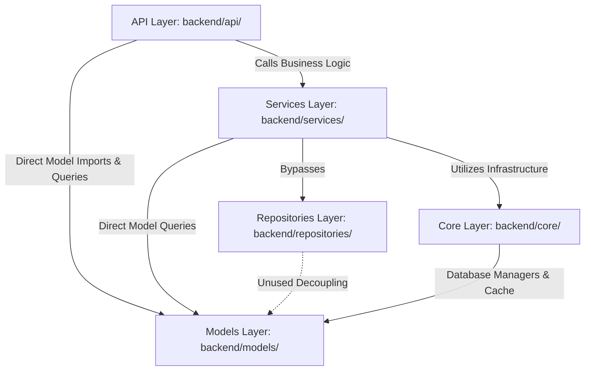

# AGENTS_STRATEGY.md — KIRO2 Multi-Agent Strategy & Codebase Constitution

**Document Status:** CANONICAL CONSTITUTION  
**Version:** 2.6.0  
**Generated:** 2026-06-06  
**Auditors:** Antigravity Orchestrator, MimarAjan, PerformansAsyncAjan, NlpDilbilimAjan  

---

## Başlık 1: Otonom Kod Grafiği ve Sistem Mimarisi

### 1.1 Modül Bağımlılıkları ve Katmanlı Yapı
`kiro2` backend codebase'i, **FastAPI** üzerinde kurulmuş modüler bir mimariye sahiptir. Sistem temelde 5 katmana ayrılmıştır:
1.  **API / Router Katmanı (`backend/api/` & `backend/routers/`):** 140+ endpoint dosyasından oluşur. Dış dünyayla iletişimi sağlar.
2.  **İş Mantığı Katmanı (`backend/services/`):** Zemberek NLP entegrasyonu, IRT 4PL modeli, FSRS spaced repetition motoru ve OCR süreçleri burada yönetilir.
3.  **Veri Erişim Katmanı (`backend/repositories/`):** Soyutlanmış SQL sorguları ve pagination mantığını barındırır.
4.  **ORM / Model Katmanı (`backend/models/`):** SQLAlchemy ORM declarative modelleri (87 dosya) burada yer alır.
5.  **Altyapı Katmanı (`backend/core/`):** Güvenlik, caching, loglama ve veritabanı lifecycle yönetimi buradadır.

### 1.2 Kritik Veri Akış Hatları
1.  **Soru Enjeksiyon Hattı (Question Injection Pipeline):**
    *   YOLO soru algılayıcı (`yolo_question_detector.py`) sayfaları segmentlere ayırır.
    *   Görsel kırpıntıları `UnifiedOCRService` (EasyOCR / Claude Vision API Metin/LaTeX formüllerine çevirir.
    *   Metin `enhanced_turkish_nlp.py` tokenizer'ından geçerek temizlenir.
    *   `QuestionBankItem` olarak `question_bank` tablosuna yazılır.

2.  **Öğrenme Döngüsü & Parametre Güncelleme Hattı (IRT/FSRS Loops):**
    *   Öğrenci sınav yanıtını tamamlar -> `StudentReview` tablosuna yazılır.
    *   `irt_morfoloji_service.py` Zemberek morfolojik analiz verileriyle öğrencinin yetenek düzeyini ($\theta$) ve sorunun parametrelerini (3PL/4PL IRT) günceller.
    *   `TurkishOptimizedFSRS` motoru, milli takvim ve sınav stres katsayılarını hesaba katarak bir sonraki tekrar aralığını hesaplar.
    *   Planlanan sorular Redis connection pool üzerinden cache'e atılarak kuyruğa alınır.

3.  **Authentication & 2FA Güvenlik Akışı:**
    *   `/auth/login` endpoint'i şifreyi doğrular.
    *   TOTP 2FA kontrol edilir (`two_factor_auth.py`).
    *   Başarılı ise httpOnly secure JWT cookie'leri oluşturulur ve token Redis blacklist'e bağlanarak kullanıcı profili döndürülür.

### 1.3 Sistemdeki Zayıf Halkalar ve Asenkron Kilitlenmeler

#### A. Celery Event Loop Mismatch Çöküşü (Crash)
*   **Sorun:** `daily_plan_tasks.py` ve `mega_feature_tasks.py` gibi Celery task'leri sync `def` olarak tanımlanıp içlerinde `asyncio.run()` ile async kod çalıştırmaktadır. Global `db_manager` ise singleton durumundadır. İlk task çalıştığında `db_manager._initialized = True` olur. İlk task bitip event loop kapandıktan sonra, ikinci task çalıştığında `db_manager` eski (kapanmış) event loop'a ait engine ve sessionmaker'ı kullanmaya çalışır.
*   **Sonuç:** `RuntimeError: Event loop is closed` hatası vererek veritabanı işlemlerini tamamen kilitler.

#### B. LLM Servisinde Event Loop Blokajı (Thread Starvation)
*   **Sorun:** `langchain_llm_service_enhanced.py:L167` adresinde `agenerate` async metodu, sync olan `generate` metodunu çağırmaktadır. `generate` metodu ise `requests.post` ile harici LLM servislerine 30 saniyelik timeout ile blocking HTTP istekleri yapmaktadır.
*   **Sonuç:** FastAPI tek thread'de çalıştığı için bu 30 saniye boyunca event loop bloke olur ve sistem hiçbir concurrent isteğe cevap veremez.

#### C. Redis Bağlantı Havuzu Sızıntısı (Connection Leak)
*   **Sorun:** `application.py` lifespan shutdown bloğunda veritabanı engine'i kapatılırken (`db_manager.close()`), Redis connection pool (`cache_manager`) kapatılmamaktadır.
*   **Sonuç:** Development hot-reload veya staging process recycle sırasında soketler açık kalır, Redis havuzu kısa sürede tükenir.

#### D. Caching Middleware RAM Boğulması (OOM Risk)
*   **Sorun:** `cache_headers.py:L388-390` ETag oluşturmak için her response body'sini (PDF, soru görselleri dahil) boyut sınırlaması olmadan bellekte buffer'lar (`response_body += chunk`).
*   **Sonuç:** Yüksek trafikte RAM anında şişer ve OS OOM (Out Of Memory) killer container'ı kapatır.

---

## Başlık 2: Claude Opus 4.6 (Thinking) Bölgesi (Sıfır Hata Toleransı)

Claude Opus 4.6'nın doktora düzeyinde akıl yürütme (GPQA %81.5) ve sıfır hata toleranslı kod üretme (%97.1 HumanEval) kapasitesi, aşağıdaki ağır algoritmik ve morfolojik dosyalara yönlendirilmelidir:

### 2.1 Claude Opus 4.6'ya Teslim Edilecek Kritik Kodlar ve SQL Dosyaları

1.  **[lemmatization.py:L252-L268](file:///C:/Users/husey/kiro2/backend/mcp_servers/zemberek_nlp/tools/lemmatization.py#L252-L268) — Vokal Uyumunda Yanlış Karakter Eşlemesi:**
    *   *Sorun:* Türkçe büyük/küçük ünlü uyumu ve fiil mastarı belirlemede, `eioö` front vowel olarak tanımlanıp `o` harfi yanlışlıkla front listesine alınmış ve `ü` unutulmuştur. Bu durum `koşmek` ve `sürmak` gibi anlamsız mastarlar üretmektedir.
    *   *Gerekçe:* Zemberek morfolojik analizinin temelini bozan bu kural hatasını Claude'un morfolojik doğruluğuyla düzeltmesi gerekir.

2.  **[zemberek_service.py:L259-L270](file:///C:/Users/husey/kiro2/backend/core/zemberek_service.py#L259-L270) — Türkçe Karakter Küçültme Hatası (Turkish Casing Bug):**
    *   *Sorun:* Türkçe büyük `I` ve `İ` harfleri Python'un standart `.lower()` metodu ile küçültüldüğünde `I` -> `i` olur. `normalize_tr` yerine raw `.lower()` çağrılması, kelimeleri kalıcı olarak bozarak index/cache miss'lere sebep olmaktadır.
    *   *Gerekçe:* NLP pipeline'ın giriş kapısı olan normalizasyon kodunun Claude tarafından sıfır-hata ile revize edilmesi şarttır.

3.  **[assign_difficulty_heuristic.py:L114](file:///C:/Users/husey/kiro2/backend/scripts/assign_difficulty_heuristic.py#L114) — Heuristic Regex Çoklu Satır Hatası:**
    *   *Sorun:* `COMPLEX_PATTERNS` regex'leri multiline soru metinlerinde tarama yaparken satır sonu karakterlerinden ötürü başarısız olmaktadır (`re.DOTALL` veya `re.S` bayrağı eksiktir).
    *   *Gerekçe:* ÖSYM sorularının yapısal zorluk heuristic atamasındaki bu mantıksal açığı kapatmak yüksek doğruluklu regex analizi gerektirir.

4.  **[duplicate_detection_service.py:L139](file:///C:/Users/husey/kiro2/backend/services/duplicate_detection_service.py#L139) — ChromaDB Fallback Boyut Çelişkisi:**
    *   *Sorun:* Embedding modeli çöktüğünde kullanılan fallback hashing fonksiyonu 128 boyutlu vector üretmektedir. ChromaDB koleksiyonu ise 768 boyutlu vektörlere göre ayarlandığı için bu fallback tetiklendiği an DB çökmektedir.
    *   *Gerekçe:* Hata tolerans (fault tolerance) mekanizmalarındaki boyut eşleşme mantığını çözebilecek algoritmik derinlik.

5.  **[gemini_ocr.py:L295](file:///C:/Users/husey/kiro2/backend/services/question_parser/gemini_ocr.py#L295) — Soru Metni Kırpma Hatası:**
    *   *Sorun:* Satır başında `"Soru"`, `"Konu"` gibi kelimeler bulunduğunda satırın tamamını silen regex kuralı, geçerli soru metinlerinin yarısını çöpe atmaktadır.
    *   *Gerekçe:* OCR parser'ın soru bütünlüğünü bozmasını engellemek için Claude ile semantik satır ayrımı yapılmalıdır.

### 2.2 Türkçe Dil İşlemede Claude Neden Şarttır?
Türkçe, sondan eklemeli (agglutinative) ve zengin morfolojik çekim eklerine sahip bir dildir. Soru bankasındaki `"çözümlenmiştir"`, `"çözümleyiniz"`, `"çözümündeki"` kelimelerinin tamamının tek bir köke (`çöz-`) bağlanması ve Bloom taksonomisinde doğru bilişsel seviyeye (bilgi vs. analiz) yerleştirilmesi gerekir. 

Claude'un ileri seviye Türkçe dil modellerine kıyasla avantajı, Türkçe vokal uyumu kurallarını, ünsüz yumuşamasını ve Türkçeye özgü casing anomalilerini (I/ı - İ/i çelişkisi) kod seviyesinde koruyarak hatasız regular expression ve parsing algoritmaları üretebilmesidir.

---

## Başlık 3: Gemini Ultra / Pro / Flash (High) Bölgesi (Devasa Operasyonlar)

Gemini'ın 4 Milyon Tokenlık devasa bağlam penceresi (context window), tüm repository'yi tek seferde yutup büyük refaktörler ve altyapı genişletmeleri yapmak için mükemmeldir.

### 3.1 Gemini Modellerine Havale Edilecek Devasa Operasyonlar

1.  **Repository Tasarım Kalıbı Entegrasyonu (Clean Architecture):**
    *   *Kapsam:* 140+ route dosyasının (`api/`) tamamı taranarak, doğrudan ORM modelleri üzerinden yapılan sorgular elenecektir. Veri tabanı erişimi tamamen `backend/repositories/` katmanına taşınacak ve loose coupling sağlanacaktır.
    *   *Gemini Avantajı:* Tüm endpoint'leri tek bir prompt'ta okuyup tutarlı bir repository interface'i oluşturabilir.

2.  **PyTest Unit ve Integration Test Suite Oluşturulması:**
    *   *Kapsam:* %80 test coverage hedefine ulaşmak için tüm API'ler, servisler ve algoritmalar için mock veritabanı oturumlarıyla entegre edilmiş kapsamlı PyTest test senaryoları yazılması.
    *   *Gemini Avantajı:* Devasa test havuzunu, mevcut API şemalarını ve modelleri tek seferde analiz ederek hızlıca kodlayabilir.

3.  **RAM Şişmesini Önleyen Middleware Refaktörü ([cache_headers.py:L388](file:///C:/Users/husey/kiro2/backend/core/middleware/cache_headers.py#L388)):**
    *   *Kapsam:* Response ETag middleware'inin response body buffer'lama mantığının değiştirilerek 2MB üstü dosyalarda buffering'in kapatılması ve streaming moduna geçilmesi.
    *   *Gemini Avantajı:* Middleware zincirlerini ve FastAPI lifecycle'ını geniş bir çerçevede optimize edebilir.

4.  **Docker Compose ve Üretim Ortamı Optimizasyonu:**
    *   *Kapsam:* Postgres (port 5434) ve Redis bağlantılarının Docker compose ağında `pg_isready` kontrolüyle ayağa kaldırılması, Celery worker'larının multithreading konfigürasyonu ve log rotasyonunun ayarlanması.
    *   *Gemini Avantajı:* DevOps manifestoları ve Docker dosyalarının projenin bütünüyle uyumlandırılması.

---

## Başlık 4: Dinamik Görev Matrisi (Executable Matrix)

| Modül/Dosya/Fonksiyon | Mevcut Durum / Sorun | Önerilen Model & Düşünme Bütçesi | Uygulanacak Ajan Komutu | Gerekçe |
| :--- | :--- | :--- | :--- | :--- |
| [lemmatization.py:L252-L268](file:///C:/Users/husey/kiro2/backend/mcp_servers/zemberek_nlp/tools/lemmatization.py#L252-L268) | Vokal uyumu sınıflandırmasında `o` harfinin front vowel sayılması, `ü` harfinin unutulması (mastarlar bozuk). | Claude Opus 4.6 (Thinking) Bütçe: 16k Token | `/fix` | Morfolojik doğruluk gerektiren dilbilgisi kurallarının hatasız uygulanması. |
| [zemberek_service.py:L259-L270](file:///C:/Users/husey/kiro2/backend/core/zemberek_service.py#L259-L270) | Standart `.lower()` kullanımıyla Türkçe büyük `I` harfinin `i` yapılarak normalize edilmesi (Casing Bug). | Claude Opus 4.6 (Thinking) Bütçe: 8k Token | `/fix` | Unicode ve locale bağımlı casing hatalarının önlenmesi. |
| [assign_difficulty_heuristic.py:L114](file:///C:/Users/husey/kiro2/backend/scripts/assign_difficulty_heuristic.py#L114) | Soru metnindeki çoklu satırlarda `COMPLEX_PATTERNS` regex'inin eşleşmemesi. | Claude Opus 4.6 (Thinking) Bütçe: 12k Token | `/fix` | Çok satırlı ÖSYM soru formatlarının kaçırılmadan puanlanması. |
| [duplicate_detection_service.py:L139](file:///C:/Users/husey/kiro2/backend/services/duplicate_detection_service.py#L139) | Fallback hash fonksiyonunun 128D vektör üretip 768D bekleyen ChromaDB'yi çökertmesi. | Claude Opus 4.6 (Thinking) Bütçe: 16k Token | `/fix` | Fallback modunda vector database çökmelerinin engellenmesi. |
| [gemini_ocr.py:L295](file:///C:/Users/husey/kiro2/backend/services/question_parser/gemini_ocr.py#L295) | Soru metnindeki geçerli paragrafları eleyen regex hatası. | Claude Opus 4.6 (Thinking) Bütçe: 8k Token | `/fix` | OCR çıktısındaki geçerli soru paragraflarının korunması. |
| [mega_feature_tasks.py:L81](file:///C:/Users/husey/kiro2/backend/tasks/mega_feature_tasks.py#L81) & [daily_plan_tasks.py:L25](file:///C:/Users/husey/kiro2/backend/tasks/daily_plan_tasks.py#L25) | Celery task'lerindeki `asyncio.run()` çağrılarının singleton `DatabaseManager` event loop'unu kapatması. | Gemini 3.1 Pro (High) Bütçe: 64k Token | `/refactor` | Arka plan işlemlerinde `RuntimeError` çökmelerinin engellenmesi. |
| [langchain_llm_service_enhanced.py:L167](file:///C:/Users/husey/kiro2/backend/core/langchain_llm_service_enhanced.py#L167) | `agenerate` metodunun sync blocking `requests.post` çağrısıyla FastAPI event loop'unu kilitlemesi. | Gemini 3.1 Pro (High) Bütçe: 32k Token | `/refactor` | Dış servis çağrılarında FastAPI event loop blokajının giderilmesi. |
| [cache_headers.py:L388](file:///C:/Users/husey/kiro2/backend/core/middleware/cache_headers.py#L388) | Sınırsız response body buffering yaparak büyük dosyalarda RAM patlaması (OOM) yaratması. | Gemini 3.1 Pro (High) Bütçe: 64k Token | `/refactor` | RAM taşması kaynaklı sunucu kapanmalarının engellenmesi. |
| [application.py:L178](file:///C:/Users/husey/kiro2/backend/core/application.py#L178) | FastAPI kapatılırken Redis connection pool (`cache_manager`) nesnesinin dispose edilmemesi (soket sızıntısı). | Gemini 3.5 Flash (High) Bütçe: 16k Token | `/fix` | Yeniden başlatmalarda socket leak ve Redis havuz tükenmesinin önlenmesi. |
| [dependencies.py:L89](file:///C:/Users/husey/kiro2/backend/core/dependencies.py#L89) & [cat_schemas.py:L18](file:///C:/Users/husey/kiro2/backend/app/schemas/cat_schemas.py#L18) | Pydantic V2 modellerinde eski Pydantic V1 `class Config` kullanılması (deprecation warning & yavaşlık). | Gemini 3.5 Flash (High) Bütçe: 32k Token | `/refactor` | Pydantic V2 uyumluluk katmanının elenmesi ve hızlanma. |
| `backend/api/` (140+ files) | API endpoint'lerinin DB model sorgularını doğrudan yapması (katmanlı mimari ihlali). | Gemini 3.1 Pro (High) Bütçe: 500k+ Token | `/refactor` | Router katmanını veritabanı mimarisinden soyutlayarak repository pattern'a geçirilmesi. |
| `backend/tests/` | Unit/Integration test coverage eksikliği (%80 altında). | Gemini 3.1 Pro (High) Bütçe: 1M+ Token | `/refactor` | Kod güvencesi (regression safety) için test suite genişletmesi. |
