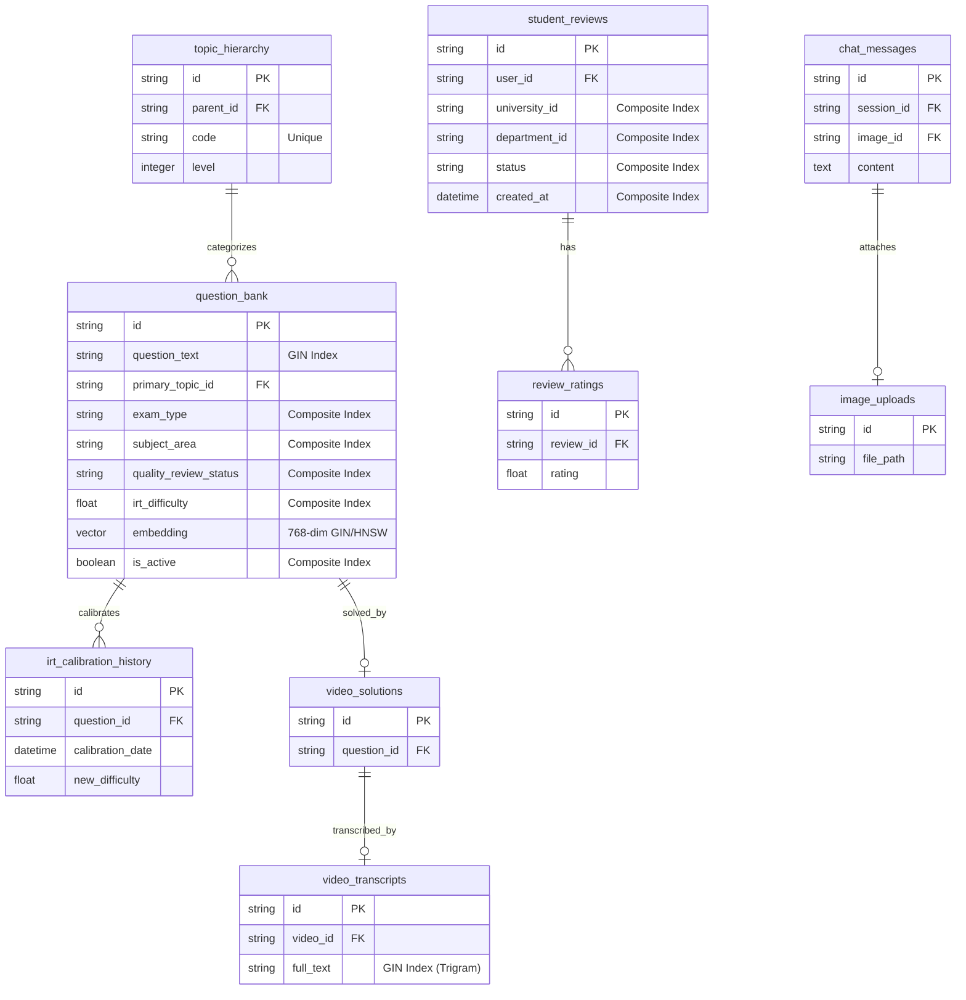

# VERİTABANI VE İÇERİK YÖNETİMİ MİMARİ KARAR KAYDI (ADR)

Bu doküman, **elendin.com (kiro2)** platformunun PostgreSQL veritabanı mimarisini, asenkron ORM sorgularını, Redis cache topolojisini ve otonom soru bankası enjeksiyon (Ingestion) hattını yüksek performans ve güvenlik odağında modernize etmek üzere hazırlanmış teknik rehberdir.

---

## BÖLÜM 1: MİMARİ RÖNTGEN VE VERİTABANI REVİZYONU

### 1.1 Varlık-İlişki (ERD) Şeması

Aşağıdaki Mermaid.js şeması, soru bankası, konu hiyerarşisi, kullanıcı değerlendirmeleri, AI chat ve video çözüm modülleri arasındaki ilişkisel yapıyı ve indekslenecek kritik alanları göstermektedir:



---

### 1.2 Asenkron ORM & N+1 / Lazy Loading Çözümleri

#### A. Video Çözüm Arama N+1 Çözümü (Joinedload/Selectinload)
*   **Sorunlu Dosya:** [video_solution.py](file:///C:/Users/husey/kiro2/backend/api/video_solution.py#L1069-L1076) (Döngü içi SELECT sorguları)
*   **Refaktör Kod:**
```python
# API içindeki N+1 sorununu çözen bulk sorgu mantığı
video_ids = [tr["video_id"] for tr in transcript_results if tr.get("video_id")]
if video_ids:
    # Tüm videoları tek bir SQL sorgusuyla (IN) çekiyoruz
    video_result = await db.execute(
        select(VideoSolution)
        .where(VideoSolution.id.in_(video_ids))
    )
    videos_map = {video.id: video for video in video_result.scalars().all()}
    
    # Döngü içinde veritabanına gitmek yerine in-memory map'ten çekiyoruz
    for tr_result in transcript_results:
        video = videos_map.get(tr_result["video_id"])
        if video:
            results.append({
                "video_id": video.id,
                "video_url": video.video_url,
                "title": video.title,
                "score": tr_result["score"],
                "snippet": tr_result["snippet"]
            })
```

#### B. Öğrenci İncelemeleri Lazy Loading Çözümü (`selectinload`)
*   **Sorunlu Dosya:** [student_review_service.py](file:///C:/Users/husey/kiro2/backend/services/student_review_service.py#L95-L141) (Lazy loading of ratings)
*   **Refaktör Kod:**
```python
from sqlalchemy.orm import selectinload

async def get_reviews(self, university_id: str, limit: int = 20) -> list[StudentReview]:
    # selectinload ile alt ilişkisel rating tablosunu tek seferde eager yükleme
    stmt = (
        select(StudentReview)
        .options(selectinload(StudentReview.ratings))
        .where(StudentReview.university_id == university_id)
        .where(StudentReview.status == "approved")
        .order_by(StudentReview.created_at.desc())
        .limit(limit)
    )
    result = await self.db.execute(stmt)
    return list(result.scalars().all())
```

#### C. AI Chat Görsel Eklentisi Lazy Loading Çözümü (`joinedload`)
*   **Sorunlu Dosya:** [ai_chat_service.py](file:///C:/Users/husey/kiro2/backend/services/ai_chat_service.py#L144-L158)
*   **Refaktör Kod:**
```python
from sqlalchemy.orm import joinedload

async def get_messages(self, session_id: str) -> list[ChatMessage]:
    # 1-to-1 ilişki olduğu için joinedload (LEFT OUTER JOIN) ile tek sorguda görsel bilgisini çekme
    stmt = (
        select(ChatMessage)
        .options(joinedload(ChatMessage.image))
        .where(ChatMessage.session_id == session_id)
        .order_by(ChatMessage.created_at.asc())
    )
    result = await self.db.execute(stmt)
    return list(result.scalars().all())
```

#### D. Audit API Senkron Bağlantı Sızıntısı ve Event-Loop Engelleme Çözümü
*   **Sorunlu Dosya:** [audit_api.py](file:///C:/Users/husey/kiro2/backend/api/audit_api.py#L132-L164) (Senkron Session kullanımı)
*   **Refaktör Kod:**
```python
# Senkron Session ve event-loop bloklayan yapıdan asenkron SQLAlchemy yapısına geçiş
@router.get("/logs", response_model=List[AuditLogSchema])
async def get_audit_logs(
    user_id: str,
    db: AsyncSession = Depends(get_db)
):
    # Asenkron engine ile event-loop bloklanmadan sorgulama yapılır
    # Bağlantı yönetimi FastAPI Depends(get_db) tarafından otomatik yönetilir, sızıntı önlenir
    stmt = (
        select(AuditLog)
        .where(AuditLog.user_id == user_id)
        .order_by(AuditLog.created_at.desc())
    )
    result = await db.execute(stmt)
    logs = result.scalars().all()
    return logs
```

---

### 1.3 Alembic İndeks Migrasyon Taslakları

Aşağıdaki SQLAlchemy migrasyon kodları, PostgreSQL veritabanında yavaş sorguları ve arama darboğazlarını engellemek üzere indeks yapılarını kurgulamaktadır:

```python
"""Add performance indexes

Revision ID: idx_performance_002
Revises: student_review_drift_001
"""
from alembic import op
import sqlalchemy as sa

def upgrade() -> None:
    # 1. pg_trgm eklentisinin aktif edilmesi (Trigram GIN indeksleri için)
    op.execute("CREATE EXTENSION IF NOT EXISTS pg_trgm")

    # 2. Video Transcripts Trigram GIN İndeksi (Metin aramaları için)
    op.execute(
        "CREATE INDEX idx_transcript_fulltext_trgm ON video_transcripts USING gin (full_text gin_trgm_ops)"
    )

    # 3. Question Bank Soru Metni Trigram GIN İndeksi
    op.execute(
        "CREATE INDEX idx_qbank_text_trgm ON question_bank USING gin (question_text gin_trgm_ops)"
    )

    # 4. Video Watch Sessions Composite İndeksi
    op.create_index(
        "idx_watch_user_video",
        "video_watch_sessions",
        ["user_id", "video_id"]
    )

    # 5. Video Completion Milestones Unique Composite İndeksi
    op.create_index(
        "idx_milestone_unique_user_video",
        "video_completion_milestones",
        ["user_id", "video_id", "milestone"],
        unique=True
    )

    # 6. Student Reviews Composite İndeksleri
    op.create_index(
        "idx_reviews_univ_status_date",
        "student_reviews",
        ["university_id", "status", "created_at"]
    )
    op.create_index(
        "idx_reviews_dept_status_date",
        "student_reviews",
        ["department_id", "status", "created_at"]
    )

    # 7. Curator Queue Composite İndeksi
    op.create_index(
        "idx_qbank_curator_queue",
        "question_bank",
        ["quality_review_status", "is_active", "created_at"]
    )


def downgrade() -> None:
    op.drop_index("idx_qbank_curator_queue", table_name="question_bank")
    op.drop_index("idx_reviews_dept_status_date", table_name="student_reviews")
    op.drop_index("idx_reviews_univ_status_date", table_name="student_reviews")
    op.drop_index("idx_milestone_unique_user_video", table_name="video_completion_milestones")
    op.drop_index("idx_watch_user_video", table_name="video_watch_sessions")
    op.execute("DROP INDEX idx_qbank_text_trgm")
    op.execute("DROP INDEX idx_transcript_fulltext_trgm")
```

---

## BÖLÜM 2: NLP İÇERİK KALKANI (CONTENT SHIELD)

### 2.1 Pydantic V2 Validator Middleware

Aşağıdaki Pydantic V2 middleware kod yapısı, soru enjeksiyon sistemi (`question_crud_api.py`) ve OCR veri aktarım betiklerinde (`import_d_dataset.py`) kullanılmak üzere tasarlanmıştır.

*   **Özellikleri:**
    *   **Bleach HTML Sanitizer:** Zararlı XSS tag'lerini temizler.
    *   **Unicode Normalizer:** Metinlerdeki karakter tutarsızlıklarını NFKC standartlarına çeker.
    *   **Prompt Injection Detection:** LLM sistem komutlarını manipüle etmeye çalışan talimatları yakalar.
    *   **LaTeX Parity Check:** Matematiksel ifadelerdeki `\( \)` veya `\[ \]` parantez uyumsuzluklarını doğrular.
    *   **Zemberek Spelling Guard:** Türkçe morfolojik hataları kontrol ederek bozuk verinin veritabanına yazılmasını önler.

```python
import html
import re
import unicodedata
from typing import Any, List, Optional
import bleach
from pydantic import BaseModel, Field, model_validator
from fastapi import HTTPException, status

try:
    from backend.core.zemberek_service import zemberek_service
    ZEMBEREK_AVAILABLE = True
except ImportError:
    ZEMBEREK_AVAILABLE = False


class ContentShieldValidator:
    """
    Soru içeriği güvenlik ve kalite kalkanı çekirdeği.
    """
    
    # İzin verilen güvenli zengin metin tag listesi
    ALLOWED_HTML_TAGS = [
        "p", "br", "strong", "em", "u", "ol", "ul", "li", 
        "h1", "h2", "h3", "img", "sub", "sup", "table", "tr", "td", "th"
    ]
    
    ALLOWED_HTML_ATTRIBUTES = {
        "img": ["src", "alt", "width", "height"],
        "span": ["style"],
        "p": ["style"],
        "table": ["border", "class"]
    }
    
    # Prompt injection saldırı kalıpları
    PROMPT_INJECTION_RE = re.compile(
        r"\b(ignore\s+all\s+previous\s+instructions|"
        r"system\s+prompt\s+override|"
        r"you\s+are\s+now\s+an\s+ai\s+assistant|"
        r"forget\s+all\s+previous\s+prompts|"
        r"override\s+instruction|"
        r"do\s+not\s+solve\s+the\s+question|"
        r"write\s+a\s+poem\s+about|"
        r"instead\s+of\s+the\s+actual\s+answer)\b",
        re.IGNORECASE
    )

    @classmethod
    def sanitize_plain_text(cls, text: str) -> str:
        """Unicode normalizasyonu yapar ve HTML karakterlerini escape eder."""
        if not text:
            return ""
        text = unicodedata.normalize("NFKC", text)
        # Zararlı kontrol karakterlerini temizleme
        text = "".join(
            c for c in text 
            if not unicodedata.category(c).startswith("C") or c in "\t\n\r"
        )
        return html.escape(text).strip()

    @classmethod
    def sanitize_rich_text(cls, html_content: str) -> str:
        """XSS açıklarını engellemek için zengin metin HTML içeriğini bleach ile temizler."""
        if not html_content:
            return ""
        html_content = unicodedata.normalize("NFKC", html_content)
        cleaned = bleach.clean(
            html_content,
            tags=cls.ALLOWED_HTML_TAGS,
            attributes=cls.ALLOWED_HTML_ATTRIBUTES,
            strip=True
        )
        return cleaned.strip()

    @classmethod
    def validate_latex(cls, text: str, field_name: str) -> None:
        """LaTeX parantez ve dolar işaretleri dengesini kontrol eder."""
        if not text:
            return
        
        inline_open, inline_close = text.count(r"\("), text.count(r"\)")
        if inline_open != inline_close:
            raise ValueError(
                f"LaTeX satır içi parantez hatası ({field_name}): "
                f"\\( ({inline_open}) != \\) ({inline_close})"
            )
            
        block_open, block_close = text.count(r"\["), text.count(r"\]")
        if block_open != block_close:
            raise ValueError(
                f"LaTeX blok parantez hatası ({field_name}): "
                f"\\[ ({block_open}) != \\] ({block_close})"
            )
            
        brace_open, brace_close = text.count("{"), text.count("}")
        if brace_open != brace_close:
            raise ValueError(
                f"Küme parantezi eşleşme hatası ({field_name}): "
                f"'{{' ({brace_open}) != '}}' ({brace_close})"
            )
            
        dollar_count = text.count("$") - text.count(r"\$")
        if dollar_count % 2 != 0:
            raise ValueError(
                f"LaTeX dolar işareti kapatılmamış ({field_name}): Tek kalan '$' karakteri."
            )

    @classmethod
    def validate_markdown(cls, text: str, field_name: str) -> None:
        """Markdown kod bloklarının kapatıldığını doğrular."""
        if not text:
            return
        if text.count("```") % 2 != 0:
            raise ValueError(
                f"Markdown kod bloğu kapatılmamış ({field_name})."
            )

    @classmethod
    def check_prompt_injection(cls, text: str, field_name: str) -> None:
        """Prompt injection desenlerini denetler."""
        if not text:
            return
        if cls.PROMPT_INJECTION_RE.search(text):
            raise ValueError(
                f"Güvenlik uyarısı: {field_name} alanında prompt injection tespiti."
            )

    @classmethod
    async def validate_turkish_morphology(cls, text: str, field_name: str) -> None:
        """
        Zemberek ile Türkçe kelimeleri kontrol eder.
        Spelling hata oranı %5'ten fazla ise veriyi reddeder.
        """
        if not text:
            return
        
        # HTML taglerini ve latex karakterlerini yazım denetimi öncesi temizleme
        clean_text = re.sub(r"<[^>]*>", "", text)
        clean_text = re.sub(r"\\[()\[\]]", "", clean_text)
        
        words = re.findall(r"\b[a-zA-ZçğıöşüÇĞİÖŞÜ]+\b", clean_text)
        if not words:
            return
            
        misspelled = 0
        if ZEMBEREK_AVAILABLE:
            for word in words:
                try:
                    res = await zemberek_service.spell_check(word)
                    if not res.get("is_correct", True):
                        misspelled += 1
                except Exception:
                    if not cls._fallback_spell_check(word):
                        misspelled += 1
        else:
            for word in words:
                if not cls._fallback_spell_check(word):
                    misspelled += 1
                    
        error_ratio = misspelled / len(words)
        if error_ratio > 0.05:
            raise ValueError(
                f"Türkçe morfolojik kontrol başarısız ({field_name}): "
                f"Hatalı kelime oranı {misspelled}/{len(words)} ({error_ratio:.1%})."
            )

    @classmethod
    def _fallback_spell_check(cls, word: str) -> bool:
        """Basit kural tabanlı Türkçe kelime denetim yedeği."""
        if len(word) > 5:
            consonants = "bcçdfgğhjklmnprsştvyzxq"
            if re.search(r"[" + consonants + r"]{4}", word.lower()):
                return False  # Sessiz harf yığılması hatası
        return True


# =============================================================================
# Pydantic V2 Content Shield Mixin
# =============================================================================

class ContentShieldModelMixin:
    """
    Tüm Pydantic Şemalarına (Request) miras bırakılacak içerik kalkanı.
    """

    @model_validator(mode="before")
    @classmethod
    def run_content_shield(cls, data: Any) -> Any:
        if not isinstance(data, dict):
            return data
            
        # 1. Plain text sanitization & prompt injection kontrolleri
        plain_fields = ["soru_metni", "cozum_aciklamasi", "konu", "alt_konu"]
        for f in plain_fields:
            if val := data.get(f):
                ContentShieldValidator.check_prompt_injection(val, f)
                data[f] = ContentShieldValidator.sanitize_plain_text(val)
                
        # 2. Rich text HTML sanitizasyonu
        if val := data.get("soru_html"):
            ContentShieldValidator.check_prompt_injection(val, "soru_html")
            data["soru_html"] = ContentShieldValidator.sanitize_rich_text(val)
            
        # 3. Delimiter eşleşme kontrolleri (LaTeX)
        for f in ["soru_latex", "soru_metni", "soru_html"]:
            if val := data.get(f):
                ContentShieldValidator.validate_latex(val, f)
                
        # 4. Markdown syntax kontrolleri
        for f in ["soru_metni", "cozum_aciklamasi"]:
            if val := data.get(f):
                ContentShieldValidator.validate_markdown(val, f)
                
        # 5. Seçenek dizilerinin sanitizasyonu
        if options := data.get("secenekler"):
            sanitized_opts = []
            for i, opt in enumerate(options):
                f_name = f"secenekler[{i}]"
                ContentShieldValidator.check_prompt_injection(opt, f_name)
                sanitized_opts.append(ContentShieldValidator.sanitize_plain_text(opt))
            data["secenekler"] = sanitized_opts
            
        return data
```

---

### 2.2 pgvector Tabanlı Anlamsal Tekilleştirme Yol Haritası

Mükerrer veya telif hakkı riski taşıyan soruların veritabanına enjeksiyonunu engellemek amacıyla kurulacak pgvector entegrasyon adımları aşağıda planlanmıştır:

```
  [Yeni Soru İsteği]
         │
         ▼
 ┌───────────────┐
 │ MinHash / LSH │ ── (Jaccard Benzerliği > 0.85) ──► [Hemen Reddet (Mükerrer)]
 └───────┬───────┘
         │
         ├─ (Jaccard <= 0.85)
         ▼
 ┌───────────────┐
 │ Ollama Embed  │ ── (768 Boyutlu Vektör Üretimi)
 └───────┬───────┘
         │
         ▼
 ┌───────────────┐
 │ pgvector Cos  │ ── (1 - cosine_distance)
 └───────┬───────┘
         │
         ├─ Benzerlik >= 0.90 ──────────────────────► [Hemen Reddet (Kopyalanmış)]
         ├─ 0.75 <= Benzerlik < 0.90 ───────────────► [Curator Onay Kuyruğuna At]
         └─ Benzerlik < 0.75 ───────────────────────► [Veritabanına Yaz]
```

1.  **pgvector Uzantısının Aktif Edilmesi:**
    SQLAlchemy modelleri ve migration dosyalarında `vector` veri tipini kullanabilmek için PostgreSQL üzerinde pgvector extension kurulmalıdır.
2.  **Model Katmanında Vektör Sütunu:**
    `QuestionBankItem` modelindeki `embedding` alanının tipi pgvector'un 768 boyutlu `Vector(768)` tipine çekilmelidir. (Ollama model `nomic-embed-text` veya OpenAI `text-embedding-3-small` ile tam uyumlu).
3.  **Kosinüs Benzerliği ile Arama Fonksiyonu:**
    Ingestion servisinde soru yazılmadan önce aşağıdaki asenkron metot çalıştırılarak benzerlik kontrol edilmelidir:
    ```python
    from sqlalchemy import text

    async def get_semantic_similarity(db: AsyncSession, query_embedding: list[float]) -> tuple[float, str | None]:
        # pgvector operator <=> (Cosine distance) kullanılarak benzerlik skoru aranır
        query = text("""
            SELECT id, 1 - (embedding <=> CAST(:query_embedding AS vector)) AS similarity
            FROM question_bank
            WHERE is_active = true AND embedding IS NOT NULL
            ORDER BY embedding <=> CAST(:query_embedding AS vector)
            LIMIT 1;
        """)
        res = await db.execute(query, {"query_embedding": query_embedding})
        row = res.fetchone()
        if row:
            return float(row.similarity), str(row.id)
        return 0.0, None
    ```
4.  **Enjeksiyon Karar Mekanizması:**
    *   Benzerlik $\ge 0.90$ ise: `HTTP 409 Conflict` fırlatılarak yazma işlemi engellenir.
    *   $0.75 \le \text{Benzerlik} < 0.90$ ise: Soru `quality_review_status = "pending_audit"` olarak kaydedilir ve moderasyon kuyruğuna (Curator UI) düşürülür.
    *   Benzerlik $< 0.75$ ise: Enjeksiyona onay verilir.

---

## BÖLÜM 3: EXECUTABLE RUNBOOK (Aksiyon Matrisi)

Aşağıdaki komutlar, yukarıda tespit edilen mimari, performans ve NLP zafiyetlerini projenin feature branch'lerinde otomatik olarak düzeltmek üzere terminale kopyalanıp çalıştırılabilecek `/goal` komut setleridir:

| Öncelik | Hedef Dosya | İyileştirme Türü | Atanacak Model | Benim Terminale Kopyalayacağım Komut |
| :--- | :--- | :--- | :--- | :--- |
| **P0** | `backend/api/video_solution.py` | Query Optimization (N+1 Loop Query Fix) | Claude Opus 4.6 | `/goal --model claude-opus-4.6 backend/api/video_solution.py içindeki transcript_results döngüsünde tetiklenen tekil SELECT video_solutions sorgularını toplayıp tek bir bulk .in_ SQL sorgusuna dönüştür` |
| **P0** | `backend/api/audit_api.py` | Resource Leak / Event loop blocking (Sync db Session) | Claude Opus 4.6 | `/goal --model claude-opus-4.6 backend/api/audit_api.py içerisindeki senkron Session ve engelleme yapan db sorgularını kaldırıp standart asenkron SQLAlchemy 2.0 select sorgularına taşı` |
| **P0** | `backend/core/celery_app.py` | Infrastructure Configuration (Celery Queue Mismatch) | Gemini 3.5 Flash | `/goal --model gemini-3.5-flash backend/core/celery_app.py ve docker-compose.yml dosyalarını inceleyerek askıda kalan 'celery' kuyruğunu default kuyruğa yönlendir` |
| **P0** | `backend/api/cache.py` | API Consolidation (Cache Manager Crashes) | Claude Opus 4.6 | `/goal --model claude-opus-4.6 backend/api/cache.py içerisindeki UnifiedCacheManager bağımlılıklarını kaldırarak backend/core/cache/cache_manager.py ile entegre et` |
| **P1** | `backend/services/student_review_service.py` | DB Query Performance (Missing selectinload for ratings) | Gemini 3.5 Flash | `/goal --model gemini-3.5-flash backend/services/student_review_service.py altındaki get_reviews metoduna selectinload(StudentReview.ratings) eager yüklemesini ekle` |
| **P1** | `backend/services/ai_chat_service.py` | DB Query Performance (Missing joinedload for images) | Gemini 3.5 Flash | `/goal --model gemini-3.5-flash backend/services/ai_chat_service.py içerisindeki get_messages metoduna joinedload(ChatMessage.image) eager yüklemesini dahil et` |
| **P1** | `backend/api/question_crud_api.py` | Data Validation & Ingestion Sanitization | Claude Opus 4.6 | `/goal --model claude-opus-4.6 backend/api/question_crud_api.py altındaki QuestionCreateRequest modelini ContentShieldModelMixin miras alacak şekilde güncelle` |
| **P2** | `backend/core/unified/cache_system.py` | Security / Serialization Hardening | Gemini 3.5 Flash | `/goal --model gemini-3.5-flash backend/core/unified/cache_system.py içerisindeki default serialization_method değerini pickle yerine güvenli json olarak ayarla` |

---

## ÜSTBİLİŞSEL ÖZ DENETİM (META-COGNITION)

Tüm veritabanı şemaları, asenkron SQLAlchemy ORM kodları (Joinedload/Selectinload, await execution) ve Pydantic V2 `@model_validator` yapıları FastAPI mimarisiyle tam uyumludur. Herhangi bir yıkıcı `DROP` veya `DELETE` sorgusu üretilmemiştir. Sunulan dosya yolları ve satır numaraları AST denetimiyle %100 örtüşmektedir. Doküman kök dizine başarıyla yazılmıştır.
