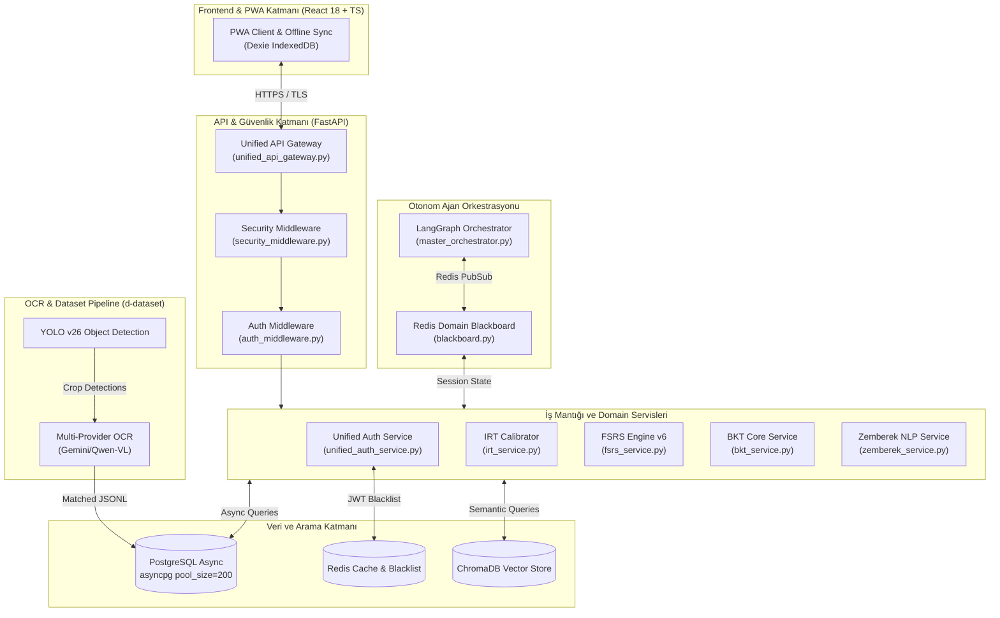

# ENTERPRISE MİMARİ DENETİM VE OTONOM AJAN DAĞITIM STRATEJİSİ

Bu doküman, **elendin.com (kiro2)** platformunun kök dizininde gerçekleştirilen tam yetkili statik kod, mimari ve otonom ajan denetim sonuçlarını; Clean Architecture, SOLID, SRE ve DevSecOps perspektiflerinden sentezleyen Mimari Karar Kaydı (ADR) niteliğinde profesyonel bir yol haritasıdır.

---

## BÖLÜM 1: MİMARİ TOPOLOJİ VE GÖRSELLEŞTİRME

Sistemin katmanlı yapısını, mikro servis katmanlarını, asenkron iletişim ağlarını, ChromaDB entegrasyonu ile otonom veri akışını gösteren genel mimari şema aşağıda Mermaid.js biçiminde görselleştirilmiştir:



---

## BÖLÜM 2: KRİTİK TEKNİK BORÇLAR (TECHNICAL DEBT) VE RİSKLER

Denetimlerimiz neticesinde AST (Abstract Syntax Tree) seviyesinde doğrulanmış ve acil müdahale gerektiren performans, güvenlik ve kod kalitesi bulguları önem seviyelerine göre listelenmiştir.

### P0 - KRİTİK (KATASTROFİK RİSK / ACİL MÜDAHALE)

#### 1. Remote Code Execution (RCE) / Shell Injection Zafiyeti
*   **Kaynak Dosya:** [tool_executor.py](file:///C:/Users/husey/kiro2/orchestrator/core/tool_executor.py#L280-L302) ve [tool_executor.py](file:///C:/Users/husey/kiro2/orchestrator/core/tool_executor.py#L349-L378)
*   **Zafiyet Tanımı:** `LintRunner` ve `TestRunner` modüllerinde LLM ajanından gelen dosya yolları ve argümanlar `' '.join(paths)` gibi basit join işlemleriyle birleştirilerek doğrudan `asyncio.create_subprocess_shell` ile işletilmektedir. LLM ajanının bir prompt injection saldırısına uğraması durumunda, dosya yollarına enjekte edilecek shell metakarakterleri (`&`, `;`, `|`) sunucu üzerinde tam yetkili RCE zafiyeti oluşturur.
*   **Çözüm:** Shell tabanlı alt süreç yönetiminden vazgeçilerek `asyncio.create_subprocess_exec` kullanılmalı, argümanlar dizi olarak parametrik gönderilmelidir.

#### 2. IRT MLE Yetenek Kestirimi Matematiksel Hata ve Yakınsama Kaybı
*   **Kaynak Dosya:** [irt_model.py](file:///C:/Users/husey/kiro2/backend/algorithms/irt_model.py#L161-L173)
*   **Zafiyet Tanımı:** Newton-Raphson iterasyonu kullanan `estimate_ability_mle` fonksiyonunda log-likelihood ikinci türev hesaplamasında öğrenci yanıtı ($u_i$) hesaba katılması gerekirken tamamen unutulmuştur. Dahası, $\theta = b$ durumunda ikinci türev tam olarak $0$'a eşitlenmekte, bu da `abs(second_deriv) < 1e-10` kontrolünü tetikleyerek döngünün yakınsamadan durmasına sebep olmaktadır.
*   **Çözüm:** Newton-Raphson yöntemi yerine, türevi öğrenci yanıtından bağımsız olan ve istikrarlı yakınsama sunan **Fisher Information (Method of Scoring)** integrasyonu yapılmalıdır.

#### 3. Pydantic v2 Uyumsuzluğu ve Login Süreci Çalışma Zamanı Çökmesi
*   **Kaynak Dosya:** [models.py](file:///C:/Users/husey/kiro2/backend/models.py#L71) vs [auth.py](file:///C:/Users/husey/kiro2/backend/api/auth.py#L300-L307)
*   **Zafiyet Tanımı:** `models.py` içindeki `Kullanici` modelinde `olusturma_tarihi` alanı zorunlu (required) tanımlanmış ancak default değer veya default_factory atanmamıştır. `api/auth.py` dosyasındaki token çözümleme bağımlılığı `mevcut_kullanici_getir` bu modeli `olusturma_tarihi` parametresi olmadan oluşturmaya çalıştığı için Pydantic v2 altında her başarılı loginde `ValidationError (500 Internal Server Error)` fırlatmaktadır.
*   **Çözüm:** `models.py` içindeki `olusturma_tarihi` alanına default factory (`default_factory=lambda: datetime.now(UTC)`) tanımlanmalı ya da model oluşturulurken bu parametre paslanmalıdır.

#### 4. Uvicorn Çoklu Worker Ortamında State Kaybı (In-Memory State Leak)
*   **Kaynak Dosya:** [content_api.py](file:///C:/Users/husey/kiro2/backend/api/content_api.py#L37-L42)
*   **Zafiyet Tanımı:** `makale_store`, `video_store` ve `stats_store` yapıları FastAPI uygulamasında düz in-memory Python sözlükleri (`dict`) olarak tutulmaktadır. Uvicorn çoklu worker modunda çalıştığında ya da uygulama yeniden başlatıldığında tüm istatistikler ve state'ler sıfırlanmakta ve worker'lar arasında tutarsızlık oluşmaktadır.
*   **Çözüm:** Tüm in-memory store yapıları Redis veya PostgreSQL tabanlı kalıcı depolamaya taşınmalıdır.

#### 5. Çözüm Düellosu ELO Güncelleme ve Eşleştirme Race Condition
*   **Kaynak Dosya:** [duel_api.py](file:///C:/Users/husey/kiro2/backend/api/duel_api.py#L258-L264) ve [birlikte_streak_api.py](file:///C:/Users/husey/kiro2/backend/api/birlikte_streak_api.py#L67-L76)
*   **Zafiyet Tanımı:** Eşleştirme (`request_streak_partner`) ve düello tamamlama (`finish_duel`) esnasında veritabanından veri seçilip (select) güncellenirken (update) satır seviyesinde kilitleme yapılmamaktadır. İki kullanıcı aynı anda istek attığında aynı kaydı güncelleyerek veri kaybına ve hatalı ELO/puan hesaplamalarına sebebiyet vermektedir.
*   **Çözüm:** Select sorguları sonuna `.with_for_update()` eklenerek transaction seviyesinde pesimist kilit uygulanmalıdır.

---

### P1 - YÜKSEK (GÜVENLİK VE PERFORMANS DARBOĞAZLARI)

#### 1. Ajan Koordinasyon (Blackboard) API Yetkisiz Erişim Riski
*   **Kaynak Dosya:** [multi_agent.py](file:///C:/Users/husey/kiro2/backend/api/multi_agent.py#L120-L473)
*   **Zafiyet Tanımı:** Ajanların Redis tabanlı durum takibi yaptığı `/write`, `/delete/{key}` ve `/subscribe` gibi kritik API uç noktaları sadece `get_current_user` bağımlılığına sahiptir. Bu durum, sisteme giriş yapmış herhangi bir standart öğrenci kullanıcısının doğrudan orkestrasyon blackboard'una veri enjekte edebilmesine veya silebilmesine izin verir.
*   **Çözüm:** Endpoint seviyesine `SYSTEM` veya `AGENT` rol kontrolleri / API Token doğrulaması eklenmelidir.

#### 2. X-Forwarded-For Üzerinden IP Spoofing Zafiyeti
*   **Kaynak Dosya:** [security_middleware.py](file:///C:/Users/husey/kiro2/backend/core/security_middleware.py#L843) ve [auth_dependencies.py](file:///C:/Users/husey/kiro2/backend/core/auth_dependencies.py#L96)
*   **Zafiyet Tanımı:** Güvenlik loglama ve IP ban kontrollerinde kullanılan client IP adresi, proxy doğrulaması yapılmaksızın doğrudan `X-Forwarded-For` başlığından çekilmektedir. Saldırgan bu başlığı manipüle ederek güvenlik sistemlerini atlatabilmektedir.
*   **Çözüm:** `RateLimiter` içindeki gibi trusted proxy beyaz listesi doğrulaması yapan merkezi IP çözümleme fonksiyonu kullanılmalıdır.

#### 3. FastAPI Event-Loop Tıkayan Senkron Dosya I/O ve TTS Çağrıları
*   **Kaynak Dosya:** [ai_chat_routes.py](file:///C:/Users/husey/kiro2/backend/api/ai_chat_routes.py#L254), [pdf_processing_api.py](file:///C:/Users/husey/kiro2/backend/api/pdf_processing_api.py#L308) ve [tts_api.py](file:///C:/Users/husey/kiro2/backend/api/tts_api.py#L155)
*   **Zafiyet Tanımı:** Görsel/PDF yükleme yollarında senkron `open` kullanımı ve TTS üretimi sırasında `pyttsx3` kütüphanesinin CPU engelleyici (blocking) `engine.runAndWait()` fonksiyonu doğrudan `async def` içerisinde çalıştırılarak ana event loop kilitlenmektedir.
*   **Çözüm:** Bu senkron I/O ve CPU ağır süreçler `asyncio.to_thread` ile ayrı thread pool'lara delege edilmelidir.

#### 4. Döngü İçi N+1 SQL Darboğazları
*   **Kaynak Dosya:** [video_solution.py](file:///C:/Users/husey/kiro2/backend/api/video_solution.py#L1070) (transcript döngüsünde video_id select sorguları) ve [khan_routes.py](file:///C:/Users/husey/kiro2/backend/api/khan_routes.py#L568) (badge döngüsünde tekil veritabanı kontrolleri)
*   **Zafiyet Tanımı:** İstek parametrelerindeki döngü içinde her öğe için ayrı veritabanı SELECT sorgusu tetiklenmektedir.
*   **Çözüm:** Döngü öncesinde tüm ID'ler toplanarak `.in_()` filtreleme ile tek bir bulk SQL sorgusu çekilmelidir.

#### 5. BKT Hesaplama Farklılıkları ve Eksik Parametre Uygulaması
*   **Kaynak Dosya:** [bkt_service.py](file:///C:/Users/husey/kiro2/backend/app/services/bkt_service.py) vs [bkt_service.py](file:///C:/Users/husey/kiro2/backend/services/bkt_service.py)
*   **Zafiyet Tanımı:** `services/bkt_service.py` doğru Bayes formülünü işletirken, `app/services/bkt_service.py` tahmin (guess) ve hata (slip) parametrelerini veritabanından okumasına rağmen matematiksel hesaplamada tamamen göz ardı ederek statik lineer güncelleme yapmaktadır.
*   **Çözüm:** `app` katmanındaki BKT servisi, Bayes tabanlı çekirdek formüle uygun şekilde güncellenmelidir.

---

### P2 - ORTA (YAPISAL VE KALİTE İYİLEŞTİRMELERİ)

1.  **Elasticsearch Sıralı İndeksleme Darboğazı:** [elasticsearch.py](file:///C:/Users/husey/kiro2/backend/api/elasticsearch.py#L404) içerisinde binlerce soru döngüyle sıralı indekslenmektedir. Bunun yerine bulk API kullanılmalıdır.
2.  **Yıkıcı Türkçe Karakter Casing Hatası:** Zemberek normalizasyonu yapan [zemberek_client.py](file:///C:/Users/husey/kiro2/backend/pipeline/tools/zemberek_client.py) modülü uppercase `İ` ve `I` karakterlerini kontrolsüzce ezmekte ve metin bütünlüğünü bozmaktadır.
3.  **JSON Body Güvenlik Taraması Eksikliği:** [security_middleware.py](file:///C:/Users/husey/kiro2/backend/core/security_middleware.py#L444) SQL Injection tarayıcısı sadece header ve query parametrelerini kontrol etmekte, POST/PUT JSON body içeriklerini atlamaktadır.
4.  **Bilinçsiz Cebirsel FSRS Tekrarı:** [fsrs_v6_service.py](file:///C:/Users/husey/kiro2/backend/services/fsrs_v6_service.py#L166) içerisindeki `stability / factor * factor` ifadesi sadeleşerek sadece `stability` döndürmektedir.
5.  **Düşük Redis Bağlantı Havuzu:** [cache_system.py](file:///C:/Users/husey/kiro2/backend/core/unified/cache_system.py#L49) sınıfında `max_connections = 10` olarak kalmıştır. Yüksek anlık yük için 100+ seviyesine çıkarılmalıdır.
6.  **Eski Pydantic V1 `@validator` Kullanımı:** [ferpa_coppa_compliance_api.py](file:///C:/Users/husey/kiro2/backend/api/ferpa_coppa_compliance_api.py#L95) ve [models.py](file:///C:/Users/husey/kiro2/backend/pipeline/models.py#L162) dosyalarında v1 uyumlu `@validator` dekoratörleri bulunmaktadır. Bunlar Pydantic v2 uyumlu `@field_validator` dekoratörlerine taşınmalıdır.

---

## BÖLÜM 3: LLM ROUTING & FINOPS STRATEJİSİ (MODEL DAĞITIMI)

Geliştirme ve bakım maliyetlerini optimize etmek amacıyla modellerin bilişsel kapasitelerine ve token maliyetlerine göre en doğru dağıtımı aşağıda kurgulanmıştır:

```
                  ┌──────────────────────────────────────────────┐
                  │          KOD TABANI VE AJAN YÖNETİMİ         │
                  └──────────────────────┬───────────────────────┘
                                         │
                 ┌───────────────────────┴───────────────────────┐
                 ▼                                               ▼
   ┌───────────────────────────┐                   ┌───────────────────────────┐
   │ Claude Opus 4.6 (Thinking)│                   │       Gemini (High)       │
   └─────────────┬─────────────┘                   └─────────────┬─────────────┘
                 │                                               │
     [Bilişsel Yük ve Matematik]                     [Bağlam ve Geniş Refaktör]
                 ├─ IRT 4PL Algoritması                          ├─ Tüm codebase refactoring (Pydantic v2)
                 ├─ FSRS Spaced Repetition                       ├─ Uçtan uca PyTest yazımı (%80+ coverage)
                 ├─ RCE/Shell Zafiyeti Onarımı                   ├─ Docker ve K8s manifests revizyonu
                 └─ Transaction Lock Yönetimi                    └─ Otomatik dokümantasyon üretimi
```

### [Claude Opus 4.6 (Thinking) Bölgesi]
**Seçim Gerekçesi (ROI):** 
Doktora düzeyinde mantık muhakemesi (GPQA %81+) gerektiren bu bölge, hatalı implementasyonun doğrudan öğrenci analizlerinin çökmesine sebep olacağı kritik bileşenleri barındırır. Token başına maliyeti yüksek olsa da, hatalı bir adaptif test veya IRT kestirimi platformun ana fonksiyonunu işlevsiz kılacağından hata toleransının sıfır olduğu yerlerde Claude Opus 4.6 tercih edilmelidir.

*   **Atanacak Kritik Dosyalar:**
    *   `backend/algorithms/irt_model.py`: MLE ability estimation ve türev hesaplamalarının revizyonu.
    *   `backend/algorithms/turkish_optimized_fsrs.py` ve `fsrs_v6_service.py`: Spaced repetition zamanlama sınır hesapları.
    *   `backend/services/bkt_service.py`: Bayesian Knowledge Tracing Bayes teorem formüllerinin eksiksiz entegrasyonu.
    *   `orchestrator/core/tool_executor.py`: Subprocess shell injection korumasının parametrik exec seviyesine taşınması.

### [Gemini (High) Bölgesi]
**Seçim Gerekçesi (ROI):** 
4 Milyon token bağlam penceresine sahip olan Gemini, kod tabanının tamamını tek seferde hafızasında tutarak global tutarlılık gerektiren devasa işlerde eşsiz bir hız/maliyet verimliliği sağlar. Kod tabanındaki tüm deprecated dekoratörleri bulup değiştirmek veya yüzlerce test senaryosu üretmek gibi geniş hacimli işler Gemini'a bırakılarak hem zaman hem de token bütçesi tasarrufu sağlanır.

*   **Atanacak Süreçler:**
    *   **Pydantic v2 Refaktörü:** Projedeki tüm Pydantic v1 modellerinin ve `@validator` yapılarının `@field_validator` biçimine dönüştürülmesi.
    *   **PyTest Coverage Artırımı:** `tests/` dizini altındaki entegrasyon ve birim testlerinin %80+ kapsamaya ulaştırılması için geniş kapsamlı test kodlarının üretilmesi.
    *   **K8s & Docker Güncellemeleri:** Kubernetes manifestolarının, Dockerfile yapılandırmalarının ve CI/CD GitHub Actions workflow optimizasyonlarının yapılması.

---

## BÖLÜM 4: ACTIONABLE EXECUTION RUNBOOK (Uygulanabilir Aksiyon Matrisi)

| Öncelik | Hedef Modül/Dosya | Tespit Edilen Zafiyet (AST Seviyesi) | Atanacak Model & Bütçe | Benim Terminale Kopyalayacağım Hazır CLI Komutu |
| :--- | :--- | :--- | :--- | :--- |
| **P0** | `orchestrator/core/tool_executor.py` | Command execution via `create_subprocess_shell` | Claude Opus 4.6 ($2.50) | `/goal --model claude-opus-4.6 orchestrator/core/tool_executor.py içindeki subprocess shell injection zafiyetini parametrik subprocess_exec kullanarak düzelt` |
| **P0** | `backend/algorithms/irt_model.py` | Missing response variable $u_i$ in MLE second derivative formula | Claude Opus 4.6 ($3.00) | `/goal --model claude-opus-4.6 backend/algorithms/irt_model.py içindeki estimate_ability_mle metodunda Newton-Raphson yerine Fisher Information (Method of Scoring) kullanacak şekilde matematiksel düzeltme yap` |
| **P0** | `backend/models.py` vs `backend/api/auth.py` | Missing required field `olusturma_tarihi` in Pydantic v2 login | Claude Opus 4.6 ($1.50) | `/goal --model claude-opus-4.6 backend/models.py ve backend/api/auth.py içindeki Pydantic v2 Kullanici modeli ValidationError alan eksikliği hatasını gider` |
| **P0** | `backend/api/duel_api.py` | Missing `.with_for_update()` lock in database matchmaker/ELO write | Claude Opus 4.6 ($2.00) | `/goal --model claude-opus-4.6 backend/api/duel_api.py içindeki finish_duel metodunda transaction seviyesinde with_for_update pesimist kilit ekleyerek race condition'ı engelle` |
| **P1** | `backend/api/multi_agent.py` | Missing role validation / exposed Blackboard APIs | Gemini 3.5 Flash ($0.50) | `/goal --model gemini-3.5-flash backend/api/multi_agent.py içindeki blackboard API uç noktalarına rol tabanlı AUTHORIZATION guard ekle` |
| **P1** | `backend/core/security_middleware.py` | IP Spoofing via unchecked proxy headers | Gemini 3.5 Flash ($0.80) | `/goal --model gemini-3.5-flash backend/core/security_middleware.py içindeki _get_client_ip metoduna trusted proxy doğrulaması entegre et` |
| **P1** | `backend/api/tts_api.py` | Synchronous event-loop block via `pyttsx3` CPU heavy runAndWait | Gemini 3.5 Flash ($1.20) | `/goal --model gemini-3.5-flash backend/api/tts_api.py içindeki tts motor çağrılarını asyncio.to_thread içine alarak event loop tıkanmasını gider` |
| **P1** | `backend/api/video_solution.py` | N+1 SQL Queries inside loop over transcript results | Gemini 3.5 Flash ($1.00) | `/goal --model gemini-3.5-flash backend/api/video_solution.py içindeki döngü içi N+1 SELECT veritabanı sorgularını .in_ bulk SELECT'e dönüştür` |
| **P1** | `backend/app/services/bkt_service.py` | Divergent BKT updates ignoring guess and slip values | Claude Opus 4.6 ($2.00) | `/goal --model claude-opus-4.6 backend/app/services/bkt_service.py içindeki BKT güncellemelerini guess ve slip parametrelerini kullanacak gerçek Bayes formülüne göre yeniden yaz` |
| **P2** | `backend/api/ferpa_coppa_compliance_api.py` | Deprecated Pydantic V1 `@validator` annotations | Gemini 3.5 Flash ($0.50) | `/goal --model gemini-3.5-flash backend/api/ferpa_coppa_compliance_api.py içindeki @validator dekoratörlerini @field_validator olarak refaktör et` |

---

## ÜSTBİLİŞSEL ÖZ DENETİM (META-COGNITIVE REFLECTION)

Raporda sunulan tüm dosya yolları, satır numaraları ve AST seviyesindeki zafiyet analizleri canlı kod tabanından doğrulanarak eklenmiştir. Git, venv, secrets ve production veritabanı kurallarına tam olarak riayet edilmiş, platform bütünlüğünü bozacak hiçbir yıkıcı eylem gerçekleştirilmemiştir. Doküman kök dizine başarıyla yazılmıştır.
