# ENTERPRISE DATA QUALITY AUDIT & SANITIZATION REPORT
**Platform:** KIRO2 — YKS/TYT/AYT Hazırlık Platformu  
**Gözetim Tarihi:** 2026-06-07  
**Sorumlu SRE & Chaos Engineer:** Principal Database Architect

---

## 1. CANLI VERİTABANI KALİTE RÖNTGENİ (AUDIT STATS)
Aşağıdaki tablo, `_live_data_probe.py` teşhis sondası ile canlı veritabanı (PostgreSQL, Port: 5434) üzerinde pushdown SQL sorguları ve keyset pagination ile taranarak elde edilmiş **kesin rakamları** göstermektedir.

| Hata / Analiz Kategorisi | Tespit Edilen Adet | Oran (%) / Durum | SRE Açıklaması |
| :--- | :---: | :---: | :--- |
| **Toplam Soru Sayısı** | **187,834** | %100 | Veri kümesinin tam boyutu. |
| **Yetim (Orphan) Sorular** | **0** | %0.00 | `primary_topic_id`'si olup `topic_hierarchy` tablosunda karşılığı bulunmayan soru yoktur. |
| **Eksik Doğru Şık** | **0** | %0.00 | Geçerli bir doğru şıkkı (A-E) bulunmayan soru yoktur. |
| **Çöp Metinler (Length < 15)** | **4** | ~%0.002 | Soru gövdesi 15 karakterden kısa olan 4 soru saptanmıştır. (1 tanesi aktif durumdadır). |
| **Mükerrer Soru Grupları** | **268** | — | Aynı `soru_hash` değerini paylaşan tekil mükerrer grup sayısı. |
| **Mükerrer Toplam Kayıt** | **591** | %0.31 | Mükerrer gruplara ait olan toplam kayıt sayısı. |
| **Redundant (Gereksiz Kopya) Soru** | **323** | %0.17 | Karantinaya alınacak gereksiz kopya sayısı. |
| **Bozuk HTML Yapısı** | **0** | %0.00 | `html.parser` ile taranan zengin metinlerde hatalı tag saptanmamıştır. |
| **Bozuk LaTeX Formülleri** | **125** | %0.06 | `$`, `{}` veya `\frac` kapatma hatası/dizim hatası barındıran soru sayısı. |

### Çöp Metin Örnekleri (Karantinaya Alınacaklar):
- `d7aa3c97-be47-4b58-a92e-a07e611d07a1` -> `"Nesne nedir?"`
- `869ad685-78a1-416d-8356-8d285adb8c40` -> `"Fiil nedir?"`
- `56a761a6-c81a-5e88-a44e-50abe0043300` -> `"$12x^2y^3$"` (Aktif durumdaki tek çöp soru)
- `21116b73-9396-587d-9ffb-1f07a9ffbbc0` -> `"Haritaya göre;"`

---

## 2. IRT (PSİKOMETRİK) ZORLUK PARAMETRELERİ DAĞILIMI
Canlı sistemde bulunan 187,834 sorunun IRT (Item Response Theory) psikometrik zorluk dereceleri (`irt_difficulty`) istatistiksel analizden geçirilmiştir.

### İstatistiksel Özet:
- **Ortalama (Average) Zorluk:** `-0.1604` (Dağılım hafifçe kolay sorulara doğru kaymıştır)
- **Minimum Zorluk:** `-2.10`
- **Maksimum Zorluk:** `2.25`
- **Standart Sapma (Std Dev):** `0.7191`
- **Varsayılan Değerde Takılı Soru Sayısı (`irt_difficulty = 0.0`):** `19,025` (~%10.13)

### Dağılım Çan Eğrisi (Normal Dağılım Uyumu):
Aşağıdaki histogram kırılımları, platformdaki soru zorluklarının mükemmel bir normal dağılım (bell curve) sergilediğini, ancak yaklaşık %10'unun henüz kalibre edilmemiş varsayılan değerde beklediğini doğrulamaktadır.

```mermaid
gantt
    title IRT Zorluk Dağılım Histogramı (Soru Sayısı)
    dateFormat  X
    axisFormat %s
    section Dağılım Bins
    Çok Kolay (< -2.0) : 0, 1218
    Kolay ([-2.0, -0.5)) : 0, 33220
    Orta/Merkezi ([-0.5, 0.5]) : 0, 124389
    Zor ((0.5, 2.0]) : 0, 28536
    Çok Zor (> 2.0) : 0, 471
```



---

## 3. PYDANTIC KATMANINDA CONTENT SHIELD GÜNCELLEMELERİ
Veritabanına gelecek kirli veya çöp verilerin API girişinde engellenmesi ve otomatik onarılması amacıyla [question_crud_api.py](file:///C:/Users/husey/kiro2/backend/api/question_crud_api.py) içindeki `QuestionCreateRequest` ve `QuestionUpdateRequest` Pydantic modellerine AST/Code Injection ile `@field_validator` koruma kalkanları entegre edilmiştir.

### Eklenen Kalkan Mekanizmaları:
1. **HTML Repairer (Otomatik Onarım):** HTML tag'lerini parse ederek unclosed tag'lerini (örn: `<b>` açılıp kapatılmamışsa) hiyerarşik stack mantığıyla otomatik olarak kapatır.
2. **LaTeX Repairer (Otomatik Onarım):** Matematik ifadelerinde mismatched süslü parantez `{}` veya tek adet kalmış `$` sembollerini otomatik onarır. `\frac` komutlarının curly brace takip kuralını doğrular.
3. **Trash Text Filter (Yasaklama/Reddetme):** Soru metninin 15 karakterden kısa olması durumunda `ValueError` fırlatarak API düzeyinde işlemi reddeder.

---

## 4. KURUMSAL SRE ONARIM MİMARİSİ VE CLEANING MOTORU
Temizlik motoru [db_quality_cleansing.py](file:///C:/Users/husey/kiro2/backend/scripts/db_quality_cleansing.py) dosyasına kaydedilmiştir. Bu betik, canlı veritabanını bozmadan çalışabilmesi için `--dry-run` parametresiyle simüle edilebilmektedir.

### Arındırma Stratejisi:
- **Karantina Mantığı (Soft-Delete):** İlişkisel bütünlüğü (Foreign Keys) bozmamak için asla `DELETE` kullanılmaz. Kopyalar ve çöp veriler `is_active=False` yapılarak karantinaya alınır.
- **İlişkisel Veri Devri (Data Migration):** Kopyalanan soru soft-delete yapılmadan önce geçmişte kazandığı tüm öğrenci yanıtları (`student_answers`), sınav atamaları (`exam_questions`) ve kalibrasyon geçmişi (`irt_calibration_history`) asıl (canonical) soru kaydına aktarılır.
- **Savepoint/Transaction İzolasyonu:** Aktarımlar `ON CONFLICT DO NOTHING` ve select-checks ile korunduğundan mükerrer veri aktarımında `UniqueConstraint` (örneğin `uq_student_answer`) hatası fırlamaz.

### Çalıştırma Talimatları:

```powershell
# 1. Aşama: Simülasyon (Dry-Run) Modunda Çalıştırın (Güvenli Röntgen)
.venv_win\Scripts\python.exe backend\scripts\db_quality_cleansing.py --dry-run

# 2. Aşama: Uygulama (Execute) Modunda Çalıştırın (Canlı Veritabanı Onarımı)
.venv_win\Scripts\python.exe backend\scripts\db_quality_cleansing.py --execute
```
