# Video Recommendation System - Architecture Diagrams

## System Architecture Diagram

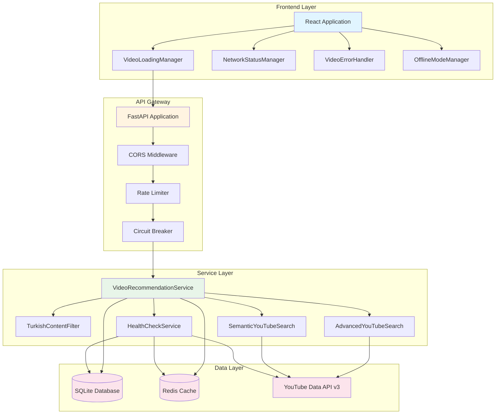

## Request Flow Diagram

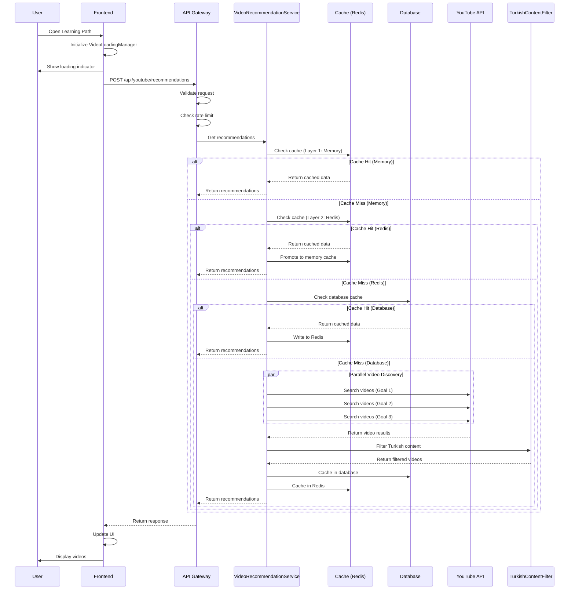

## Cache Architecture Diagram

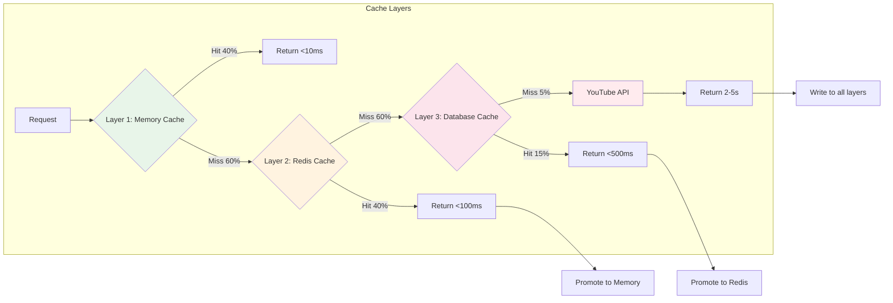

## Turkish Content Filtering Flow

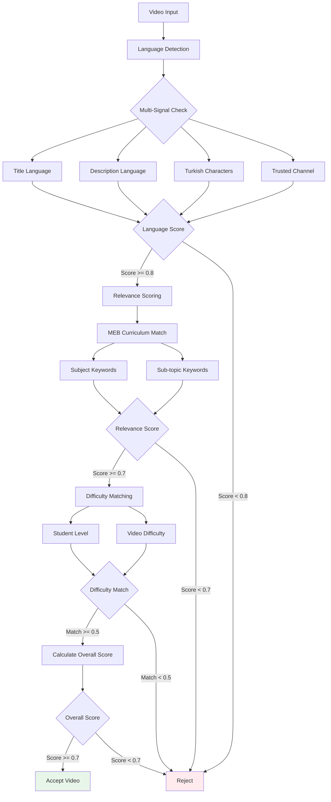

## Circuit Breaker State Machine

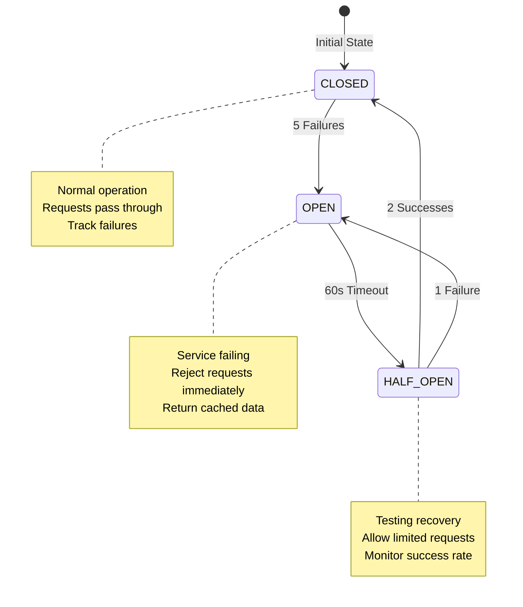

## Deployment Architecture

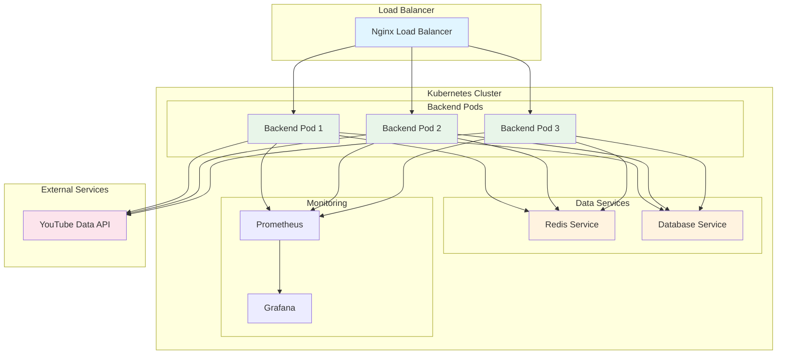

## Error Handling Flow

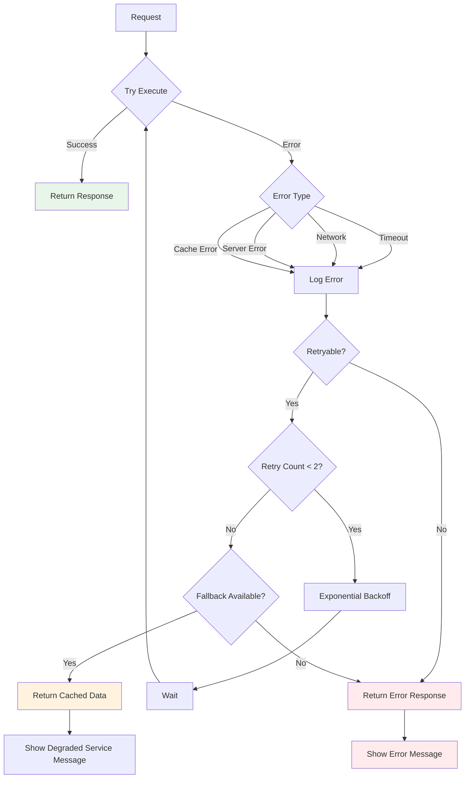

## Monitoring Architecture

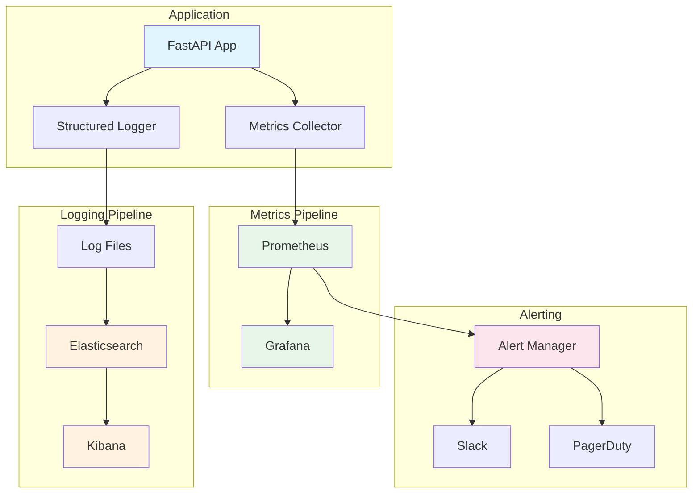

## Data Model Diagram

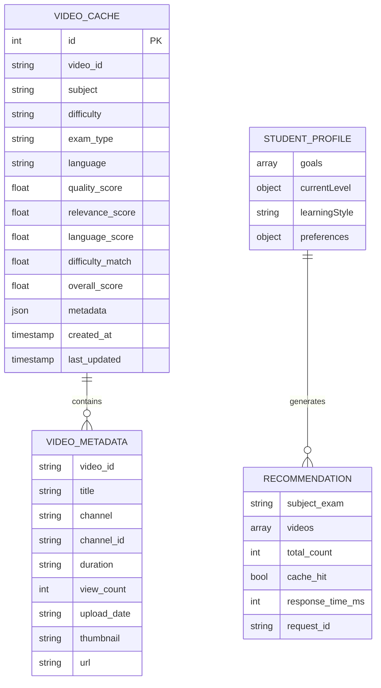

## Security Architecture

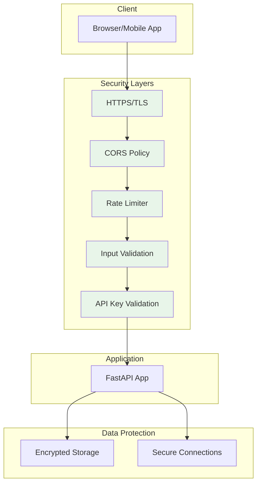

## Startup Sequence Diagram

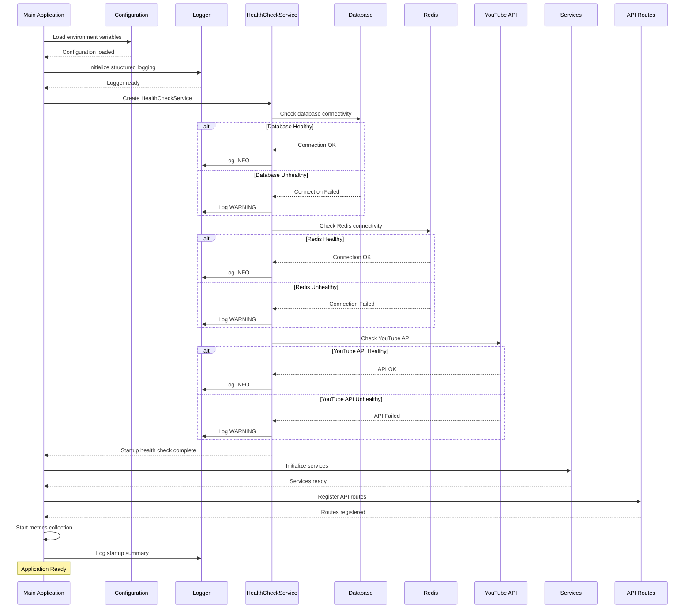

## Legend

### Colors
- 🔵 Blue: Frontend/Client Layer
- 🟡 Yellow: API/Gateway Layer
- 🟢 Green: Service/Business Logic Layer
- 🔴 Red: Data/External Services Layer
- 🟣 Purple: Monitoring/Alerting Layer

### Symbols
- Rectangle: Component/Service
- Cylinder: Database/Storage
- Diamond: Decision Point
- Circle: Start/End Point
- Arrow: Data Flow/Dependency

## Diagram Tools

Bu diyagramlar Mermaid syntax kullanılarak oluşturulmuştur. Görüntülemek için:

1. **GitHub/GitLab:** Otomatik render edilir
2. **VS Code:** Mermaid Preview extension
3. **Online:** https://mermaid.live/
4. **Documentation:** https://mermaid.js.org/

## Updating Diagrams

Diyagramları güncellemek için:

1. Mermaid syntax'ı düzenle
2. Online editor'da test et
3. Commit ve push yap
4. Documentation'da otomatik render edilir

## Additional Resources

- [Mermaid Documentation](https://mermaid.js.org/)
- [Architecture Decision Records](./ADR/)
- [API Documentation](./VIDEO_API.md)
- [System Design Document](./ARCHITECTURE.md)
