# Architecture Overview

This document provides a comprehensive overview of Kiro2's system architecture.

---

## 🏗️ System Architecture

### High-Level Architecture

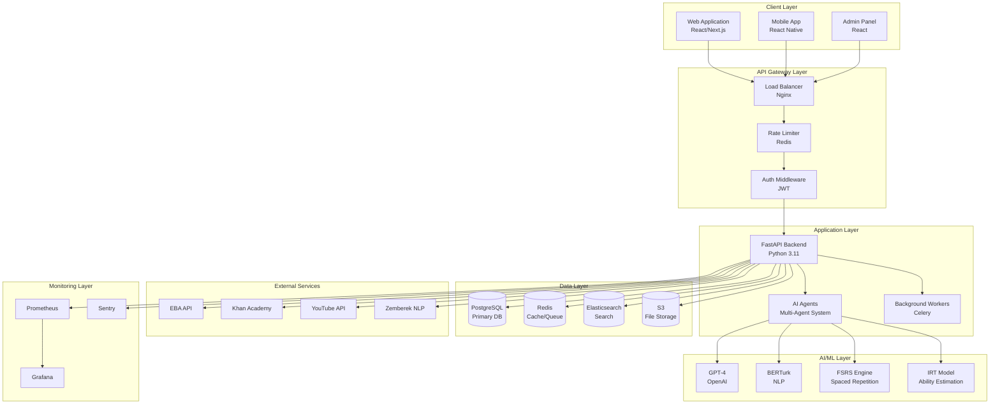

---

## 📊 Component Architecture

### Backend Components

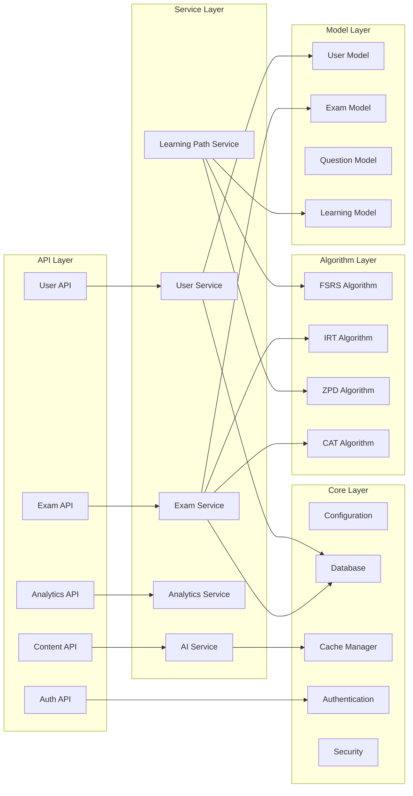

---

## 🔄 Request Flow

### Authenticated API Request

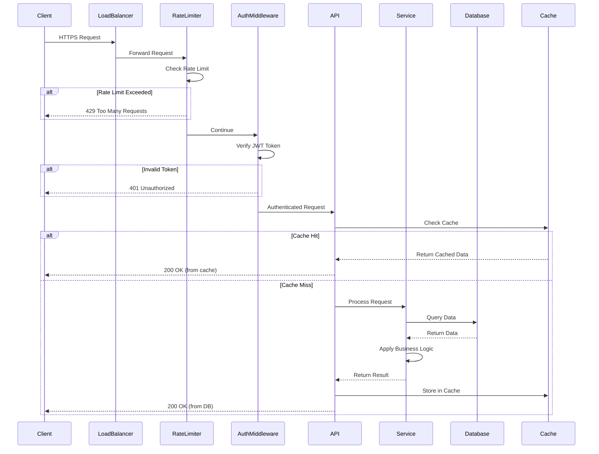

---

## 🧠 AI Agent Architecture

### Multi-Agent System

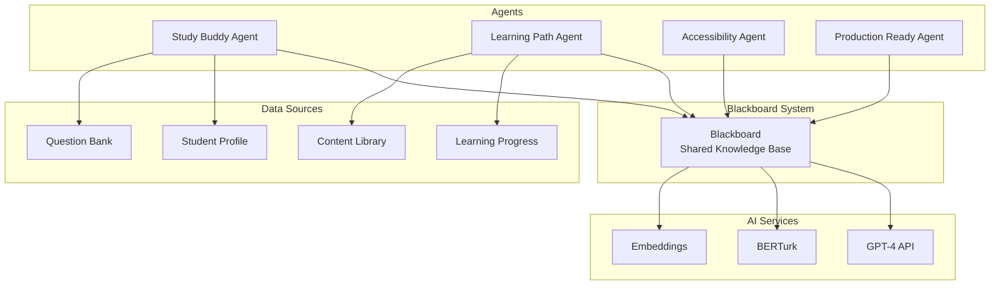

### Agent Communication Flow

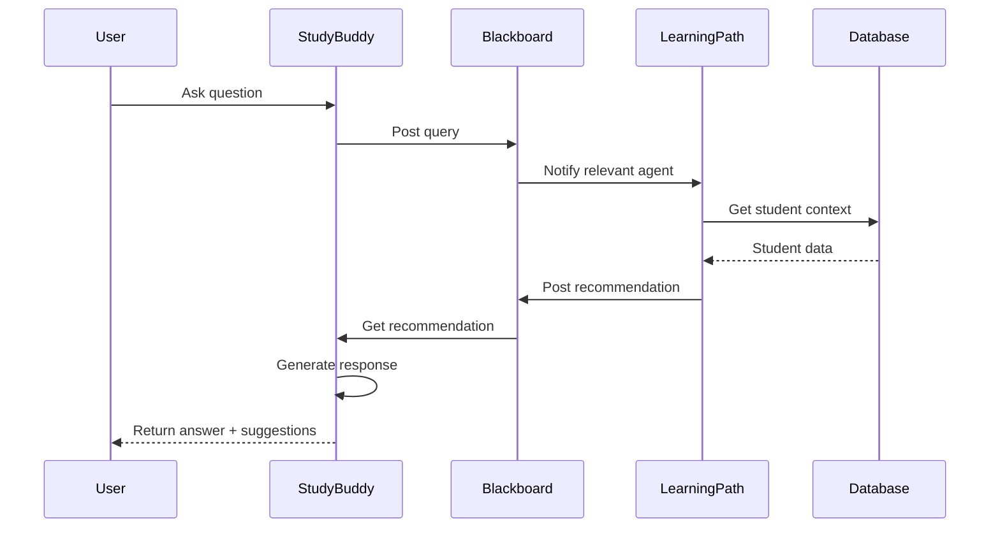

---

## 💾 Database Architecture

### Entity Relationship Diagram

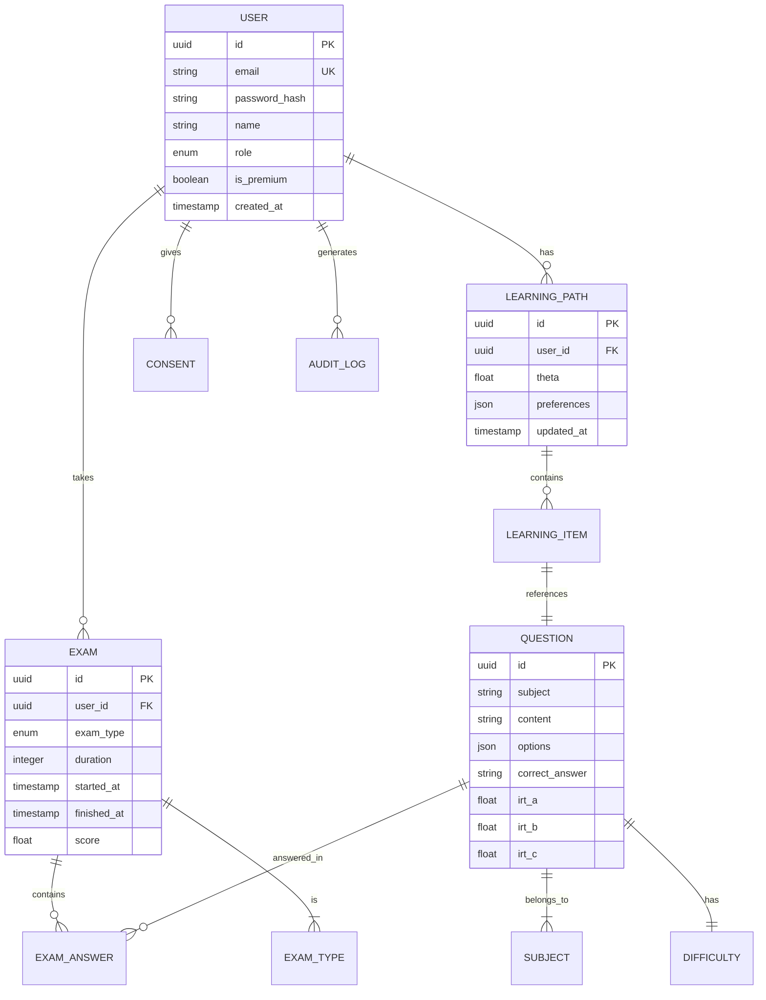

### Database Sharding Strategy

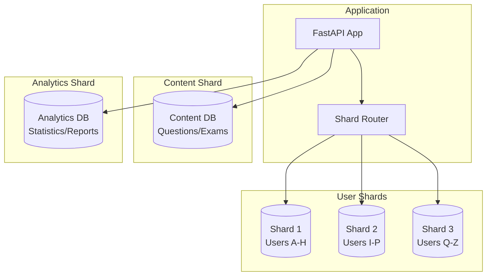

---

## 🚀 Deployment Architecture

### Container Architecture

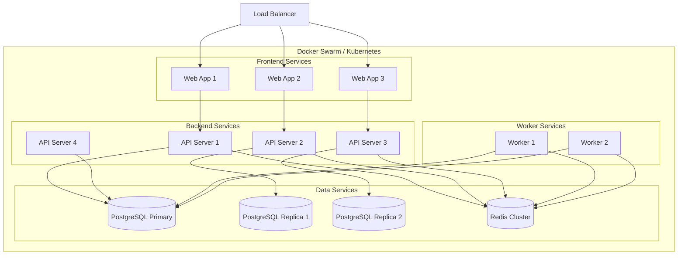

---

## 🔐 Security Architecture

### Security Layers

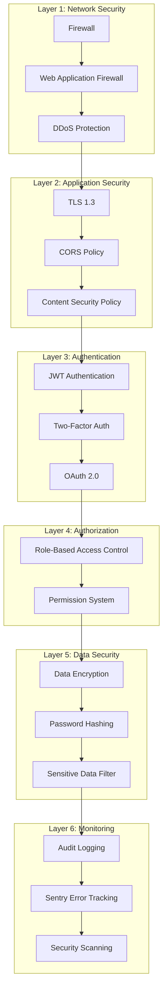

---

## 📈 Scalability Strategy

### Horizontal Scaling

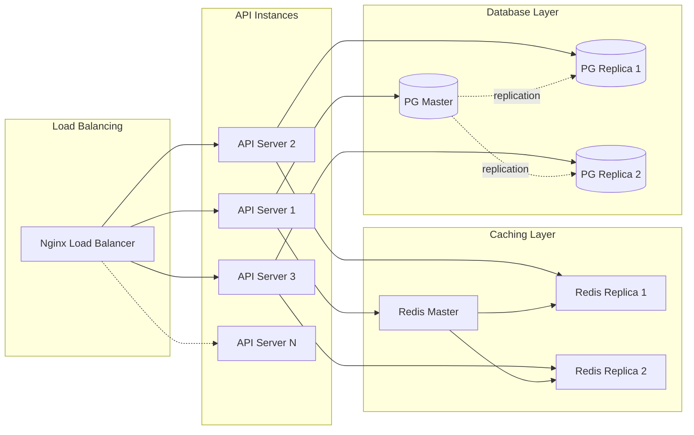

---

## 🔄 Cache Strategy

### Multi-Layer Caching

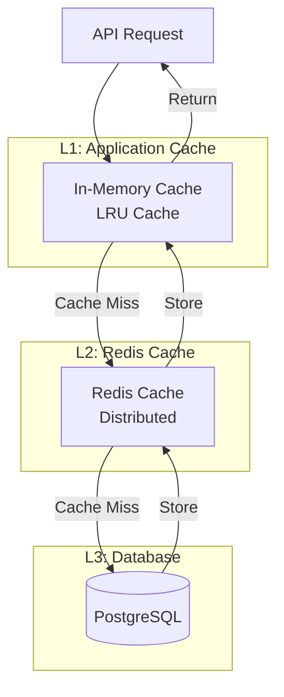

### Cache Invalidation Strategy

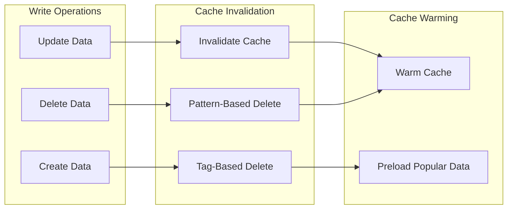

---

## 📊 Technology Stack

### Backend Stack

| Layer | Technology | Purpose |
|-------|-----------|---------|
| **Web Framework** | FastAPI 0.104+ | High-performance async API |
| **ORM** | SQLAlchemy 2.0 | Database abstraction |
| **Validation** | Pydantic V2 | Data validation |
| **Database** | PostgreSQL 15+ | Primary data store |
| **Cache** | Redis 7+ | Distributed caching |
| **Search** | Elasticsearch 8+ | Full-text search |
| **Task Queue** | Celery | Background jobs |
| **Message Broker** | RabbitMQ | Async messaging |

### AI/ML Stack

| Component | Technology | Purpose |
|-----------|-----------|---------|
| **LLM** | GPT-4 | Question generation, chat |
| **NLP** | BERTurk | Turkish language processing |
| **Morphology** | Zemberek | Turkish morphological analysis |
| **Embeddings** | OpenAI Ada-002 | Semantic search |
| **Framework** | PyTorch | Custom ML models |

### DevOps Stack

| Tool | Purpose |
|------|---------|
| **Docker** | Containerization |
| **Docker Compose** | Local development |
| **GitHub Actions** | CI/CD pipeline |
| **Prometheus** | Metrics collection |
| **Grafana** | Metrics visualization |
| **Sentry** | Error tracking |
| **ELK Stack** | Log aggregation |

---

## 🎯 Design Principles

### 1. **Scalability**
- Horizontal scaling for API servers
- Database read replicas
- Redis clustering
- CDN for static assets

### 2. **Reliability**
- Circuit breakers for external services
- Retry logic with exponential backoff
- Graceful degradation
- Health checks

### 3. **Performance**
- Multi-layer caching
- Database query optimization
- Lazy loading
- Async processing

### 4. **Security**
- Defense in depth
- Least privilege principle
- Input validation
- KVKK compliance

### 5. **Maintainability**
- Clean architecture
- SOLID principles
- Comprehensive testing
- Documentation

---

## 📖 Related Documentation

- [System Design](system-design.md) - Detailed design decisions
- [Database Schema](database-schema.md) - Complete schema documentation
- [API Design](api-design.md) - API design principles
- [Security Architecture](security.md) - Security implementation details
- [Performance](performance.md) - Performance optimization techniques

---

**Last Updated**: 2025-11-12 | **Sprint**: 9 - Documentation
