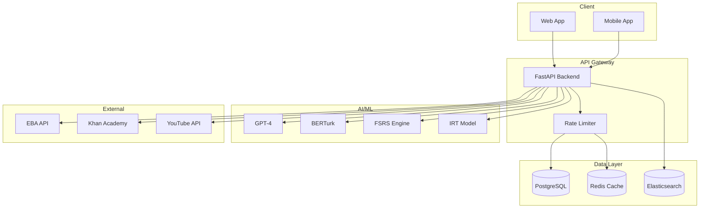
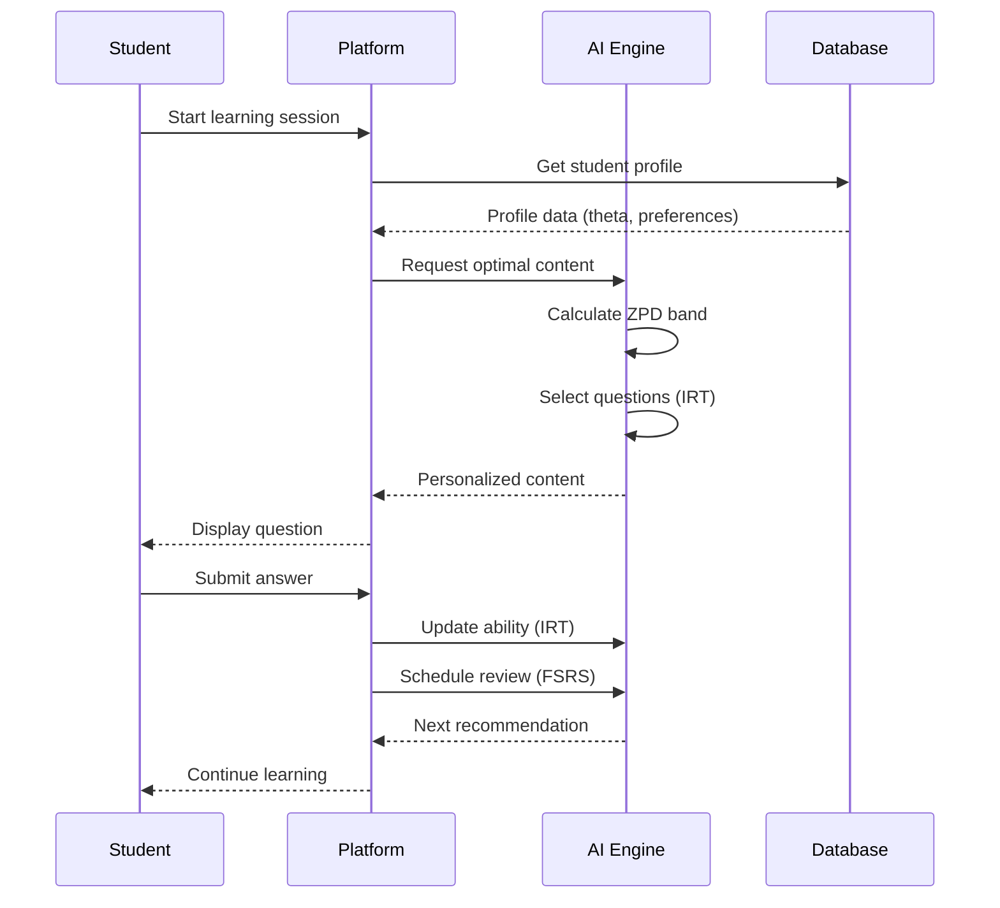

# Kiro2 Platform Documentation

<div align="center">

# 🎓 Kiro2

**Türkiye Üniversite Sınavları Hazırlık Platformu**

[](https://kiro2.com/license)
[](https://python.org)
[](https://fastapi.tiangolo.com)
[](https://postgresql.org)
[](https://redis.io)

[Quick Start](getting-started/quickstart.md) •
[API Reference](api/overview.md) •
[Architecture](architecture/overview.md) •
[Contributing](development/contributing.md)

</div>

---

## 🌟 Hoş Geldiniz

Kiro2, Türk öğrencileri için YKS (TYT/AYT/YDT) üniversite giriş sınavlarına hazırlık sunan
**yapay zeka destekli eğitim platformudur**.

### ✨ Temel Özellikler

#### 🧠 Yapay Zeka Destekli Öğrenme

- **FSRS Algorithm**: 17 parametreli spaced repetition sistemi
- **IRT Model**: 3 parametreli soru tepki kuramı (a, b, c)
- **ZPD System**: Vygotsky'nin ZPD teorisi ile optimal zorluk
- **CAT Engine**: Gerçek zamanlı adaptif sınav motoru
- **Turkish NLP**: Zemberek ile gelişmiş Türkçe dil işleme

#### 📚 Kapsamlı İçerik

- **40,000+ ÖSYM Sorusu**: Geçmiş YKS sorularının tam arşivi
- **Video Çözümler**: Uzman öğretmenlerden detaylı anlatımlar
- **EBA Entegrasyonu**: Milli Eğitim Bakanlığı içerikleri
- **Khan Academy**: Dünya çapında kanıtlanmış içerikler
- **Multimedya**: Görsel, audio, interaktif simülasyonlar

#### 📊 Gelişmiş Analitik

- **Real-time Performance**: Anlık performans takibi
- **Predictive Analytics**: Başarı tahmini ve önerileri
- **Benchmark**: Türkiye geneli karşılaştırma
- **Dashboards**: Öğrenci, öğretmen ve veli panelleri
- **Reports**: Detaylı performans raporları

#### 🔒 Güvenlik & Uyumluluk

- **KVKK Uyumlu**: Türkiye Kişisel Verilerin Korunması Kanunu
- **2FA**: TOTP tabanlı iki faktörlü kimlik doğrulama
- **Rate Limiting**: Tier bazlı gelişmiş hız sınırlama
- **JWT Authentication**: Güvenli token tabanlı auth
- **Audit Logging**: Kapsamlı denetim kaydı

---

## 🏗️ Mimari



### Technology Stack

| Layer | Technologies |
|-------|-------------|
| **Backend** | FastAPI, SQLAlchemy 2.0, Pydantic V2 |
| **Database** | PostgreSQL 15+ |
| **Cache** | Redis 7+ (multi-layer) |
| **Search** | Elasticsearch 8+ |
| **AI/ML** | GPT-4, BERTurk, PyTorch |
| **NLP** | Zemberek, spaCy |
| **Container** | Docker, Docker Compose |
| **Monitoring** | Prometheus, Grafana |
| **Testing** | Pytest, Coverage |
| **Documentation** | MkDocs, OpenAPI |

---

## 🚀 Quick Start

### Ön Gereksinimler

```bash
# Python 3.11 or higher
python --version  # Python 3.11+

# PostgreSQL 15 or higher
psql --version   # PostgreSQL 15+

# Redis 7 or higher
redis-cli --version  # Redis 7+

# Docker (optional)
docker --version
docker-compose --version
```

### Kurulum

=== "With Docker"

    ```bash
    # Clone repository
    git clone https://github.com/yourusername/kiro2.git
    cd kiro2

    # Start services
    docker-compose up -d

    # Check health
    curl http://localhost:8000/health
    ```

=== "Without Docker"

    ```bash
    # Clone repository
    git clone https://github.com/yourusername/kiro2.git
    cd kiro2/backend

    # Create virtual environment
    python -m venv venv
    source venv/bin/activate  # Windows: venv\Scripts\activate

    # Install dependencies
    pip install -r requirements.txt

    # Configure environment
    cp .env.example .env
    # Edit .env with your configuration

    # Run database migrations
    alembic upgrade head

    # Start server
    uvicorn main:app --reload
    ```

### İlk API Çağrısı

```bash
# Health check (no auth required)
curl http://localhost:8000/health

# Register user
curl -X POST http://localhost:8000/api/v1/auth/register \
  -H "Content-Type: application/json" \
  -d '{
    "email": "student@example.com",
    "password": "SecurePass123!",
    "name": "Test Student",
    "role": "student"
  }'

# Login
curl -X POST http://localhost:8000/api/v1/auth/login \
  -H "Content-Type: application/json" \
  -d '{
    "email": "student@example.com",
    "password": "SecurePass123!"
  }'

# Use token for authenticated requests
curl -X GET http://localhost:8000/api/v1/user/profile \
  -H "Authorization: Bearer YOUR_ACCESS_TOKEN"
```

---

## 📖 Documentation Sections

### For Developers

<div class="grid cards" markdown>

-   :material-rocket-launch:{ .lg .middle } __Getting Started__

    ---

    Installation, configuration, and first steps

    [:octicons-arrow-right-24: Quick Start](getting-started/quickstart.md)

-   :material-cube-outline:{ .lg .middle } __Architecture__

    ---

    System design, database schema, and patterns

    [:octicons-arrow-right-24: Architecture](architecture/overview.md)

-   :material-api:{ .lg .middle } __API Reference__

    ---

    Complete REST API documentation with examples

    [:octicons-arrow-right-24: API Docs](api/overview.md)

-   :material-brain:{ .lg .middle } __AI & Algorithms__

    ---

    FSRS, IRT, ZPD, CAT and recommendation engine

    [:octicons-arrow-right-24: AI Docs](ai/overview.md)

-   :material-code-braces:{ .lg .middle } __Development__

    ---

    Coding standards, testing, and contributing

    [:octicons-arrow-right-24: Dev Guide](development/setup.md)

-   :material-cloud-upload:{ .lg .middle } __Deployment__

    ---

    Docker, migrations, monitoring, and scaling

    [:octicons-arrow-right-24: Deploy Guide](deployment/overview.md)

</div>

### For Users

<div class="grid cards" markdown>

-   :material-school:{ .lg .middle } __For Students__

    ---

    How to use the platform as a student

    [:octicons-arrow-right-24: Student Guide](guides/students.md)

-   :material-account-tie:{ .lg .middle } __For Teachers__

    ---

    Teacher dashboard and classroom management

    [:octicons-arrow-right-24: Teacher Guide](guides/teachers.md)

-   :material-account-supervisor:{ .lg .middle } __For Parents__

    ---

    Monitor your child's progress

    [:octicons-arrow-right-24: Parent Guide](guides/parents.md)

-   :material-shield-crown:{ .lg .middle } __For Admins__

    ---

    System administration and moderation

    [:octicons-arrow-right-24: Admin Guide](guides/admins.md)

</div>

---

## 🎯 Key Concepts

### Adaptive Learning Flow



### Learning Algorithms

#### FSRS (Forgetting Curve)
```python
# Retention calculation
retention = exp(-(t / stability))

# Difficulty update
difficulty = D0 - W[5] * (rating - 3)

# Stability calculation
stability_short = W[0] + W[1] * difficulty
stability_long = stability * exp(W[6] * rating)
```

#### IRT (Item Response Theory)
```python
# 3-Parameter Logistic Model
P(θ) = c + (1-c) / (1 + exp(-a(θ-b)))

# Where:
# θ = student ability
# a = discrimination
# b = difficulty
# c = guessing factor
```

#### ZPD (Zone of Proximal Development)
```python
# ZPD band calculation
zpd_lower = current_ability - zpd_width/2
zpd_upper = current_ability + zpd_width/2

# Optimal challenge
optimal_difficulty = current_ability + 0.3
```

---

## 📊 Sprint Progress

| Sprint | Focus | Status | Report |
|--------|-------|--------|--------|
| **Sprint 6** | Advanced Rate Limiting | ✅ Complete | [Report](reference/sprint-6.md) |
| **Sprint 7** | Test Coverage | ✅ Complete | [Report](reference/sprint-7.md) |
| **Sprint 8** | Code Quality | ✅ Complete | [Report](reference/sprint-8.md) |
| **Sprint 9** | Documentation | 🔄 In Progress | [Report](reference/sprint-9.md) |

---

## 🤝 Contributing

We welcome contributions! Please see our [Contributing Guide](development/contributing.md) for details.

### Quick Contribution Steps

1. **Fork** the repository
2. **Clone** your fork
3. **Create** a feature branch
4. **Make** your changes
5. **Test** thoroughly
6. **Submit** a pull request

```bash
# Fork and clone
git clone https://github.com/YOUR_USERNAME/kiro2.git
cd kiro2

# Create branch
git checkout -b feature/amazing-feature

# Make changes, add tests
# ...

# Run tests
make test

# Run quality checks
make quality

# Commit and push
git add .
git commit -m "feat: Add amazing feature"
git push origin feature/amazing-feature
```

---

## 📝 License

Copyright © 2025 Kiro2 Platform. All rights reserved.

See [LICENSE](https://kiro2.com/license) for details.

---

## 💬 Support

- **Documentation**: [docs.kiro2.com](https://docs.kiro2.com)
- **Email**: [support@kiro2.com](mailto:support@kiro2.com)
- **GitHub Issues**: [github.com/yourusername/kiro2/issues](https://github.com/yourusername/kiro2/issues)
- **Status Page**: [status.kiro2.com](https://status.kiro2.com)

---

<div align="center">

**Made with ❤️ for Turkish students preparing for YKS**

[Getting Started](getting-started/quickstart.md){ .md-button .md-button--primary }
[API Reference](api/overview.md){ .md-button }

</div>
