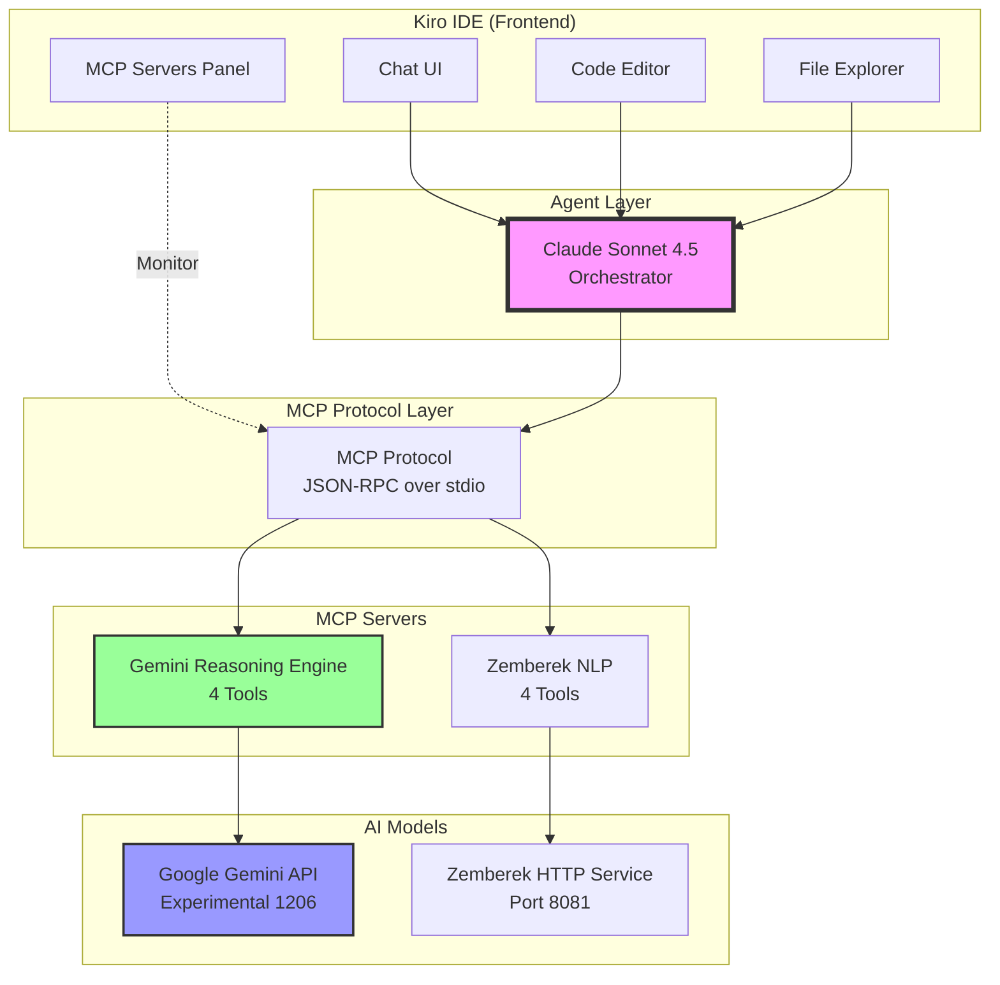
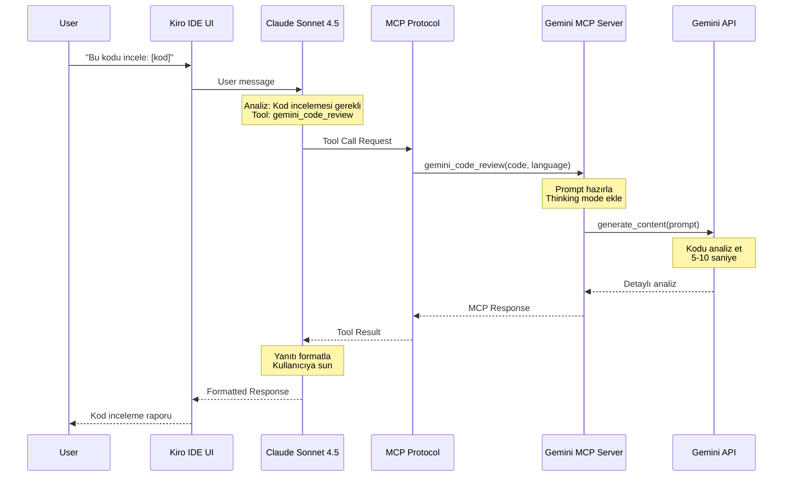
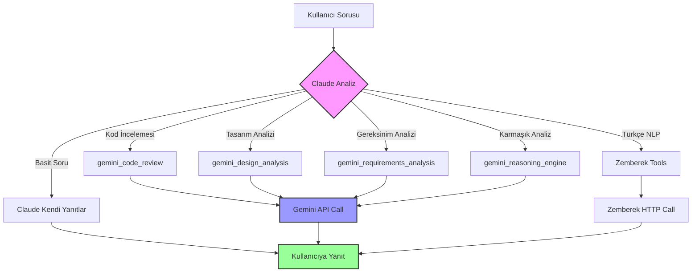
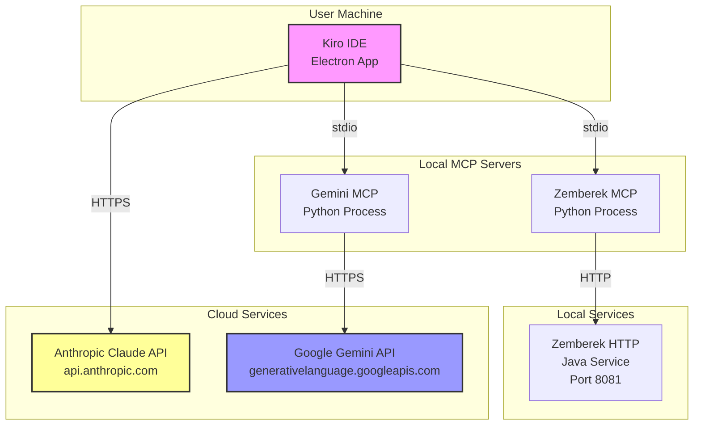
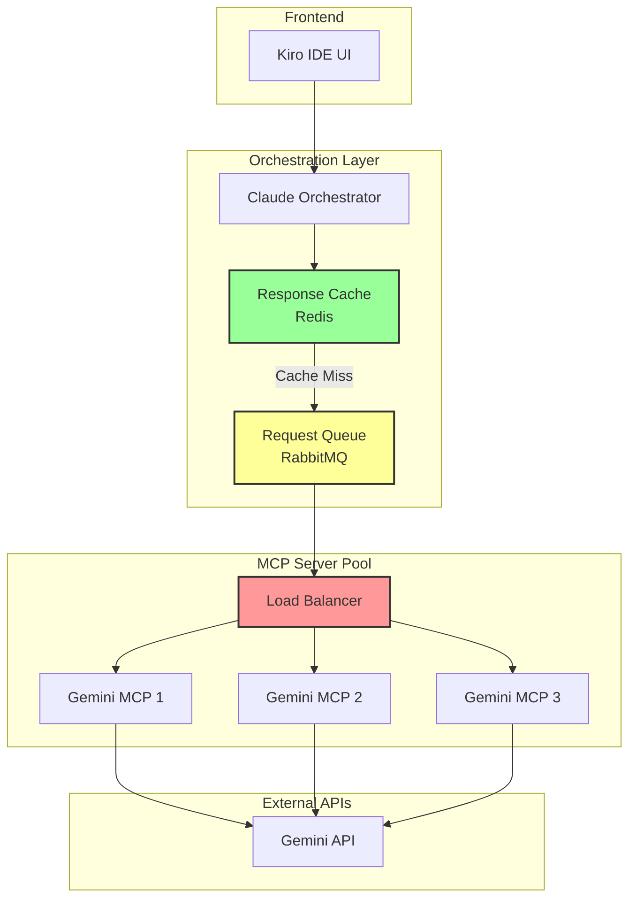

# 🏗️ Gemini + Claude Entegre Mimari Diyagramları

## 1. Genel Sistem Mimarisi

## 2. Veri Akış Diyagramı (Kod İncelemesi)

## 3. Karar Ağacı (Tool Selection)

## 4. Deployment Mimarisi

## 5. Performans Optimizasyonu Mimarisi (Önerilen)

---

**Not:** Bu diyagramlar Mermaid formatındadır. Markdown viewer'da veya GitHub'da görüntülenebilir.
